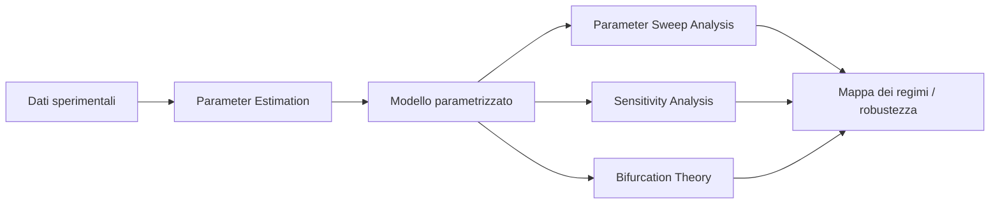
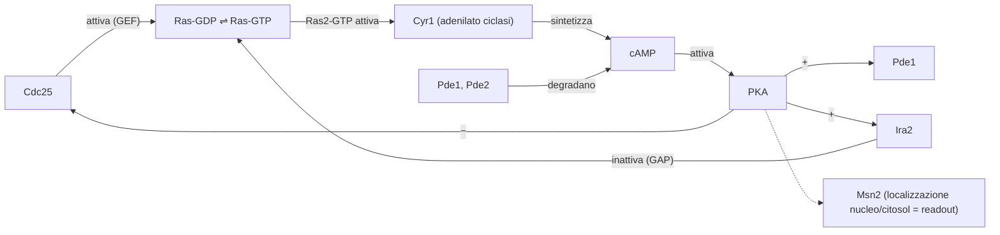
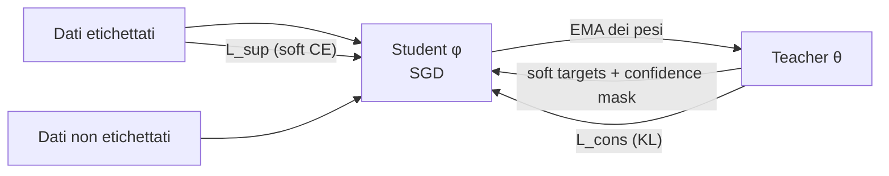
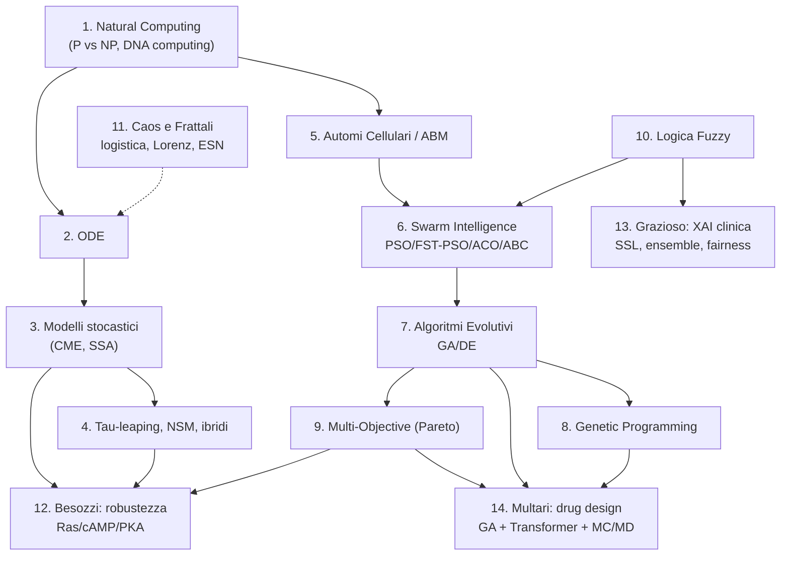

# Introduzione: come è organizzata questa dispensa

Questa dispensa documenta **l'intero contenuto della repository** `902945/computational-intelligence-`, che raccoglie il materiale didattico del modulo di **Computational Intelligence** del corso *Computer Science II* (Laurea in Informatica e in Ingegneria Fisica, A.A. 2025–2026, Università Ca' Foscari Venezia, Prof. Marco S. Nobile), più tre seminari ospiti e una dispensa precedente (`DISPENSA_COMPUTATIONAL_INTELLIGENCE.md`) dedicata ai soli seminari.

La repository non contiene codice sorgente, test o file di configurazione: è una **collezione di slide in PDF** (14 documenti, ~900 pagine complessive) più un documento Markdown. La dispensa è quindi organizzata **seguendo l'architettura concettuale del corso**, non l'ordine alfabetico dei file:

1. **Parte I — Fondamenti**: Natural Computing (i tre pilastri della CI e i limiti della computazione classica), modellazione con ODE.
2. **Parte II — Modellazione e simulazione stocastica**: dal Dogma Centrale al Gillespie SSA, fino ai metodi approssimati, spaziali e ibridi.
3. **Parte III — Modelli non convenzionali**: automi cellulari e agent-based modeling.
4. **Parte IV — Ottimizzazione bioispirata**: swarm intelligence, algoritmi evolutivi, genetic programming, ottimizzazione multi-obiettivo.
5. **Parte V — Logica fuzzy**: fuzzy set, sistemi di inferenza, clustering fuzzy.
6. **Parte VI — Caos e frattali**: mappa logistica, Feigenbaum, Lorenz, Echo-State Network.
7. **Parte VII — Seminari di ricerca applicata**: robustezza dei sistemi complessi (Besozzi), AI spiegabile per la cardiologia (Grazioso), drug design computazionale (Multari).
8. **Parte VIII — Sintesi trasversale**: connessioni tra i temi, glossario, punti da chiarire.

**Convenzioni tipografiche usate in tutta la dispensa:**

- I concetti spiegati direttamente nelle slide sono esposti normalmente, con citazione della fonte.
- **`[Approfondimento aggiunto]`** — il concetto è *menzionato* nelle slide ma non spiegato a sufficienza; qui viene colmata la lacuna.
- **`[Spiegazione integrativa]`** — il concetto *non proviene dalle slide* ma è necessario per capire il progetto; la spiegazione si basa su conoscenza standard del dominio.
- **Esempi pratici** (snippet Python/pseudocodice, input/output numerici) sono aggiunti ovunque il materiale originale fosse solo astratto.
- Le **fonti** (paper, libri, URL, software) sono citate inline e raccolte per capitolo.
- Le **incongruenze** rilevate nei materiali sono raccolte nella sezione finale [Punti da chiarire](#18-punti-da-chiarire).

---

# INDICE

**Parte I — Fondamenti**
1. [Natural Computing e i limiti della computazione classica](#1-natural-computing-e-i-limiti-della-computazione-classica)
2. [Equazioni Differenziali Ordinarie (ODE) e integrazione numerica](#2-equazioni-differenziali-ordinarie-ode-e-integrazione-numerica)

**Parte II — Modellazione e simulazione stocastica**
3. [Modellazione e simulazione di sistemi biologici: dal Dogma Centrale all'algoritmo di Gillespie](#3-modellazione-e-simulazione-di-sistemi-biologici)
4. [Metodi avanzati di simulazione stocastica: tau-leaping, simulazione spaziale e ibrida multi-scala](#4-metodi-avanzati-di-simulazione-stocastica)

**Parte III — Modelli non convenzionali**
5. [Automi Cellulari e Agent-Based Modeling](#5-automi-cellulari-e-agent-based-modeling)

**Parte IV — Ottimizzazione bioispirata**
6. [Swarm Intelligence: PSO, FST-PSO, Ant Colony e Bee Colony](#6-swarm-intelligence)
7. [Algoritmi Evolutivi: Genetic Algorithms e Differential Evolution](#7-algoritmi-evolutivi)
8. [Genetic Programming: evolvere programmi](#8-genetic-programming)
9. [Ottimizzazione Multi-Obiettivo e fronte di Pareto](#9-ottimizzazione-multi-obiettivo)

**Parte V — Logica fuzzy**
10. [Logica Fuzzy: insiemi sfumati, sistemi di inferenza e clustering](#10-logica-fuzzy-insiemi-sfumati-sistemi-di-inferenza-e-clustering)

**Parte VI — Caos e frattali**
11. [Dai conigli di Fibonacci al caos deterministico: mappe, frattali ed Echo-State Network](#11-dai-conigli-di-fibonacci-al-caos-deterministico)

**Parte VII — Seminari di ricerca applicata**
12. [Seminario Besozzi: Robustezza nei sistemi complessi e ruolo dei parametri](#12-seminario-besozzi-robustezza-nei-sistemi-complessi)
13. [Seminario Grazioso: AI supervisionata e semi-supervisionata spiegabile per il T1/T2 mapping cardiovascolare](#13-seminario-grazioso-ai-spiegabile-per-il-mapping-cardiovascolare)
14. [Seminario Multari: Drug Design nell'era del Machine Learning](#14-seminario-multari-drug-design-nellera-del-machine-learning)

**Parte VIII — Sintesi**
15. [Connessioni trasversali](#15-connessioni-trasversali)
16. [Glossario esteso](#16-glossario-esteso)
17. [Elenco completo delle fonti](#17-elenco-completo-delle-fonti)
18. [Punti da chiarire](#18-punti-da-chiarire)

---

# PARTE I — FONDAMENTI

# 1. Natural Computing e i limiti della computazione classica

> **Fonte primaria:** `Computer Science II - Natural Computing.pdf` (60 slide), M.S. Nobile, A.A. 2025–2026.

## 1.1 Che cos'è il Natural Computing

Il **Natural Computing (NC)** — detto anche Natural Computation — abbraccia **tre classi di metodi**:

1. **Metodi che traggono ispirazione dalla Natura** — algoritmi evolutivi, swarm intelligence, reti neurali artificiali;
2. **Metodi che usano i computer per sintetizzare fenomeni naturali** — simulazioni di sistemi biologici, fisici, sociali;
3. **Metodi che impiegano materiali naturali per eseguire computazione** — DNA computing, computing molecolare, e più in generale l'*unconventional computing*.

Questa tripartizione è la cornice di tutto il corso: la lezione di Natural Computing funge da **introduzione concettuale** — ogni lezione successiva ricade in una delle tre classi (es. l'SSA di Gillespie è di tipo 2, gli algoritmi genetici di tipo 1, il DNA computing di tipo 3).

La lezione pone poi la domanda radicale: *ci sono limiti intrinseci a ciò che un computer classico può fare in tempo ragionevole?* Per rispondere serve la teoria della complessità computazionale.

## 1.2 Le classi di complessità: P, NP, NP-completi

**La classe P.** La complessità computazionale misura la quantità di risorse (tempo o spazio) necessarie a eseguire un algoritmo. La classe **P** contiene informalmente tutti i *problemi decisionali* (quelli con risposta SÌ/NO) risolvibili **efficientemente**, cioè in un tempo **polinomiale** rispetto alla dimensione dell'input. Molti problemi comuni (ordinamento, ricerca, cammini minimi) appartengono a P.

**La classe NP.** Esistono problemi decisionali per cui *non si conosce* un algoritmo efficiente, ma per cui una **soluzione candidata può essere verificata** in tempo polinomiale. Questi appartengono alla classe **NP** (*Non-deterministic Polynomial time*). Non è noto se $P \neq NP$: è il più famoso problema aperto dell'informatica teorica (e uno dei Millennium Prize Problems del Clay Mathematics Institute).

**NP-completi.** I problemi **NP-completi** sono i problemi "più difficili" dentro NP: ogni problema in NP si riduce a ciascuno di essi in tempo polinomiale. Se anche *uno solo* di essi ammettesse un algoritmo polinomiale, allora P = NP. Esempi citati nel corso: **Hamiltonian Path Problem (HPP)**, **Travelling Salesman Problem (TSP)**, **Subset Sum**, **SAT**, **Graph Coloring**, **Knapsack**, **Clique**.

> `[Spiegazione integrativa]` **Riduzioni polinomiali e la gerarchia completa.** Le slide introducono P, NP e NP-complete ma non formalizzano la *riduzione polinomiale*: un problema $A$ si riduce a $B$ ($A \leq_p B$) se esiste una funzione calcolabile in tempo polinomiale che trasforma ogni istanza di $A$ in un'istanza di $B$ con la stessa risposta. È lo strumento con cui Karp (1972) dimostrò la NP-completezza di 21 problemi classici, partendo dalla dimostrazione di Cook (1971) che SAT è NP-completo. La gerarchia è più ricca di quanto mostrato a lezione: esistono anche **NP-hard** (problemi *almeno* difficili quanto gli NP-completi, ma non necessariamente in NP — es. le versioni di ottimizzazione come TSP), **co-NP** e **PSPACE**. Ai fini del corso basta ricordare: *NP-complete = dentro NP e NP-hard*.

**Esempio pratico — l'esplosione combinatoria del TSP.** Con $n$ città, il numero di tour possibili è $(n-1)!/2$. Per $n=20$ sono già $\approx 6 \times 10^{16}$ tour: anche valutandone un miliardo al secondo servirebbero ~2 anni. Per $n=100$ il numero supera gli atomi dell'universo osservabile. È questo muro che il Natural Computing prova a scavalcare *cambiando il substrato fisico della computazione*.

## 1.3 Macchine di Turing: deterministiche e non deterministiche

Per dare fondamento formale a P e NP le slide richiamano la **Macchina di Turing (MdT)**: nastro infinito, testina di lettura/scrittura, stati finiti, funzione di transizione.

- **MdT deterministica (DTM):** a ogni coppia (stato, simbolo letto) corrisponde *una sola* azione. P è la classe dei problemi risolubili da una DTM in tempo polinomiale.
- **MdT non deterministica (NDTM):** a ogni coppia possono corrispondere *più* azioni; la macchina "esplora in parallelo" tutti i rami di computazione e accetta se *almeno un* ramo accetta. NP è la classe dei problemi risolubili da una NDTM in tempo polinomiale.

Il punto cruciale: **una NDTM è un'idealizzazione** — nessun computer fisico classico può replicare il parallelismo infinito dei rami senza pagare un costo esponenziale. *A meno che…* il substrato fisico della computazione non offra parallelismo massiccio *gratis*. È esattamente l'intuizione alla base del **DNA computing**: una provetta contiene $\sim 10^{20}$ molecole che reagiscono *contemporaneamente* — una NDTM realizzata in chimica.

## 1.4 DNA computing: l'esperimento di Adleman (1994)

**Leonard Adleman** — co-inventore del crittosistema **RSA** (Turing Award 2002) — pubblicò su *Science* (1994) il primo esperimento di computazione molecolare: la soluzione di un'istanza dell'**Hamiltonian Path Problem** con 7 vertici usando filamenti di DNA.

**Il problema:** dato un grafo orientato con vertice di partenza $v_{in}$ e di arrivo $v_{out}$, esiste un cammino che visita *ogni vertice esattamente una volta*? (Versione decisionale, NP-completa.)

**L'algoritmo molecolare di Adleman**, passo-passo:

1. **Codifica.** Ogni vertice $i$ è codificato da una sequenza casuale di 20 basi (oligonucleotide); ogni arco $i \to j$ è codificato dalla concatenazione della seconda metà del codice di $i$ e della prima metà del codice di $j$.

   *Esempio concreto:* se il vertice 2 è `TATCGGATCGGTATATCCGA` e il vertice 3 è `GCTATTCGAGCTTAAAGCTA`, l'arco 2→3 è `GTATATCCGAGCTATTCGAG` (le ultime 10 basi di 2 + le prime 10 di 3).

2. **Generazione (parallelismo massiccio).** Si mescolano in provetta $\sim 10^{14}$ copie di ogni oligonucleotide (vertici + archi, questi ultimi come complementari Watson-Crick). Per **complementarietà di Watson-Crick** (A↔T, C↔G) e **ligazione**, le molecole si concatenano casualmente formando *tutti* i cammini possibili del grafo — miliardi di miliardi di tentativi in parallelo in pochi secondi.

3. **Filtraggio per estremi (PCR).** Con la **PCR** (Polymerase Chain Reaction, inventata da **Kary Mullis**, Nobel per la Chimica 1993) si amplificano solo i filamenti che *iniziano* con $v_{in}$ e *terminano* con $v_{out}$.

4. **Filtraggio per lunghezza (elettroforesi su gel).** Un cammino hamiltoniano su $n$ vertici ha esattamente $20n$ basi. L'elettroforesi separa i filamenti per lunghezza: si estrae solo la banda corrispondente (140 basi per $n=7$).

5. **Filtraggio per copertura (separazione per affinità).** Per ogni vertice $i$, si trattengono (con sonde complementari ancorate a biglie magnetiche) solo i filamenti che *contengono* il codice di $i$. Ripetuto per tutti gli $n$ vertici, sopravvivono solo i cammini che li visitano tutti.

6. **Lettura.** Se alla fine resta DNA in provetta → risposta SÌ; provetta vuota → NO. Il cammino stesso si legge con sequenziamento.

> **Perché funziona (il "perché", non solo il "cosa"):** i passi 3–6 implementano *fisicamente* il vaglio esaustivo dello spazio delle soluzioni che una MdT classica dovrebbe eseguire sequenzialmente in tempo esponenziale. Il collo di bottiglia non è più il tempo ma il **volume di DNA** necessario: lo spazio delle soluzioni cresce esponenzialmente e con esso il numero di molecole richieste. Per grafi di poche decine di vertici servirebbero masse di DNA impraticabili: è il vero limite del DNA computing.

**Complessità computazionale:** il numero di *passi biochimici* cresce **linearmente** in $n$ (O(n) operazioni di laboratorio), ma la *quantità di DNA* cresce esponenzialmente ($O(2^n)$ molecole nel caso peggiore). Il DNA computing scambia tempo con spazio/massa.

## 1.5 Wang Tiles e self-assembly algoritmico

Le **piastrelle di Wang** (Wang Tiles), proposte dal logico **Hao Wang** (1961), sono quadrati con i quattro lati "colorati"; la regola è affiancarli in modo che i lati a contatto abbiano lo stesso colore, senza ruotarli né rifletterli. Wang dimostrò che il problema "*un insieme dato di piastrelle può tassellare l'intero piano?*" è **indecidibile** — equivalente all'Halting Problem. In altre parole, le Wang Tiles sono **Turing-complete**: possono simulare qualsiasi computazione.

L'idea chiave per il computing molecolare: i "colori" possono essere realizzati come **sticky ends** di DNA (estremità appiccicose complementari). Un insieme di DNA tile che si auto-assembla esegue quindi una **computazione**: la struttura cristallina risultante *è* l'output.

- **Rothemund e Winfree** (2000) dimostrarono la self-assembly algoritmica: con DNA tile opportunamente progettati "crebbero" un **triangolo di Sierpiński** (il frattale!) per auto-assemblaggio — il pattern emerge dalle regole locali di complementarietà. [Collegamento con il Cap. 11: il triangolo di Sierpiński è generato anche dalla Regola 90 degli automi cellulari — vedi §5.]
- **Yuri Brun** (2007–2008) mostrò come risolvere problemi NP-completi (SubsetSum, SAT) con self-assembly di DNA tile: il numero di tipi di tile resta costante mentre l'istanza cresce — il costo è il tempo di assemblaggio e il tasso d'errore.
- **DNA origami** (Rothemund 2006): un lungo filamento "scaffold" (~7000 basi, dal fago M13) viene piegato in forme arbitrarie 2D/3D da centinaia di brevi filamenti "staple" complementari a regioni specifiche. È la base della nanotecnologia del DNA programmabile.

> `[Approfondimento aggiunto]` **Complementarietà di Watson-Crick: perché A-T e C-G?** Le slide usano la complementarietà come dato di fatto. La ragione chimica: adenina e timina formano **2 legami a idrogeno**, guanina e citosina **3**; la geometria della doppia elica (diametro costante ~2 nm) ammette solo l'accoppiamento di una purina (A, G — doppio anello) con una pirimidina (T, C — anello singolo). Questa specificità *digitale* (4 simboli, 2 coppie complementari) è ciò che rende il DNA un alfabeto computazionale: ogni sequenza di 20 basi ha un unico "complemento" tra $4^{20} \approx 10^{12}$ possibilità, garantendo indirizzabilità quasi univoca.

> `[Approfondimento aggiunto]` **Errori e affidabilità.** Le slide citano l'uso di 4 sticky end per tile per ridurre gli errori, senza spiegare il principio: gli errori di assemblaggio (un tile che si attacca con un solo lato corretto) sono termodinamicamente sfavoriti perché il legame completo (più legami a idrogeno) è molto più stabile ($\Delta G$ più negativo). La probabilità di attacco segue approssimativamente una **distribuzione di Boltzmann** $p \propto e^{-\Delta G / k_B T}$: raffreddando lentamente il sistema (*annealing*) si favorisce l'assemblaggio a energia minima, cioè quello corretto.

**Complessità:** la self-assembly algoritmica con $k$ tipi di tile può simulare $t$ passi di una MdT in uno spazio $O(t)$ di piastrelle assemblate, con tempo fisico dipendente dalla concentrazione. Il modello formale di riferimento è l'**aTAM** (abstract Tile Assembly Model) di Winfree.

**Fonti citate in questo capitolo:** Adleman, *Science* 266, 1994; Turing Award ad Adleman (2002, per RSA); Nobel a Mullis (1993); Rothemund & Winfree (2000) sul self-assembly di triangoli di Sierpiński; lavori di Brun su SubsetSum/SAT con DNA tile; Wang (1961) per le piastrelle omonime.

---

# 2. Equazioni Differenziali Ordinarie (ODE) e integrazione numerica

> **Fonte primaria:** `Computer Science II - ODEs.pdf` (34 slide), M.S. Nobile, A.A. 2025–2026.

## 2.1 Perché le ODE

Un'**equazione differenziale** descrive il **tasso di cambiamento** di una quantità — non la quantità stessa. Sorge in praticamente ogni sistema complesso naturale o sociale (concentrazioni chimiche, popolazioni, correnti elettriche). Formalmente:

$$\frac{d}{dt} x(t) = f(x(t), t)$$

dove $x(t)$ è lo **stato** del sistema al tempo $t$ e $f(\cdot)$ è una funzione (in generale non lineare) che ne descrive il cambiamento. Nelle ODE $t$ è l'unica variabile indipendente. Lo stato può essere un **vettore** $\mathbf{x}(t)$: in tal caso si ha un **sistema di ODE accoppiate** (una per componente), come nel caso di specie chimiche che reagiscono tra loro. Le variabili costanti hanno semplicemente $f(x) = 0$.

Punto didattico essenziale: un'ODE *non* fornisce una formula chiusa per $x(t)$; per la stragrande maggioranza dei sistemi non lineari reali **non esiste soluzione analitica** e bisogna ricorrere all'**integrazione numerica**: dato lo stato iniziale $x(t_0) = x_0$ (problema ai valori iniziali, IVP), si avanza a piccoli passi $\Delta t$ approssimando la soluzione.

## 2.2 Il metodo di Eulero (esplicito)

L'idea di **Eulero** (1768): approssimare la derivata con il rapporto incrementale,

$$\frac{dx}{dt} \approx \frac{x(t+\Delta t) - x(t)}{\Delta t} \quad\Longrightarrow\quad x(t+\Delta t) = x(t) + \Delta t \cdot f(x(t), t)$$

```python
def euler(f, x0, t0, t_end, dt):
    """Integrazione di Eulero esplicita di dx/dt = f(x, t)."""
    t, x = t0, x0
    traj = [(t, x)]
    while t < t_end:
        x = x + dt * f(x, t)
        t = t + dt
        traj.append((t, x))
    return traj
```

- **Accuratezza:** errore di troncamento locale $O(\Delta t^2)$, errore globale $O(\Delta t)$ — metodo del **primo ordine**. Per dimezzare l'errore bisogna dimezzare il passo (e raddoppiare il costo).
- **Costo:** 1 valutazione di $f$ per passo.
- **Difetto:** può richiedere passi minuscoli per restare stabile (vedi §2.6).

**Esempio:** per $\dot{x} = -k x$ (decadimento) con $x_0 = 1$, $k = 2$, $\Delta t = 0.6$: Eulero dà $x_1 = 1 - 1.2 = -0.2$, poi $x_2 = 0.04$, poi $-0.008$…: la soluzione numerica **oscilla**, mentre quella vera $e^{-2t}$ decade monotonicamente. Con $\Delta t > 1/k$ le oscillazioni addirittura *divergono*. Questo anticipa il problema della **stiffness** (§2.6).

## 2.3 La famiglia Runge-Kutta

I metodi di **Runge-Kutta** (Runge e Kutta, ~1900) migliorano Eulero valutando $f$ in più punti intermedi del passo, ottenendo ordini di accuratezza superiori senza ricorrere alle derivate di $f$.

Il cavallo di battaglia è **RK4** (4° ordine, 4 valutazioni di $f$ per passo):

$$k_1 = f(x_n, t_n), \quad k_2 = f\!\left(x_n + \tfrac{\Delta t}{2} k_1, t_n + \tfrac{\Delta t}{2}\right), \quad k_3 = f\!\left(x_n + \tfrac{\Delta t}{2} k_2, t_n + \tfrac{\Delta t}{2}\right), \quad k_4 = f(x_n + \Delta t\, k_3, t_n + \Delta t)$$

$$x_{n+1} = x_n + \frac{\Delta t}{6}(k_1 + 2k_2 + 2k_3 + k_4)$$

Errore globale $O(\Delta t^4)$: con passo dimezzato l'errore si riduce di un fattore 16. **Complessità:** 4 valutazioni di funzione per passo (metodo a $s$ stadi → $s$ valutazioni).

> `[Spiegazione integrativa]` **Da dove viene il 1/6, 2/6, 2/6, 1/6?** RK4 è una generalizzazione della **regola di Simpson** per l'integrazione: la media pesata delle pendenze $k_i$ approssima l'integrale di $f$ sul passo con accuratezza del 4° ordine. I coefficienti si ricavano imponendo che lo sviluppo di Taylor della soluzione esatta e quello del metodo coincidano fino ai termini in $\Delta t^4$.

## 2.4 Metodi adattivi: Runge-Kutta-Fehlberg e DOPRI

Il passo $\Delta t$ ottimale **non è costante**: dove la soluzione varia rapidamente serve un passo piccolo; dove è piatta si può accelerare. I **metodi adattivi** stimano l'errore a ogni passo e aggiustano $\Delta t$ di conseguenza.

**Idea (step-doubling / coppie embedded):** si calcolano due soluzioni di ordine diverso (es. RK di ordine 4 e 5, condividendo gli stessi stadi — trucco di **Fehlberg**, RKF45) e si usa la loro differenza come stima dell'errore locale:

$$e = \|x^{(5)} - x^{(4)}\|$$

- Se $e \leq \varepsilon$ (tolleranza): il passo è **accettato** e si propone un $\Delta t$ maggiore per il passo successivo;
- Se $e > \varepsilon$: il passo è **rifiutato** e si riprova con $\Delta t$ ridotto.

La regola standard di aggiornamento è $\Delta t_{new} = \Delta t \cdot \left(\varepsilon / e\right)^{1/(p+1)}$ con $p$ ordine del metodo inferiore. **DOPRI** (Dormand-Prince, 1980) è la variante moderna più usata: è il metodo di default di `scipy.integrate.solve_ivp` (nome `"RK45"`).

```python
from scipy.integrate import solve_ivp
sol = solve_ivp(lambda t, x: -2*x, [0, 5], [1.0], method="RK45",
                rtol=1e-6, atol=1e-9)
# sol.t contiene i tempi (NON equispaziati!), sol.y la soluzione
```

> `[Approfondimento aggiunto]` **Errore locale vs errore globale.** Le slide definiscono il *local truncation error* come "norma della differenza" senza precisare la norma né distinguerlo dall'errore globale. Chiarezza: l'errore **locale** è quello commesso in *un singolo passo* partendo dal valore esatto; l'errore **globale** è l'accumulo su tutti i passi, ed è tipicamente di un ordine inferiore (locale $O(h^{p+1})$ → globale $O(h^p)$). Nelle implementazioni si controlla l'errore locale *stimato* con norme miste $\sqrt{\frac{1}{n}\sum_i \left(\frac{e_i}{atol + rtol\,|x_i|}\right)^2}$ (norma RMS scalata — è quella di SciPy).

## 2.5 Metodi impliciti: Backward Euler

Nei metodi **impliciti** il nuovo stato compare a destra dell'equazione:

$$x_{n+1} = x_n + \Delta t \cdot f(x_{n+1}, t_{n+1}) \quad \text{(Backward Euler)}$$

Per trovare $x_{n+1}$ bisogna **risolvere un sistema (in generale) non lineare** a ogni passo, tipicamente con **iterazione di Newton** — che richiede la **matrice Jacobiana** $J_{ij} = \partial f_i / \partial x_j$ (o una sua approssimazione numerica). Costo per passo molto superiore a Eulero esplicito.

**Perché sopportare questo costo?** Perché Backward Euler è **A-stabile**: resta stabile per *qualsiasi* $\Delta t$ su problemi di decadimento (anche con $\Delta t$ grande), dove i metodi espliciti esplodono. È il trade-off fondamentale: *stabilità in cambio di lavoro algebrico per passo*.

> `[Spiegazione integrativa]` **A-stabilità e regioni di stabilità.** Applichiamo un metodo al problema test $\dot{x} = \lambda x$, $\lambda \in \mathbb{C}$ con $\Re(\lambda) < 0$. La **regione di stabilità** è l'insieme dei $z = \lambda \Delta t$ per cui la soluzione numerica non diverge. Per Eulero esplicito è il disco $|1 + z| < 1$ (limitato!); per Backward Euler è *tutto il semipiano sinistro* esterno al disco $|1 - z| < 1$: da qui "A-stabile". Eulero esplicito su $\dot{x} = -1000x$ richiede $\Delta t < 0.002$; Backward Euler accetta qualsiasi passo. Questo è esattamente il motivo per cui i problemi stiff (§2.6) richiedono metodi impliciti.

## 2.6 Problemi stiff e LSODA

Un sistema è **stiff** (rigido) quando contiene **scale temporali molto diverse**: es. una reazione chimica velocissima (microsecondi) accoppiata a una lenta (ore). Le componenti veloci costringono i metodi espliciti a passi minuscoli *anche dopo essersi esaurite*, rendendo la simulazione impraticabile; in più, con passi forzatamente piccoli si rischia l'**underflow** in virgola mobile.

> `[Spiegazione integrativa]` **Criterio quantitativo di stiffness.** Per un sistema lineare $\dot{\mathbf{x}} = A\mathbf{x}$, la stiffness è misurata dal rapporto tra l'autovalore di modulo massimo e quello di modulo minimo di $A$ (in valore assoluto delle parti reali): $S = \frac{\max_i |\Re \lambda_i|}{\min_i |\Re \lambda_i|}$. Se $S \gg 1$ (es. $10^6$), il problema è stiff. Esempio biologico tipico: legame/dissociazione proteina-DNA (millisecondi) accoppiato a degradazione proteica (ore).

**LSODA** (Livermore Solver for ODEs with Automatic method switching; Hindmarsh & Petzold, anni '80, su base **VODE**/**LSODE** di Brown-Byrne-Hindmarsh) è il risolutore che **rileva automaticamente la stiffness** e commuta tra:
- metodo di **Adams** (multistep, esplicito-predittore/correttore) per il regime non stiff — efficiente;
- metodo **BDF** (Backward Differentiation Formula, implicito) per il regime stiff — stabile.

È lo strumento pratico di riferimento per la cinetica biochimica: in SciPy è disponibile come `solve_ivp(..., method="LSODA")`.

| Metodo | Tipo | Ordine | Costo/passo | Uso ideale |
|---|---|---|---|---|
| Eulero esplicito | esplicito | 1 | 1 eval $f$ | didattica, problemi dolci |
| RK4 | esplicito | 4 | 4 eval $f$ | passo fisso, accuratezza media |
| RKF45 / DOPRI | esplicito adattivo | 4/5 | ~6 eval $f$ | default generale non stiff |
| Backward Euler | implicito | 1 | Newton + Jacobiana | stiff, passi grandi |
| LSODA | ibrido adattivo | variabile | variabile | stiffness ignota a priori |

> `[Approfondimento aggiunto]` **Metodi multistep.** Le slide usano LSODA senza spiegare i metodi a più passi: i metodi di **Adams-Bashforth** (espliciti) e **Adams-Moulton** (impliciti) riusano i valori di $f$ dei passi *precedenti* per raggiungere ordini alti con **una sola valutazione di $f$ per passo** — molto più economici di RK a parità di ordine. Il prezzo: non si auto-avviano (servono $k$ punti iniziali, tipicamente ottenuti con RK) e cambiare passo è macchinoso (interpolazione della storia).

**Fonti citate in questo capitolo:** Brown, Byrne & Hindmarsh (VODE, *SIAM J. Sci. Stat. Comput.* 1989); Petzold (LSODA, *SIAM J. Sci. Stat. Comput.* 1983); Gillespie (*J. Phys. Chem.* 2009) per la regola empirica "poche molecole → descrizione stocastica, molte → ODE"; Nobile et al. (*J. Supercomputing* 2018) per **ginSODA**, integratore LSODA massivamente parallelo su GPU. Software: **SciPy** (`solve_ivp`), **SymPy** (`lambdify` per convertire espressioni simboliche in funzioni numeriche).

---

# PARTE II — MODELLAZIONE E SIMULAZIONE STOCASTICA

# 3. Modellazione e simulazione di sistemi biologici

> **Fonte primaria:** `Computer Science II - E1.pdf` (78 slide), titolo interno "E1: modeling and simulation", M.S. Nobile, A.A. 2025–2026.

## 3.1 Il Dogma Centrale della biologia molecolare

Il **Dogma Centrale** descrive il flusso dell'informazione genetica negli esseri viventi:

1. il **DNA** viene **trascritto** in mRNA (RNA messaggero);
2. l'mRNA viene **tradotto** in proteine dai **ribosomi** — grandi complessi macromolecolari che convertono la sequenza di nucleotidi (adenina, citosina, guanina, uracile) in una sequenza di amminoacidi;
3. la sequenza di amminoacidi **ripiega** (*folding*) a formare la struttura 3D della proteina, che ne determina la funzione.

Esistono varianti del Dogma (es. retrotrascrizione nei retrovirus), ma tutte affermano che **una proteina non può essere "ritradotta" in DNA**: l'informazione fluisce in una sola direzione. Poiché l'espressione genica (quanto di ogni proteina viene prodotta) governa il comportamento cellulare, la sua **deregolazione** è alla base di moltissime malattie — ecco perché *modellare* questi processi è rilevante.

> `[Spiegazione integrativa]` **La dimensione numerica del problema.** Una cellula di lievito esprime migliaia di proteine, ma molte specie regolatorie esistono in poche copie per cellula (decine o centinaia di molecole). I ribosomi traducono a ~10–20 amminoacidi/secondo; la trascrizione impiega decine di secondi. Questi numeri spiegano perché i modelli biochimici operano su scale temporali di secondi-minuti e perché il **numero discreto** di molecole (non la concentrazione continua) è la variabile corretta quando le copie sono poche.

## 3.2 Gerarchia di modellazione: scegliere il giusto livello di astrazione

Un sistema biologico può essere modellato a livelli di dettaglio molto diversi, con trade-off netti tra **accuratezza** ed **efficienza**:

| Approccio | Variabili | Scala temporale | Costo computazionale |
|---|---|---|---|
| **Molecular Dynamics (MD)** | posizioni/velocità degli atomi | femtosecondi–microsecondi | altissimo (giorni/CPU per ns) |
| **ODE deterministiche** (reaction-based) | concentrazioni continue | secondi–ore | basso |
| **Simulazione stocastica** (SSA) | numeri interi di molecole | secondi–ore | medio-alto |
| **Modelli spaziali** (RDME/NSM) | molecole per sottovolume | secondi–ore | alto |

Le slide enfatizzano un messaggio chiave: **non esiste un'approssimazione one-size-fits-all** — la scelta dipende dalla domanda scientifica e dalla scala del fenomeno. La MD (v. [video "Inner Life of a Cell"](https://www.youtube.com/watch?v=yKW4F0Nu-UY)) risolve le forze atomiche ma non arriva alle scale dei pathway; le ODE assumono il **limite termodinamico** (tante molecole, fluttuazioni trascurabili); l'SSA cattura il **rumore biologico** ma è lento per sistemi grandi — motivando i metodi approssimati del Cap. 4.

## 3.3 Perché la stocasticità: il rumore biologico

Con poche molecole, le reazioni biochimiche sono **eventi discreti e casuali**: due cellule geneticamente identiche nello stesso ambiente possono esprimere quantità diverse della stessa proteina. Questo **rumore biologico** non è un difetto da eliminare ma una **caratteristica intrinseca** che genera fenomeni emergenti — ad esempio la **bistabilità** (cellule identiche che assumono destini diversi) e transizioni spontanee tra stati. [Collegamento: il seminario Besozzi (Cap. 12) mostra come il rumore contribuisca alla *robustezza* dei sistemi biologici; la lezione "Rabbits and Chaos" (Cap. 11) mostra il lato opposto: sistemi *deterministici* che sembrano casuali.]

## 3.4 Catene di Markov

Il formalismo matematico corretto per sistemi discreti con rumore è la **catena di Markov**:

- È un **processo stocastico** su uno spazio degli stati (numerabile) che gode della **proprietà markoviana** (o "di mancanza di memoria", *memoryless*): il futuro dipende solo dallo stato presente, non dalla storia passata.
- Può essere a **tempo discreto** o a **tempo continuo**; la simulazione biochimica usa catene a **tempo continuo e stati discreti** (continuous-time Markov chain, CTMC).
- È caratterizzata dalle **probabilità di transizione** (o *rate*, nel caso continuo) tra stati.

**Esempio — processo nascita/morte.** Il modello Markoviano più semplice: una popolazione $X$ con transizioni $X \to X+1$ (nascita, rate $b$) e $X \to X-1$ (morte, rate $d$). Descrive bene la dinamica di singole specie molecolari (es. produzione/degradazione di una proteina) e la sua distribuzione stazionaria è spesso di **Poisson** — ponte verso il tau-leaping del Cap. 4.

## 3.5 La Chemical Master Equation (CME)

Per un sistema di $N$ specie e $M$ reazioni, lo stato è il vettore dei conteggi molecolari $\mathbf{X}(t) = (X_1, \dots, X_N)$. La **Chemical Master Equation** è l'equazione che governa l'evoluzione della **probabilità** $P(\mathbf{X}, t)$ di trovare il sistema in uno stato:

$$\frac{\partial P(\mathbf{X}, t)}{\partial t} = \sum_{j=1}^{M} \Big[ a_j(\mathbf{X} - \mathbf{v}_j)\, P(\mathbf{X} - \mathbf{v}_j, t) - a_j(\mathbf{X})\, P(\mathbf{X}, t) \Big]$$

dove $a_j$ è la **propensity** (propensione) della reazione $j$ — la probabilità per unità di tempo che quella reazione avvenga nello stato corrente — e $\mathbf{v}_j$ il **vettore di cambio di stato** (quante molecole di ogni specie la reazione $j$ crea/consuma).

*Lettura intuitiva:* la probabilità dello stato $\mathbf{X}$ aumenta per le reazioni che *arrivano* in $\mathbf{X}$ da stati vicini (primo termine) e diminuisce per quelle che *partono* da $\mathbf{X}$ (secondo termine). È un bilancio di probabilità, del tutto analogo a un bilancio di massa.

**Il problema:** la CME è un sistema di ODE con **un'equazione per ogni stato possibile** del sistema — e gli stati crescono esponenzialmente (esplosione combinatoria). Analiticamente o numericamente è **intrattabile** già per sistemi piccoli. Serve un'altra strategia: invece di calcolare tutta la distribuzione, si **campionano traiettorie** — è l'algoritmo di Gillespie.

## 3.6 L'algoritmo di Gillespie (SSA)

Lo **Stochastic Simulation Algorithm** (Gillespie, *J. Comput. Phys.* 1976; *J. Phys. Chem.* 1977) genera traiettorie **esatte** (statisticamente equivalenti alla CME) della catena di Markov a tempo continuo e stati discreti, una reazione alla volta.

### Formulazione

Per ogni reazione $R_\mu$: $a_\mu(\mathbf{X}) = c_\mu \cdot h_\mu(\mathbf{X})$, dove $c_\mu$ è la costante cinetica stocastica e $h_\mu$ il numero di combinazioni distinte di molecole reagenti (es. per $A + B \to C$: $h = X_A \cdot X_B$; per $2A \to C$: $h = X_A(X_A-1)/2$). Sia $a_0(\mathbf{X}) = \sum_\mu a_\mu(\mathbf{X})$.

**Passo 1 — quando avviene la prossima reazione?** Si estrae il tempo di attesa da una distribuzione esponenziale:

$$\tau = \frac{1}{a_0(\mathbf{X})} \ln\frac{1}{r_1}, \qquad r_1 \sim \mathcal{U}[0,1)$$

**Passo 2 — quale reazione avviene?** Si sceglie $\mu$ con probabilità proporzionale alla propensione: si estrae $r_2 \sim \mathcal{U}[0, a_0)$ e si prende il $\mu$ tale che $\sum_{j<\mu} a_j \leq r_2 < \sum_{j \leq \mu} a_j$ (intervalli cumulativi sulla retta).

**Passo 3 — aggiornamento.** $t \leftarrow t + \tau$, $\mathbf{X} \leftarrow \mathbf{X} + \mathbf{v}_\mu$, e si ripete fino al tempo finale (o finché $a_0 = 0$: il sistema è morto).

```python
import numpy as np

def ssa_direct(X, S, c, t_end, rng):
    """SSA diretto. X: conteggi iniziali; S: matrice stechiometrica (M x N);
       c: costanti cinetiche; rng: np.random.Generator."""
    t = 0.0
    while t < t_end:
        a = propensities(X, c)          # a_mu = c_mu * h_mu(X)
        a0 = a.sum()
        if a0 == 0.0: break             # nessuna reazione possibile
        r1, r2 = rng.random(2)
        tau = np.log(1.0 / r1) / a0     # tempo alla prossima reazione
        mu = np.searchsorted(np.cumsum(a), r2 * a0)  # scelta della reazione
        X = X + S[mu]                   # applica il cambio di stato
        t += tau
    return X, t
```

### Proprietà e costo

- **Esattezza:** le traiettorie campionate dalla SSA hanno *esattamente* la distribuzione di probabilità risolta dalla CME. Una sola traiettoria però è un singolo campione: servono **molte repliche** per stimare medie e varianze (Monte Carlo).
- **Bottleneck intrinseco:** più molecole → propensioni alte → $\tau$ piccoli → più eventi da simulare per unità di tempo simulato → costo crescente. L'SSA scala male con la dimensione del sistema: questo motiva *tutti* i metodi approssimati del Cap. 4.
- **Complessità per evento:** $O(M)$ per la somma e la ricerca lineare della reazione (riducibile con strutture dati, v. NRM sotto).

### Ottimizzazioni: il Next Reaction Method

Il **Next Reaction Method (NRM)** di **Gibson & Bruck** (*J. Chem. Phys.* 2000) riduce il costo per evento usando:
1. un **grafo di dipendenza** tra reazioni: dopo l'evento $\mu$ si ricalcolano solo le propensioni delle reazioni i cui reagenti sono stati toccati da $\mathbf{v}_\mu$;
2. una **coda con priorità** (heap) dei prossimi tempi di evento, aggiornata in $O(\log M)$;
3. il riuso dei numeri casuali (i tempi residui scalano deterministicamente).

Risultato: costo per evento da $O(M)$ a circa $O(\log M)$, cruciale per modelli con decine di reazioni come il pathway Ras/cAMP/PKA (33 specie, 39 reazioni — Cap. 12).

## 3.7 Una parentesi sui numeri (pseudo)casuali

Tutta la simulazione stocastica poggia su generatori di numeri casuali. Le slide distinguono:

- **PRNG pseudo-casuali:** algoritmi deterministici con periodi lunghissimi e buone proprietà statistiche. Python (`random`) usa il **Mersenne Twister** (periodo $2^{19937}-1$); NumPy usa il più recente **PCG-64**.
- **Numeri "veramente" casuali:** da fenomeni fisici (es. [random.org](https://www.random.org/)).
- **Sequenze a bassa discrepanza (quasi-casuali):** le **sequenze di Sobol** coprono lo spazio in modo più uniforme dei pseudo-casuali, evitando grumi e buchi — *non* per la SSA, ma per l'esplorazione sistematica di spazi di parametri (PSA, v. Cap. 12).

Citazione guida (Donald Knuth, *The Art of Computer Programming*, Vol. 2): *"random numbers should not be generated with a method chosen at random"* — la qualità del generatore condiziona la correttezza scientifica dei risultati.

**Fonti citate in questo capitolo:** Gillespie, *J. Comput. Phys.* 1976 e *J. Phys. Chem.* 1977 (SSA); Gibson & Bruck, *J. Chem. Phys.* 2000 (Next Reaction Method); Mersenne Twister (Matsumoto & Nishimura) e PCG-64 (O'Neill); codice Python della SSA disponibile sul Moodle del corso; video MD: youtube.com/watch?v=yKW4F0Nu-UY; blog di John D. Cook su PRNG e quasi-random; random.org.

---

# 4. Metodi avanzati di simulazione stocastica

> **Fonte primaria:** `Computer Science II - E3 advanced methods.pdf` (137 slide). ⚠️ *Nota di coerenza: il titolo interno delle slide è "E2: approximate, multi-scale, and spatial stochastic simulation" — la discrepanza di numerazione (file "E3" vs titolo "E2") è segnalata nei [Punti da chiarire](#18-punti-da-chiarire).*

## 4.1 Il punto di partenza: i limiti dell'SSA

Riepilogo: l'SSA simula **una reazione alla volta**, con passo stocastico $\tau = \frac{1}{a_0}\ln\frac{1}{r_1}$. Poiché le propensioni sono proporzionali alla quantità di reagenti, *più reagenti → passi più piccoli → simulazione più lenta*. Domanda guida della lezione: *esiste una strategia più veloce?*

La risposta si articola in tre direzioni, che formano la struttura della lezione:
1. **approssimazione temporale** — tau-leaping (più eventi per passo);
2. **approssimazione spaziale** — Reaction-Diffusion, Next Subvolume Method;
3. **simulazione ibrida multi-scala** — metodi diversi per sottosistemi diversi (Burrage, Harris PLA).

## 4.2 La distribuzione di Poisson

Ponte matematico necessario: la **distribuzione di Poisson** $\mathcal{P}(\lambda)$, distribuzione discreta con

$$P(X = k) = \frac{\lambda^k e^{-\lambda}}{k!}, \qquad \mathbb{E}[X] = \mathrm{Var}[X] = \lambda$$

Conta il numero di eventi indipendenti in un intervallo, dato un tasso medio $\lambda$. Proprietà decisiva per noi: se in un intervallo $\tau$ la propensione $a_j$ resta **approssimativamente costante**, allora il numero di volte che la reazione $j$ scocca in $\tau$ è $\sim \mathcal{P}(a_j \tau)$.

> `[Spiegazione integrativa]` **Come campionare da una Poisson.** Le slide rimandano al blog di [John D. Cook](https://www.johndcook.com/blog/2010/06/14/generating-poisson-random-values/) (2010). Il metodo di **Knuth** (*TAOCP* Vol. 2): per $\lambda$ piccoli ($<30$), si contano quante variabili esponenziali servono per superare $\lambda$ — cioè si moltiplicano uniformi $u_i$ finché $\prod u_i < e^{-\lambda}$ e si restituisce $k-1$. Costo $O(\lambda)$. Per $\lambda$ grandi si usano metodi di rejection più sofisticati (es. algoritmo PTRS di Hörmann, implementato in NumPy).

## 4.3 Tau-leaping

L'idea di **Gillespie (2001)**: invece di simulare un evento alla volta, si fa un **salto** di durata $\tau$ prefissata e si applicano **tutti** gli eventi occorsi nel salto:

$$X_i(t+\tau) = X_i(t) + \sum_{j=1}^{M} v_{ji}\, K_j, \qquad K_j \sim \mathcal{P}\big(a_j(\mathbf{X})\, \tau\big)$$

**Condizione di salto (leap condition):** l'approssimazione è valida solo se nel salto le propensioni cambiano *di poco*. Formalmente, si richiede che la variazione attesa di ogni propensione sia limitata da una frazione $\varepsilon$ della propensione totale. La scelta di $\tau$ è quindi il cuore del metodo: troppo grande → errori (persino **conteggi molecolari negativi**); troppo piccolo → si torna al costo dell'SSA.

**Selezione efficiente di $\tau$ (Cao, Gillespie & Petzold, *J. Chem. Phys.* 2006):** si calcola il più grande $\tau$ che soddisfa la leap condition stimando media e varianza del cambiamento delle propensioni tramite i momenti condizionati — coinvolgendo le derivate $\partial a_j / \partial X_i$; il risultato è una formula che limita $\tau$ in base a $\varepsilon$, alle propensioni e ai valori medi dei cambi di stato. In pratica: $\tau = \min_i \left\{ \frac{\varepsilon\, a_0}{|\mu_i|}, \frac{\varepsilon^2 a_0^2}{\sigma_i^2} \right\}$ con $\mu_i, \sigma_i^2$ media e varianza stimate della variazione di propensione della specie $i$.

> `[Approfondimento aggiunto]` **I denominatori della formula di Cao.** La formula originale del 2006 definisce $\mu_i = \sum_j v_{ji} f_j$ e $\sigma_i^2 = \sum_j v_{ji}^2 f_j$ (con $f_j$ combinazioni delle propensioni) e impone che il cambio relativo atteso di ogni propensione non ecceda $\varepsilon$. Le slide mostrano la formula finale senza svilupparne i passaggi algebrici: per l'implementazione si rimanda al paper (Cao et al., 2006, Eq. 33–34). Valore tipico di $\varepsilon$: 0.03–0.05.

**Pitfalls ed euristiche pratiche (dalle slide):**
- **Popolazioni negative:** possibili quando una reazione scocca più volte delle molecole disponibili. Rimedi: *binomial tau-leap* (Cao et al. 2005/2007 — si campiona da binomiali invece che da Poisson per le reazioni critiche), oppure rifiuto del salto.
- **Reazioni critiche** (che rischiano di esaurire un reagente): si simulano esattamente (alla SSA) dentro il salto — strategia ibrida alla base dei metodi partizionati.
- Tau-leaping condivide con l'integrazione ODE lo stesso dilemma passo/accuratezza: **il tau-leaping è allo SSA ciò che Eulero è alla soluzione esatta di un'ODE**.

## 4.4 Verso le SDE: il Chemical Langevin Equation

Quando le molecole sono **tante**, i salti discreti si sfumano in un processo continuo: la **Chemical Langevin Equation (CLE)** — un'**equazione differenziale stocastica (SDE)**:

$$dX_i = \sum_j v_{ji} a_j(\mathbf{X})\, dt + \sum_j v_{ji} \sqrt{a_j(\mathbf{X})}\, dW_j$$

Il primo termine è la **deriva deterministica** (come le ODE); il secondo è il **rumore** guidato da **processi di Wiener** $dW_j$ (moto browniano matematico: incrementi gaussiani indipendenti con varianza $dt$). Il rumore è "moltiplicativo": la sua ampiezza dipende da $\sqrt{a_j}$ — eredità della Poisson ($\mathrm{Var} = \mathbb{E}$).

> `[Spiegazione integrativa]` **Come si risolve una SDE: Euler-Maruyama.** Le slide arrivano "verso le SDE" senza dare il metodo numerico. Lo standard è **Euler-Maruyama**: $X_{n+1} = X_n + \sum_j v_{ji} a_j \Delta t + \sum_j v_{ji} \sqrt{a_j \Delta t}\, \xi_j$ con $\xi_j \sim \mathcal{N}(0,1)$. Convergenza forte $O(\sqrt{\Delta t})$ — più lenta di Eulero per ODE; metodi di ordine superiore (Milstein) richiedono derivate della propensione.

La gerarchia delle approssimazioni (guidata dal numero di molecole) è quindi:

$$\text{CME (esatta)} \;\xrightarrow{\text{molte molecole}}\; \text{tau-leaping} \;\xrightarrow{\text{ancora più}}\; \text{CLE/SDE} \;\xrightarrow{\text{limite termodinamico}}\; \text{ODE}$$

Questa scala giustifica anche la *regola empirica* citata nel Cap. 2 (Gillespie, *J. Phys. Chem.* 2009): poche molecole → catene di Markov; moltissime → ODE; nel mezzo, i metodi approssimati.

## 4.5 Sistemi ben rimescolati? Reaction-Diffusion e Next Subvolume Method

Tutti i metodi visti finora assumono un sistema **well-stirred** (ben rimescolato): ogni molecola può reagire con ogni altra con uguale probabilità, ovunque si trovi. Ma in una cellula reale la **diffusione non è istantanea**: la posizione conta (gradienti, compartimenti, membrane). Il passaggio a modelli **spaziali** è necessario.

**Reaction-Diffusion Master Equation (RDME) / Next Subvolume Method (NSM)** (Elf & Ehrenberg, 2004):

1. il volume è diviso in $N_{sv}$ **sottovolumi** (voxel) — abbastanza piccoli da poterli considerare well-stirred *localmente*, abbastanza grandi da contenere dinamica interessante;
2. dentro ogni sottovolume: reazioni chimiche come nell'SSA;
3. tra sottovolumi adiacenti: **eventi di diffusione** — una molecola "salta" in un sottovolume vicino con rate $d \cdot X_{i,\text{specie}}$, dove $d = D/h^2$ ($D$ coefficiente di diffusione, $h$ lato del voxel).

**Struttura dati:** matrice di connettività dei sottovolumi, grafo di dipendenza esteso (un evento di diffusione tocca *due* sottovolumi), **coda con priorità** (heap) con il prossimo tempo di evento *per sottovolume*; a ogni evento si aggiornano solo i sottovolumi affetti. **Complessità per evento:** $O(\log N_{sv})$ per l'aggiornamento della heap + ricalcolo locale delle propensioni.

```text
NSM (schema):
 1. Per ogni sottovolume i: rate reazioni r_i = Σ_j a_j(X_i);
    rate diffusione s_i = Σ_specie n_i · d_specie · X_i,specie
    (n_i = numero di vicini del sottovolume)
 2. next_i = tempo del prossimo evento in i  →  heap su {next_i}
 3. Estrai il minimo: sottovolume i, tempo τ
 4. Con prob. r_i/(r_i+s_i): evento REAZIONE → scegli quale con r2·r_i
    altrimenti: evento DIFFUSIONE → scegli specie e vicino a caso,
    sposta 1 molecola i → vicino
 5. Ricalcola rate e next_time solo per i sottovolumi toccati
 6. Vai al passo 3 fino a t_end
```

**Effetti emergenti:** la discretizzazione spaziale rende possibili **pattern** (onde, fronti, strutture di Turing). Le slide mostrano i casi **Lotka-Volterra spaziale** ([demo del Prof. Darren Wilkinson](https://www.youtube.com/shorts/UsYNGSUIS6o)) e **Gray-Scott** ([pattern formation](https://www.youtube.com/watch?v=ESwQLcoCc8Y)).

> `[Approfondimento aggiunto]` **Quanto grandi i sottovolumi?** Le slide non danno euristiche per la scelta di $h$. La letteratura (Elf & Ehrenberg; Isaacson, *SIAM J. Appl. Math.* 2009) indica che $h$ deve essere abbastanza grande da contenere "molte" collisioni reattive prima della diffusione, ma abbastanza piccolo da risolvere i gradienti; esiste un limite inferiore critico sotto il quale la RDME diventa fisicamente inconsistente (i tempi di collisione intra-voxel divergono). In pratica $h$ va scelto dell'ordine di decine di diametri molecolari — per una cellula batterica ($\sim 1\,\mu m$) tipicamente 10–100 voxel per dimensione.

## 4.6 Simulazione ibrida multi-scala

Nei sistemi reali coesistono reazioni **veloci** e **lente**, specie **abbondanti** e **rare**. Idea unificante: *partizionare* il sistema e trattare ogni parte con il metodo più efficiente:

- **Haseltine & Rawlings (2002):** partizione lenta/veloce — reazioni lente con SSA, veloci approssimate (ODE o Langevin);
- **Burrage, Tian & Burrage (2004):** tre regimi coesistenti nello stesso sistema — **SSA** per le reazioni discrete-lente, **tau-leaping** per quelle intermedie, **CLE/SDE** per quelle veloci con popolazioni grandi — con conversioni di rappresentazione (interi ↔ continui) alle frontiere;
- **Partitioned Leaping Algorithm (PLA) di Harris & Clancy (2006):** unificazione elegante — a ogni passo, *tutte* le reazioni scoccano un numero di volte campionato da **distribuzioni esatte condizionate** (multinomiali/Poisson a seconda del regime), mantenendo coerenza senza passi intermedi;
- **S-PLA + simulazione rule-based network-free** (Sneddon, Faeder & Emonet, *Nature Methods* 2011): estensione a sistemi spaziali e a modelli **rule-based** (BioNetGen, Blinov et al. 2006), dove le specie non sono enumerate a priori ma generate implicitamente da regole di binding — indispensabile quando il numero di complessi molecolari possibili esplode (es. segnalazione recettoriale tipo EGFR, Hlavacek et al.).

| Metodo | Sistemi piccoli | Sistemi grandi | Multi-scala | Spaziale | Accuratezza |
|---|---|---|---|---|---|
| SSA | ✓ | ✗ (lento) | ✗ | ✗ | esatta |
| Tau-leaping | ✓ | ~ | ✗ | ✗ | alta (se leap ok) |
| CLE/SDE | ✗ | ✓ | ✗ | ✗ | media |
| NSM | ✓ | ✗ | ✗ | ✓ | alta |
| Burrage 3-regimi | ~ | ✓ | ✓ | ✗ | media |
| PLA / S-PLA | ✓ | ✓ | ✓ | ✓ (S-PLA) | medio-alta |

**Fonti citate in questo capitolo:** Gillespie, *J. Chem. Phys.* 115, 2001 (tau-leaping); Cao, Gillespie & Petzold, *J. Chem. Phys.* 122, 2005 (slow-scale SSA) e *J. Chem. Phys.* 124, 2006 (selezione di τ); Elf & Ehrenberg, *Systems Biology* 1, 2004 (NSM); Isaacson, *SIAM J. Appl. Math.* 70, 2009 (RDME↔CLE); Haseltine & Rawlings, *J. Chem. Phys.* 117, 2002; Burrage, Tian & Burrage, *Prog. Biophys. Mol. Biol.* 85, 2004; Harris & Clancy, *J. Chem. Phys.* 125, 2006 (PLA); Blinov et al., *Biosystems* 83, 2006 (BioNetGen); Sneddon, Faeder & Emonet, *Nature Methods* 8, 2011 (S-PLA/NFsim); Hellander & Lötstedt 2012; Liu, Tian & Burrage, *J. Chem. Phys.* 135, 2012; Kierzek, *Bioinformatics* 18, 2002 (STOCKS); Knuth, *TAOCP* Vol. 2; blog di J. D. Cook (2010).

---

# PARTE III — MODELLI NON CONVENZIONALI

# 5. Automi Cellulari e Agent-Based Modeling

> **Fonte primaria:** `Computer Science II - E4 unconventional models.pdf` (65 slide). ⚠️ *Il titolo interno è "E5: cellular automata & agent-based modeling" — discrepanza file/titolo segnalata nei [Punti da chiarire](#18-punti-da-chiarire).*

## 5.1 Origini: Ulam e von Neumann

**Stanisław Ulam** — matematico polacco-americano, emigrato negli USA nel 1935 su invito di **John von Neumann** (parte della sua famiglia morì nell'Olocausto) — lavorò con von Neumann al **Progetto Manhattan**, dove ideò il progetto delle armi termonucleari (configurazione di Teller-Ulam), **inventò il metodo Monte Carlo** e propose la propulsione nucleare a impulsi. Insieme a von Neumann introdusse il concetto di **Automa Cellulare (CA)** — originariamente per studiare l'*auto-riproduzione* dei sistemi logici.

## 5.2 Definizione di Automa Cellulare

Un **automa cellulare** è un modello dinamico **discreto** (spazio, tempo e stati sono discreti) definito da:

1. un **reticolo regolare** (di qualsiasi dimensione; topologie quadrate, esagonali…) di **celle**;
2. ogni cella ha uno **stato** (tipicamente finito, es. binario on/off);
3. ogni cella ha un **vicinato** (*neighborhood*);
4. una **regola di transizione** locale: lo stato di una cella al tempo $t+1$ è funzione degli stati del suo vicinato al tempo $t$;
5. l'aggiornamento avviene **in parallelo** (in modo sincrono) per tutte le celle.

I CA sono un tema classico della **teoria della complessità** per il loro comportamento imprevedibile, e sono usati in modellazione strutturale, economia, sociologia, arte generativa, chimica, biologia teorica e fisica.

I due vicinati canonici in 2D:

| Vicinato | Celle incluse | # vicini |
|---|---|---|
| **von Neumann** | le 4 celle ortogonali (N, S, E, O) | 4 |
| **Moore** | le 4 ortogonali + le 4 diagonali | 8 |

> ⚠️ **Nota critica:** le slide affermano che "nell'esempio, i vicinati di Moore e di von Neumann considerano lo *stesso numero* di celle": è **falso in generale** (8 vs 4 in 2D). L'affermazione vale solo per l'immagine specifica mostrata — vedi [Punti da chiarire](#18-punti-da-chiarire).

**Condizioni al bordo:** le celle di frontiera non hanno vicinato completo. Le due convenzioni principali sono il **bordo toroidale** (il reticolo "si avvolge": la colonna destra è adiacente alla sinistra) e lo **zero-padding** (fuori dal reticolo tutto è morto). La scelta influenza profondamente la dinamica.

## 5.3 CA elementari (1D) e la classificazione di Wolfram

In un CA elementare (1D, stati binari, vicinato raggio 1: cella + 2 adiacenti) la regola è una tabella di 8 configurazioni possibili → nuovo stato: ci sono $2^8 = 256$ regole possibili, identificate dal **codice di Wolfram** (il numero binario della colonna degli output).

**Esempio — Regola 30:** la tabella 111→0, 110→0, 101→0, 100→1, 011→1, 010→1, 001→1, 000→0 si scrive `00011110`₂ = 30. Partendo da una singola cella viva genera un pattern **caotico e non ripetitivo** — tanto che è stata usata come generatore pseudo-casuale in Mathematica.

**Stephen Wolfram** (*A New Kind of Science*, 2002) classificò la dinamica dei CA in **4 classi**:

| Classe | Comportamento asintotico | Analogia dinamica |
|---|---|---|
| 1 | Stato omogeneo (tutto muore) | punto fisso |
| 2 | Pattern periodici/stabili | cicli limite |
| 3 | Caotico, aperiodico | attrattori strani |
| 4 | Strutture localizzate complesse, a volte computazionalmente universali | "edge of chaos" |

**Regola 90** (110→0, 101→0, 100→1, 011→1, 010→1, 001→1, 000→0, 111→0 — cioè XOR dei due vicini) genera il **triangolo di Sierpiński**: lo stesso frattale che Rothemund & Winfree realizzarono con DNA tile (§1.5) — un bel ponte tra computazione astratta e molecolare.

> `[Approfondimento aggiunto]` **Turing-completezza e Regola 110.** Le slide citano la completezza di Turing per il Game of Life ma non per la **Regola 110** (dimostrata Turing-completa da Cook, 2004): è il più semplice sistema noto capace di computazione universale — un singolo punto di partenza e una regola di 8 righe. *Turing-completo* significa: può simulare qualsiasi Macchina di Turing, quindi eseguire qualsiasi algoritmo calcolabile (Tesi di Church-Turing).

## 5.4 Il Game of Life di Conway

Il **Game of Life** (John Horton Conway, 1970; reso celebre dalla rubrica *Mathematical Games* di **Martin Gardner** su Scientific American) è il CA 2D più famoso: reticolo infinito, stati binari (vivo/morto), vicinato di Moore, e regole B3/S23:

- **Nascita (B3):** una cella morta con **esattamente 3** vicini vivi diventa viva;
- **Sopravvivenza (S23):** una cella viva con **2 o 3** vicini vivi resta viva;
- altrimenti la cella muore (isolamento o sovrappopolazione).

```python
def gol_step(grid):
    """Un passo del Game of Life (B3/S23), bordo toroidale."""
    import numpy as np
    from scipy.signal import convolve2d
    kernel = np.ones((3, 3)); kernel[1, 1] = 0
    neighbors = convolve2d(grid, kernel, mode="same", boundary="wrap")
    return ((neighbors == 3) | (grid & (neighbors == 2))).astype(int)
```

**Pattern canonici** (fondamentali per il ripasso; nelle slide citati a categorie):

| Tipo | Esempi | Proprietà |
|---|---|---|
| **Still life** (fissi) | Block, Beehive, Loaf | non cambiano |
| **Oscillatori** | Blinker (periodo 2), Toad, Pulsar (periodo 3) | ciclo finito |
| **Spaceship** | **Glider** (periodo 4, si sposta in diagonale), LWSS | si traslano |
| **Guns** | Gosper Glider Gun | emettono spaceship all'infinito |
| **Methuselah** | R-pentomino (stabilizza dopo 1103 generazioni) | evoluzione lunga da poche celle |

> `[Approfondimento aggiunto]` **Perché il Game of Life è Turing-completo.** Le slide lo affermano senza dimostrarlo. La catena logica (costruita tra gli anni '70 e 2000): con glider come "segnali" e still life come "specchi" si costruiscono **porte logiche** NOT/AND/OR; con una gun come "clock" si ottiene un **registro di memoria**; porte logiche + memoria + clock = **computer universale**. Nel 2000 è stata costruita una vera implementazione di MdT in GoL; nel 2010 perfino un GoL *dentro* il GoL (pattern "OTCA metapixel"). Conseguenza filosofica: la domanda "questo pattern morirà mai?" è **indecidibile**.

> ⚠️ **Nota di aggiornamento:** le slide affermano ("Afaik") che non si sono mai osservati oscillatori di periodo 19, 34 e 41. La terminologia colloquiale ("Afaik" = as far as I know) è inadeguata a una dispensa e l'affermazione è **rischiosa**: la comunità di Life (conwaylife.com) scopre regolarmente nuovi oscillatori; ad esempio oscillatori di periodo 34 e 41 sono stati trovati nel 2018–2022, e nel 2023 è stato coperto anche il periodo 19 — vedi [Punti da chiarire](#18-punti-da-chiarire).

Risorse interattive citate: [playgameoflife.com](https://playgameoflife.com/), simulatore di CA 1D [celldemo](https://devinacker.github.io/celldemo/), video su [pattern complessi del GoL](https://www.youtube.com/watch?v=iNB-FLOJWn0), [CA per fluidodinamica](https://www.youtube.com/watch?v=XfhNlTt3zeQ), [CA 3D](https://www.youtube.com/watch?v=dQJ5aEsP6Fs).

## 5.5 Agent-Based Modeling (ABM)

Gli **Agent-Based Models** spostano l'attenzione dalla *cella* all'**agente**: entità autonome, ciascuna con *stato interno*, *percezione dell'ambiente* e *regole comportamentali*, che interagiscono tra loro e con l'ambiente. L'interesse scientifico è nel **comportamento collettivo emergente**: regole individuali semplici → fenomenologia macroscopica complessa (esattamente come nei CA, ma gli agenti possono muoversi, imparare, essere eterogenei).

**Esempio fondativo: BOIDS** (Craig Reynolds, 1986, *Flocks, Herds, and Schools: A Distributed Behavioral Model*, ACM SIGGRAPH — [video](https://www.youtube.com/watch?v=9iDA6WMqEyQ)). Ogni "boid" (uccello artificiale) segue solo **3 regole locali** rispetto ai vicini nel proprio raggio di percezione:

1. **Separazione:** allontanati dai vicini troppo vicini;
2. **Allineamento:** orienta la velocità verso la direzione media dei vicini;
3. **Coesione:** muoviti verso il baricentro dei vicini.

Il volo dello stormo *emerge* senza alcun leader né piano globale — paradigma di tutta la swarm intelligence (Cap. 6). [La ricerca sul flocking è arrivata al Nobel: **Giorgio Parisi** (Nobel Fisica 2021) ha studiato il moto collettivo degli storni con tecniche di meccanica statistica, cfr. Parisi et al., *PNAS* 2010.]

**Esempi applicativi dalle slide:**
- **Epidemiologia:** modelli **SEIR** (Susceptible → Exposed → Infectious → Recovered) su GIS — ogni agente è una persona che si muove su una mappa; i contatti trasmettono l'infezione (Perez & Dragicevic, *Int. J. Health Geographics* 2009).
- **Economia:** mercato immobiliare — agenti compratori/venditori con budget ed eterogeneità (Axtell et al. 2014 su Washington D.C.; Baptista et al. 2016 sul mercato UK; [tutorial Mesa](https://medium.com/@ptlabadie/agent-based-models-in-python-simulating-a-housing-market-94a30be84924)).

> `[Spiegazione integrativa]` **Le dinamiche del modello SEIR.** Le slide elencano gli acronimi senza darne la dinamica. In forma ODE (deterministica, ben rimescolata): $\dot S = -\beta S I / N$, $\dot E = \beta S I / N - \sigma E$, $\dot I = \sigma E - \gamma I$, $\dot R = \gamma I$; $\beta$ = tasso di contatto infettivo, $1/\sigma$ = periodo di incubazione medio, $1/\gamma$ = durata media dell'infettività. Il numero riproduttivo di base è $R_0 = \beta/\gamma$: se $R_0 > 1$ l'epidemia si diffonde (collegamento alla biforcazione *transcritica* del Cap. 12: $R_0 = 1$ è esattamente il punto di biforcazione in cui lo stato "senza malattia" perde stabilità). In versione ABM, gli stessi rate diventano *probabilità per contatto* tra agenti specifici — catturando eterogeneità e reti di contatto che le ODE non vedono.

**Software citati:** **NetLogo** (ambiente e linguaggio dedicato, Northwestern University, con GUI e community molto attiva) e **Mesa** (libreria Python open-source per ABM, [documentazione](https://mesa.readthedocs.io/stable/tutorials/intro_tutorial.html)).

**Fonti citate in questo capitolo:** Wolfram, *A New Kind of Science* (2002); Conway (1970) via Gardner, Scientific American (colonna *Mathematical Games*, anche 1983 sui pattern Methuselah); Reynolds, SIGGRAPH 1986 (BOIDS); Parisi et al., PNAS 2010; Perez & Dragicevic, IJHG 2009; Axtell et al. 2014; Baptista et al. 2016; Rothemund et al., PLoS Biology 2004 (Rule 90 su DNA).

---

# PARTE IV — OTTIMIZZAZIONE BIOISPIRATA

# 6. Swarm Intelligence

> **Fonte primaria:** `Computer Science II - E5 swarm intelligence.pdf` (69 slide). ⚠️ *Titolo interno: "E8: Swarm Intelligence" — discrepanza file/titolo in [Punti da chiarire](#18-punti-da-chiarire).*

## 6.1 Problemi di ottimizzazione e calibrazione di modelli

Vista astratta di un **modello**: dato uno *stato iniziale* e un vettore di **parametri** $\boldsymbol{\theta}$, il modello produce un *comportamento simulato* $\mathbf{X}$. La domanda centrale della calibrazione: *quali valori di $\boldsymbol{\theta}$ riproducono i dati osservati?* — un **problema di ottimizzazione**: minimizzare una funzione obiettivo (fitness) $f(\boldsymbol{\theta})$ che misura la distanza tra simulazione e dati.

Perché servono metodi euristici? Perché in generale $f$ è **non lineare, non convessa, rumorosa, non derivabile** e definita solo *implicitamente* (per valutarla bisogna eseguire una simulazione — black-box optimization). I metodi a gradiente sono inapplicabili; serve esplorazione globale stocastica. Esempi citati: **Brusselator** (oscillatore chimico), **TSP**, modello **HP di folding proteico**.

## 6.2 Superorganismi e intelligenza di sciame

Formicai, alveari, stormi e banchi di pesci sono **superorganismi**: nessun individuo ha un piano globale, eppure la colonia risolve problemi sofisticati (foraggiamento ottimo, costruzione, difesa) tramite **interazioni locali** e **stigmergia** (coordinazione indiretta tramite modifiche dell'ambiente, es. le tracce di feromone). La **Swarm Intelligence** traduce questi principi in algoritmi di ottimizzazione.

## 6.3 Particle Swarm Optimization (PSO)

Il **PSO** (Kennedy & Eberhart, 1995) simula uno sciame di particelle che "volano" nello spazio di ricerca. Ogni particella $i$ ha **posizione** $\mathbf{x}_i$ (una soluzione candidata) e **velocità** $\mathbf{v}_i$; ricorda la sua migliore posizione personale $\mathbf{p}_i$ (*pbest*) e conosce la migliore posizione globale dello sciame $\mathbf{g}$ (*gbest*).

**Equazioni di aggiornamento:**

$$\mathbf{v}_i \leftarrow \underbrace{w\,\mathbf{v}_i}_{\text{inerzia}} + \underbrace{\varphi_p\, \mathbf{U}_p \odot (\mathbf{p}_i - \mathbf{x}_i)}_{\text{componente cognitiva}} + \underbrace{\varphi_g\, \mathbf{U}_g \odot (\mathbf{g} - \mathbf{x}_i)}_{\text{componente sociale}}, \qquad \mathbf{x}_i \leftarrow \mathbf{x}_i + \mathbf{v}_i$$

- $w$: **inertia weight** — quanta velocità si conserva (esplorazione vs sfruttamento);
- $\varphi_p, \varphi_g$: coefficienti di accelerazione **cognitivo** (fiducia in sé) e **sociale** (fiducia nello sciame);
- $\mathbf{U}_p, \mathbf{U}_g$: vettori di numeri casuali $\sim \mathcal{U}[0,1]$ estratti a ogni passo (l'operatore $\odot$ è il prodotto componente-per-componente) — fonte della stocasticità;
- $\mathbf{p}_i, \mathbf{g}$: memoria individuale e sociale.

```python
def pso(fitness, n_particles=30, n_iters=200, w=0.7, fp=1.5, fg=1.5, bounds=(-5, 5)):
    import numpy as np
    X = np.random.uniform(*bounds, (n_particles, DIM))   # posizioni
    V = np.zeros_like(X)                                 # velocità
    P = X.copy()                                         # pbest
    g = P[np.argmin([fitness(x) for x in P])]            # gbest
    for _ in range(n_iters):
        Up, Ug = np.random.rand(*X.shape), np.random.rand(*X.shape)
        V = w*V + fp*Up*(P - X) + fg*Ug*(g - X)
        X = X + V
        for i in range(n_particles):                     # aggiorna memorie
            if fitness(X[i]) < fitness(P[i]): P[i] = X[i]
        g = P[np.argmin([fitness(p) for p in P])]
    return g, fitness(g)
```

**Problemi pratici discussi nelle slide:**
- **Condizioni al contorno:** una particella può uscire dai limiti ammissibili; strategie: *clamping* (fermarla sul bordo), *reflection*, o lasciarla "esplodere" senza valutarla. La scelta influenza la convergenza ma è raramente giustificata teoricamente.
- **Esplosione delle velocità:** senza controllo, $\mathbf{v}$ può divergere → si impone un $v_{max}$ o si ragiona su $w$ (tipicamente $w \in [0.4, 0.9]$).
- **Convergenza prematura:** se gbest domina troppo presto, lo sciame collassa su un minimo locale.

**Complessità:** $O(N \cdot D)$ per iterazione ($N$ particelle, $D$ dimensioni) + costo delle valutazioni di fitness — che domina quando la fitness è una simulazione (v. Cap. 3–4).

## 6.4 FST-PSO: auto-taratura fuzzy dei parametri del PSO

Il punto debole del PSO è la **scelta dei 3 iperparametri** $(w, \varphi_p, \varphi_g)$: non esiste una scelta universalmente buona (collegamento al No Free Lunch Theorem, §7.7). **FST-PSO** (Fuzzy Self-Tuning PSO; **Nobile et al., *Swarm and Evolutionary Computation*, 2018**) elimina il problema: ogni particella porta con sé **i propri** valori di $(w, \varphi_p, \varphi_g)$, aggiornati a ogni iterazione da un **sistema di inferenza fuzzy** (v. Cap. 10) che usa come input la fitness corrente (normalizzata) e l'iterazione corrente — senza alcun intervento umano. La logica fuzzy è perfetta qui perché codifica regole euristiche del tipo *"se siamo all'inizio E la fitness è bassa, allora esplora (alta inerzia)"* in modo continuo e interpretabile. FST-PSO è risultato competitivo con PSO standard tarato a mano e con varianti adattive, su benchmark e su problemi reali di calibrazione di modelli biologici.

> `[Approfondimento aggiunto]` **Le regole fuzzy di FST-PSO.** Le slide non elencano la base di regole completa. Nel paper originale (Nobile et al. 2018) le regole coprono le 4 combinazioni {inizio/fine ottimizzazione} × {fitness buona/cattiva}: all'inizio si favorisce l'esplorazione globale (alto $w$), verso la fine lo sfruttamento (basso $w$, alto $\varphi_g$ per convergere sul gbest); particelle con fitness scarsa vengono spinte a esplorare di più. È un esempio paradigmatico dei *tre pilastri della CI* che si combinano: fuzzy (logica) + swarm (natura) + apprendimento dai dati.

## 6.5 Ant Colony Optimization (ACO)

L'**ACO** (Dorigo, anni '90) si ispira alle **formiche**: quelle reali trovano cammini brevi verso il cibo depositando **feromone** sul terreno; i cammini più brevi accumulano feromone più in fretta (vengono percorsi più spesso), attirando altre formiche — un **feedback positivo** che converge sul cammino ottimo.

Formalizzazione per problemi combinatori (es. TSP): ogni formica $k$ costruisce un tour scegliendo la prossima città $j$ da $i$ con probabilità

$$p_{ij}^{k} = \frac{[\tau_{ij}]^{\alpha}\, [\eta_{ij}]^{\beta}}{\sum_{l \in \mathcal{N}_i^k} [\tau_{il}]^{\alpha}\, [\eta_{il}]^{\beta}}$$

dove $\tau_{ij}$ = feromone sull'arco, $\eta_{ij} = 1/d_{ij}$ = *visibilità* (euristica: città vicine più attraenti), $\alpha, \beta$ pesano informazione appresa vs euristica. Dopo ogni giro:

$$\tau_{ij} \leftarrow (1 - \rho)\, \tau_{ij} + \sum_{k} \Delta\tau_{ij}^{k}, \qquad \Delta\tau_{ij}^{k} = \begin{cases} Q / L_k & \text{se la formica } k \text{ ha usato l'arco } (i,j) \\ 0 & \text{altrimenti} \end{cases}$$

$\rho$ = **evaporazione** (dimentica le soluzioni non riaffermate, evita convergenza prematura), $L_k$ = lunghezza del tour della formica $k$ (tour più corti depositano più feromone).

## 6.6 Artificial Bee Colony (ABC)

L'algoritmo **ABC** (Karaboga, 2005) modella la ricerca del cibo delle api: le **api operaie** sfruttano fonti di nettare note (soluzioni), le **osservatrici** scelgono quali fonti sfruttare ulteriormente in base alla loro "qualità" (selezione proporzionale alla fitness, come la roulette wheel), le **esploratrici** abbandonano fonti esaurite e ne cercano di nuove a caso (diversificazione). Ogni "modifica" di una soluzione è un perturbazione locale: $\mathbf{x}' = \mathbf{x} + \phi (\mathbf{x} - \mathbf{x}_{\text{altro}})$ con $\phi \in [-1,1]$ — simile alla mutazione differenziale del DE (§7.8).

**Fonti citate in questo capitolo:** Kennedy & Eberhart (PSO, 1995); Nobile et al. 2018 (FST-PSO, *Swarm and Evolutionary Computation*); Dorigo e l'ACO (v. anche Dorigo & Stützle, *Ant Colony Optimization*, MIT Press 2004); Karaboga (ABC, 2005); benchmark Brusselator, TSP, modello HP.

---

# 7. Algoritmi Evolutivi

> **Fonte primaria:** `Computer Science II - E6 evolutionary.pdf` (72 slide). ⚠️ *Titolo interno: "E9: evolutionary algorithms" — discrepanza in [Punti da chiarire](#18-punti-da-chiarire).*

## 7.1 L'evoluzione come motore di ottimizzazione

L'apertura è il celebre esperimento del **Kishony Lab** (*The Evolution of Bacteria on a "Mega-Plate" Petri Dish*, [video](https://www.youtube.com/watch?v=plVk4NVIUh8)): batteri che colonizzano una piastra gigante con concentrazioni crescenti di antibiotico — l'evoluzione della resistenza *in diretta*. Idea degli algoritmi evolutivi: **simulare il processo darwiniano** su una popolazione di **soluzioni candidate**, facendole evolvere verso l'ottimo rispetto alla pressione selettiva indotta dalla **funzione obiettivo** $f$.

Nota storica: il **Genetic Algorithm (GA)** è stato formalizzato da **John Holland** negli anni '70 (*Adaptation in Natural and Artificial Systems*, MIT Press 1975), ma **Alan Turing** stesso aveva suggerito l'idea di "imparare per evoluzione" già negli anni '50. I GA sono **meta-euristiche**: non risolvono *un* problema, ma una *classe* di problemi di ottimizzazione.

## 7.2 Rappresentazione: individui e popolazione

Un **individuo** codifica una soluzione candidata come vettore di lunghezza fissa composto da simboli di un alfabeto finito: stringhe di bit, liste di caratteri, array di numeri. Un insieme di individui è una **popolazione**. Terminologia mutuata dalla genetica: *genotipo* (la codifica) vs *fenotipo* (la soluzione decodificata), *gene* (posizione), *allele* (valore), *locus*.

> `[Spiegazione integrativa]` **Genotipo ≠ fenotipo.** Le slide usano la terminologia senza esplicitare che la mappa genotipo→fenotipo non è sempre 1-a-1: codifiche diverse della stessa soluzione possono avere "paesaggi di fitness" molto diversi, e vincoli possono rendere alcuni genotipi non validi (§7.9). La scelta della rappresentazione è *la* decisione progettuale più importante di un GA.

**Esempio giocattolo canonico — One Max:** massimizzare il numero di 1 in una stringa di $M$ bit. Fitness: $f(\mathbf{x}) = \sum_{i=1}^{M} x_i$. Banale per l'uomo (l'ottimo è noto), ma perfetto come banco di prova: con $M = 100$ lo spazio ha $2^{100} \approx 10^{30}$ punti e nessuna ricerca esaustiva è possibile.

## 7.3 Il ciclo evolutivo

```text
1. INIZIALIZZAZIONE: popolazione casuale di N individui (tipicamente uniforme)
2. VALUTAZIONE: calcola la fitness di ogni individuo
3. SELEZIONE: scegli i genitori (i migliori si riproducono di più)
4. CROSSOVER: ricombina coppie di genitori → figli (prob. P_c ≈ 0.9)
5. MUTAZIONE: perturba casualmente i figli (prob. per bit P_b ≈ 1/M)
6. SOPRAVVIVENZA: nuova popolazione (generazionale / elitismo)
7. Se non è soddisfatto un criterio di stop, torna a 2
```

## 7.4 Selezione

| Metodo | Meccanica | Pro | Contro |
|---|---|---|---|
| **Roulette wheel** (fitness-proporzionale) | $p_i = f_i / \sum_j f_j$ | semplice, interpretabile | dominata da super-individui (convergenza prematura); ignora le differenze di scala |
| **Rank-based** | probabilità ∝ al rango, non alla fitness | robusta agli outlier | perde informazione sulle distanze |
| **Tournament** | si estraggono $k$ individui a caso, vince il migliore | nessuna somma globale; pressione regolabile con $k$; parallela | varianza stocastica |

**Pressione selettiva:** troppa (tornei grandi, fitness esponenziate) → convergenza prematura; troppa poca → deriva genetica lenta.

## 7.5 Crossover e mutazione

**Crossover (prob. tipica $P_c \approx 0.9$):**
- **One-point (SPX):** un punto di taglio casuale, scambio delle code. `111|000` × `000|111` → `111111`, `000000`.
- **Two-point:** due tagli, scambio del segmento centrale.
- **Uniform (UX):** ogni gene ereditato da un genitore scelto a caso con prob. 1/2.
- **Aritmetico (per variabili reali):** $\mathbf{x}' = w\mathbf{x}_1 + (1-w)\mathbf{x}_2$ con $w \in [0,1]$; anche per-componente (binomial crossover del DE).
- **PMX (Partially-Matched Crossover)** per **permutazioni** (es. TSP, N-Queens): garantisce figli che restano permutazioni valide tramite una mappa parziale tra i segmenti scambiati (Goldberg 1985; Rutkowski et al. 2004 per varianti order-preserving). *Esempio:* genitori `[1 2 3 | 4 5 6 | 7 8]`, `[5 4 6 | 1 2 3 | 8 7]` → segmento `1 2 3` nel primo figlio, poi i restanti geni rimappati attraverso le corrispondenze {4↔1, 5↔2, 6↔3}.

**Mutazione (prob. tipica $P_b \approx 1/M$ per bit):**
- **Bit-flip:** $0 \leftrightarrow 1$;
- **Uniforme (reali):** $x_m \leftarrow \mathcal{U}[x_m^{min}, x_m^{max}]$;
- **Gaussiana (reali):** $x_m \leftarrow x_m + \mathcal{N}(0, \sigma)$, con clamping ai limiti; $\sigma$ piccolo → sfruttamento, grande → esplorazione. Nelle **Evolution Strategies** $\sigma$ stesso evolve: $\sigma' = \sigma \cdot e^{\tau \mathcal{N}(0,1)}$ (*self-adaptation*).

**Elitismo:** copiare intatti i migliori $E$ individui nella nuova generazione — garantisce monotonicità della fitness migliore (mai peggiorare).

## 7.6 Lo Schema Theorem e l'ipotesi dei building block

Perché i GA *funzionano*? La risposta classica è lo **Schema Theorem di Holland**. Uno **schema** $H$ è un pattern con jolly (es. `1*0*` = tutte le stringhe che iniziano con 1 e hanno 0 in terza posizione); sia $m_H(t)$ il numero di istanze di $H$ nella popolazione al tempo $t$, $f(H)$ la fitness media dello schema, $\bar f$ la fitness media, $o_H$ l'**ordine** (numero di posizioni fissate), $l_d$ la **lunghezza di definizione** (distanza tra primo e ultimo bit fissato), $M$ la lunghezza della stringa. Allora:

$$m_H(t+1) \;\geq\; m_H(t)\, \frac{f(H)}{\bar f}\, \Big[1 - P_c \frac{l_d}{M-1}\Big]\, (1 - P_b)^{o_H}$$

*Derivazione (dalle slide, in tre passi):*
1. **Selezione:** schemi con fitness sopra la media crescono esponenzialmente: $m_H(t+1) = m_H(t)(1+c)^t$ se $f(H) = \bar f(1+c)$.
2. **Crossover (one-point):** la probabilità che lo schema *sopravviva* al taglio è $\geq 1 - P_c \frac{l_d}{M-1}$ — schemi **corti** sono difficili da spezzare.
3. **Mutazione:** ogni bit fissato sopravvive con probabilità $(1 - P_b)$; tutti insieme: $(1-P_b)^{o_H}$ — schemi di **basso ordine** sono robusti.

**Building Blocks Hypothesis:** gli schemi *sopra la media, corti e di basso ordine* ("mattoni costruttivi") crescono esponenzialmente e vengono **ricombinati** dal crossover in soluzioni complete. Con $N$ individui il GA elabora implicitamente $\sim N^3$ schemi per generazione (**parallelismo implicito**).

⚠️ **Limite (segnalato dalle slide stesse):** lo Schema Theorem considera solo gli effetti *distruttivi* degli operatori, non quelli *costruttivi* (crossover e mutazione possono anche *creare* nuove istanze di schemi). Una teoria completa della convergenza dei GA resta aperta.

## 7.7 Criteri di arresto e valutazione delle prestazioni

**Arresto:** ottimo noto (One Max: fitness = M); soglia di fitness; **numero fisso di generazioni** (il più comune); perdita di diversità (distanza di Hamming media < ε); plateau della fitness (miglioramento < ε per $k$ generazioni — attenzione: i plateau possono essere temporanei).

**Valutazione rigorosa:** mai fidarsi di una singola esecuzione (algoritmi stocastici!): **30+ run indipendenti**, confronto delle curve di *Average Best Fitness* (ABF) e delle distribuzioni finali con test statistici (es. **DSCtool**, Eftimov et al., *Applied Soft Computing* 2020). Curve concave veloci = buona convergenza; plateau precoce = convergenza prematura.

> `[Spiegazione integrativa]` **Il No Free Lunch Theorem.** Le slide implicano ma non enunciano il risultato di Wolpert & Macready (1997): *mediato su tutti i problemi possibili, nessun algoritmo di ottimizzazione è migliore di un altro* (nemmeno della ricerca casuale). Conseguenza pratica enorme: non esiste il "miglior GA universale" né una taratura degli iperparametri valida sempre — il tuning è *necessariamente* problem-dependent. È la giustificazione teorica di FST-PSO (auto-tuning) e di tutta la sperimentazione empirica del Cap. 9.

## 7.8 Differential Evolution (DE) e GA a variabili reali

Per problemi continui, la **Differential Evolution** (Storn & Price, *J. Global Optimization* 1997) sostituisce il crossover con la **mutazione differenziale**: per ogni individuo $\mathbf{x}_i$ si genera un mutante

$$\mathbf{v}_i = \mathbf{x}_a + F \cdot (\mathbf{x}_b - \mathbf{x}_c)$$

con $a, b, c$ indici casuali distinti e $F \in [0, 2]$ (fattore di scala, tipicamente ~0.8). Poi **binomial crossover** con $\mathbf{x}_i$ (Qin et al., IEEE TEVC 2009) e **selezione greedy**: il figlio sostituisce il genitore solo se migliore (elitismo implicito). Varianti: `DE/rand/1`, `DE/best/1`, … Il DE è spesso lo stato dell'arte su benchmark continui (CEC, BBOB — Black-Box Optimization Benchmarking).

> `[Approfondimento aggiunto]` **Perché la mutazione differenziale è elegante.** Il vettore $(\mathbf{x}_b - \mathbf{x}_c)$ si auto-adatta alla geometria della popolazione: quando gli individui sono dispersi i passi sono grandi (esplorazione); quando la popolazione converge verso un minimo, le differenze si riducono e i passi diventano piccoli (sfruttamento) — *senza alcuna taratura della deviazione standard*, a differenza della mutazione gaussiana.

## 7.9 Gestione dei vincoli

Problemi reali (es. **Knapsack**: massimizzare $\sum v_i x_i$ con $\sum w_i x_i \le W_{max}$) hanno **soluzioni non ammissibili**. Quattro strategie:

1. **Penalità nella fitness:** $f'(\mathbf{x}) = f(\mathbf{x}) - \lambda \cdot \max(0, \sum w_i x_i - W_{max})$ — semplice ma il tuning di $\lambda$ è critico;
2. **Valori estremi:** fitness = 0 (o $-\infty$) per gli infeasible — chiaro ma può rallentare la ricerca;
3. **Codifiche speciali:** rappresentazioni che *garantiscono* l'ammissibilità per costruzione (es. permutazioni + PMX);
4. **Riparazione:** trasformare gli infeasible in feasible (es. togliere gli item con peggior rapporto valore/peso) — efficace ma costoso e può distorcere la semantica.

## 7.10 Applicazioni e framework

- **Circuiti quantistici:** Creevey et al., *Scientific Reports* 2023 — GA per state preparation a bassa profondità: **13 gate contro i 120** dell'algoritmo deterministico di Qiskit, più robusto al rumore.
- **N-Queens:** rappresentazione a permutazione + PMX converge molto più velocemente del GA naïf a bitstring — lezione didattica: *adattare rappresentazione e operatori al problema è cruciale*.
- **Framework DEAP** (Distributed Evolutionary Algorithms in Python, [pypi.org/project/deap](https://pypi.org/project/deap/)): un GA completo per le N-Queens in ~80 righe.

```python
from deap import base, creator, tools, algorithms
creator.create("FitnessMax", base.Fitness, weights=(1.0,))
creator.create("Individual", list, fitness=creator.FitnessMax)
toolbox = base.Toolbox()
toolbox.register("attr_int", random.randint, 0, 1)
toolbox.register("individual", tools.initRepeat, creator.Individual, toolbox.attr_int, n=M)
toolbox.register("population", tools.initRepeat, list, toolbox.individual)
toolbox.register("evaluate", fitness_function)
toolbox.register("mate", tools.cxOnePoint)
toolbox.register("mutate", tools.mutFlipBit, indpb=0.05)
toolbox.register("select", tools.selTournament, tournsize=3)
pop, log = algorithms.eaSimple(toolbox.population(n=100), toolbox,
                               cxpb=0.9, mutpb=0.05, ngen=100)
```

**Fonti citate in questo capitolo:** Holland 1975; Turing (anni '50, precursore); Kishony Lab (mega-plate); Sivaraj & Ravichandran, IJEST 2011 (selezioni); Goldberg 1985 (PMX); Eiben et al., ECAL 1995 (crossover multi-genitore); Storn & Price 1997 (DE); Qin et al. 2009 (binomial crossover); Rutkowski et al., LNAI 2004 (order-preserving crossover); Creevey et al., Sci. Rep. 2023; Eftimov et al. 2020 (DSCtool); benchmark BBOB/CEC.

---

# 8. Genetic Programming

> **Fonte primaria:** `Computer Science II - E7 genetic programming.pdf` (47 slide), "Genetic Programming", M.S. Nobile.

## 8.1 Dalle stringhe ai programmi

Il **Genetic Programming (GP)** — creato da **John Koza**, dottorando di Holland, alla fine degli anni '80 — estende l'evoluzione dalle *stringhe* ai **programmi**. Il ciclo evolutivo è lo stesso dei GA (§7.3), ma gli individui sono **alberi sintattici** (*parse tree*): i nodi interni sono **funzioni**, le foglie **terminali**.

Perché non evolvere direttamente codice sorgente come stringa? Perché quasi ogni modifica casuale a un testo produce codice **sintatticamente invalido** (`if (A>0)paz() do_: ...`). Gli alberi, invece, garantiscono per costruzione programmi ben formati: crossover e mutazione operano su **sottoalberi** e preservano la sintassi.

## 8.2 Terminal set, function set, chiusura e sufficienza

- **Terminal set $\mathcal{T}$:** le foglie — variabili del problema ($x, y$), costanti, e **costanti effimere** (random constant placeholder, materializzate a valori casuali a inizializzazione).
- **Function set $\mathcal{F}$:** i nodi interni — operatori aritmetici $\{+, -, \times, /\}$, funzioni $\{\sin, \cos, \exp, \log\}$, logiche, ecc.

Due proprietà fondamentali (Koza):
1. **Chiusura (closure):** ogni funzione deve accettare come argomento *qualsiasi* combinazione di valori restituibili da funzioni/terminali. Problema: la divisione per zero! Soluzione: **funzioni protette** — es. la *protected division* $\% (a, b) = a/b$ se $b \neq 0$, altrimenti $1$. Altrimenti servono sistemi a tipi (strongly-typed GP).
2. **Sufficienza (sufficiency):** $\mathcal{F} \cup \mathcal{T}$ deve essere *espressivo abbastanza* da risolvere il problema — evolvere $\sin(x)$ senza $\sin$ in $\mathcal{F}$ darà solo approssimazioni polinomiali. Trade-off: un $\mathcal{F}$ troppo grande dilata lo spazio di ricerca inutilmente.

## 8.3 Inizializzazione della popolazione

Tre metodi per generare alberi casuali con profondità massima $D$:

- **FULL:** si scelgono *funzioni* fino alla profondità $D-1$; le foglie (terminali) solo a profondità $D$. Tutti gli alberi hanno la stessa forma piena.
- **GROW:** a ogni nodo si pesca *a caso* tra funzioni e terminali (con vincolo di profondità): alberi di forma varia.
- **Ramped Half'n'Half:** metà popolazione con FULL e metà con GROW, con profondità variabili da 2 a $D$ — massima diversità iniziale (è il default di Koza).

> ⚠️ Le slide affermano che FULL produce alberi "in general much smaller" — affermazione controintuitiva (FULL forza la profondità massima); probabile refuso o riferimento a contesti specifici: vedi [Punti da chiarire](#18-punti-da-chiarire).

## 8.4 Operatori genetici sugli alberi

| Operatore | Meccanica |
|---|---|
| **Subtree crossover** | si scelgono punti casuali nei due genitori e si scambiano i sottoalberi — l'operatore principale del GP |
| **Subtree mutation** | un sottoalbero casuale è sostituito da un albero generato ex novo (GROW) |
| **Point mutation** | un nodo è sostituito da un altro della *stessa arietà* (funzione→funzione, terminale→terminale) |
| **Hoist mutation** | l'intero albero è sostituito da un suo sottoalbero — riduce la dimensione |

## 8.5 Il fenomeno del bloat

Empiricamente, gli alberi evoluti **crescono di dimensione** nel tempo senza miglioramenti di fitness proporzionali (**bloat**): le strutture si riempiono di **regioni non codificanti** (*introns*, analoghi al DNA spazzatura) che proteggono dal crossover distruttivo. Contromisure: limite di profondità/dimensione, **parsimony pressure** (penalità per la dimensione nella fitness), operatori anti-bloat (hoist), e — di recente — la riformulazione semantica (§8.7).

## 8.6 Killer application: symbolic regression

La **regressione simbolica** cerca *contemporaneamente* la **struttura** e i **parametri** di un modello matematico che fitti i dati — a differenza della regressione classica, che ottimizza solo i parametri di una forma fissata. È la killer application del GP: scoperta di leggi empiriche interpretabili dai dati.

**Esempio pratico (l'oscillatore armonico, link Colab nelle slide):** dato un dataset di misure di posizione nel tempo, il GP con $\mathcal{F} = \{+, -, \times, /, \sin, \cos\}$, $\mathcal{T} = \{t, \omega, A, \varphi\}$ può evolvere l'espressione $x(t) = A\cos(\omega t + \varphi)$ — il modello *esatto* della fisica, riscoperto dai dati.

```python
from gplearn.genetic import SymbolicRegressor   # libreria gplearn
est = SymbolicRegressor(population_size=1000, generations=50,
                        function_set=("add", "sub", "mul", "div", "sin", "cos"),
                        parsimony_coefficient=0.01,  # pressione anti-bloat
                        random_state=42)
est.fit(X_train, y_train)
print(est._program)   # formula scoperta, human-readable
```

## 8.7 Semantic GP e SLIM_GSGP

Il **Geometric Semantic GP (GSGP)** sostituisce gli operatori sintattici con operatori che agiscono direttamente sulla **semantica** del programma (il vettore dei suoi output sui dati di training): il **semantic crossover** produce un figlio la cui semantica è la combinazione convessa di quelle dei genitori (nello spazio degli output — una sfera), la **semantic mutation** aggiunge una piccola perturbazione di semantica nota. Il fitness landscape diventa **convesso per costruzione** (per regressione con MSE), eliminando i minimi locali — a prezzo di un bloat strutturale che **SLIM_GSGP** (2024) controlla con mutazioni *inflate/deflate*.

## 8.8 Applicazioni avanzate e AutoML

- **Cartesian GP** per circuiti digitali (griglia di porte logiche);
- **circuiti quantistici** (evoluzione di sequenze di gate);
- **reti biochimiche** e **drug discovery** su stringhe **SMILES/SELFIES** (v. Cap. 14);
- **surrogate models** (formule evolute come modelli sostitutivi veloci di simulazioni costose);
- **neuroevolution** (es. **NEAT**: topologia e pesi delle reti neurali evoluti insieme);
- **AutoML / TPOT** (Tree-based Pipeline Optimization Tool): le *pipeline* di machine learning (preprocessing → feature selection → modello) sono rappresentate come **alberi** ed evolute col GP — il GP che programma... programmi di ML.

**Fonti citate in questo capitolo:** Koza, *Genetic Programming* (1992) e seguiti; Holland 1975; Turing anni '50; citazione di Knuth (*TAOCP* vol. 2) sulla generazione casuale; gplearn; TPOT; SLIM_GSGP (2024); NEAT. Colab del corso per la symbolic regression dell'oscillatore armonico.

---

# 9. Ottimizzazione Multi-Obiettivo

> **Fonte primaria:** `Computer Science II - E8 MOO.pdf` (56 slide), "Multi-objective optimization", M.S. Nobile.

## 9.1 Perché un solo obiettivo non basta

I problemi reali hanno quasi sempre **obiettivi multipli e conflittuali**: massimizzare l'efficacia di un farmaco *minimizzando* costi e tossicità; massimizzare la copertura di una rete di sensori minimizzando energia; minimizzare tempo-di-arrivo e consumo di carburante. Non esiste in generale una soluzione ottima per *tutti* gli obiettivi insieme: esiste un **insieme di compromessi ottimali**.

Formalmente: $\min_{\mathbf{x}} \mathbf{f}(\mathbf{x}) = (f_1(\mathbf{x}), \dots, f_k(\mathbf{x}))$.

## 9.2 Dominanza e fronte di Pareto

**Definizioni (minimizzazione):**
- $\mathbf{x}^1$ **domina** $\mathbf{x}^2$ ($\mathbf{x}^1 \prec \mathbf{x}^2$) se $f_i(\mathbf{x}^1) \le f_i(\mathbf{x}^2)$ per *tutti* gli obiettivi $i$ e $f_j(\mathbf{x}^1) < f_j(\mathbf{x}^2)$ per *almeno uno*;
- $\mathbf{x}^*$ è **Pareto-ottimale** se nessun'altra soluzione ammissibile la domina;
- il **fronte di Pareto** $\mathcal{P}^*$ è l'insieme di tutte le soluzioni Pareto-ottimali (nello spazio degli obiettivi).

**Esempio pratico:** farmaci descritti da (efficacia ↑, tossicità ↓). Il farmaco A (efficacia 0.9, tossicità 0.6) e B (0.7, 0.2) **non si dominano a vicenda** — sono entrambi sul fronte; C (0.8, 0.7) è dominato da A e va scartato. Il *decision maker* sceglierà a posteriori sul fronte, conoscendo i compromessi reali.

Perché **non** basta ridurre a singolo obiettivo:
- **Somme pesate** $F = \sum_i w_i f_i$: i pesi sono arbitrari, le scale degli obiettivi incomparabili (kcal/mol vs euro vs score), e i fronti **non convessi** sono irraggiungibili;
- **VEGA** (Schaffer 1984, selezione a rotazione per obiettivo): tende alla **speciazione** — convergenza solo sugli estremi del fronte;
- **Metodi a distanza** da un punto ideale: richiedono conoscenza a priori dell'ideale.

## 9.3 NSGA-II

Il **Non-dominated Sorting Genetic Algorithm II** (Deb, Pratap, Agarwal & Meyarivan, *IEEE TEVC* 2002) è l'algoritmo di riferimento. Due ingredienti:

**1. Non-dominated sorting.** La popolazione è partizionata in fronti: $F_1$ = soluzioni non dominate, $F_2$ = non dominate una volta rimosso $F_1$, ecc. Costo: $O(k N^2)$ con fast non-dominated sort.

**2. Crowding Distance (diversità).** Per ogni soluzione $i$ in un fronte, si misura quanto è "isolata" nello spazio degli obiettivi — media delle dimensioni del "cubetto" formato dai vicini ordinati:

$$CD_i = \sum_{j=1}^{k} \frac{f_j^{(i+1)} - f_j^{(i-1)}}{f_j^{max} - f_j^{min}}$$

I punti di bordo ricevono $CD = \infty$ (sempre preservati). In caso di parità di fronte, si preferisce la CD **maggiore** (soluzioni più isolate → copertura uniforme del fronte).

**Selezione:** torneo binario sul criterio lessicografico (fronte migliore vince; a parità, CD maggiore vince). **Elitismo:** genitori+figli fusi e troncati ai migliori $N$.

```text
NSGA-II (una generazione):
  R_t = P_t ∪ Q_t                      # genitori + figli (2N)
  F_1, F_2, ... = non_dominated_sort(R_t)
  P_{t+1} = ∅ ; i = 1
  while |P_{t+1}| + |F_i| ≤ N:  P_{t+1} ∪= F_i ; i += 1
  crowding_distance(F_i)
  P_{t+1} ∪= prime (N - |P_{t+1}|) soluzioni di F_i per CD decrescente
  Q_{t+1} = torneo+CD → crossover → mutazione
```

## 9.4 MOPSO e varianti

Il **MOPSO** (Coello-Coello & Lechuga, 2002) porta il PSO (§6.3) nel multi-obiettivo: non esiste un unico *gbest* → si mantiene un **archivio esterno** di soluzioni non dominate; lo spazio degli obiettivi è diviso in **iper-cubi** e il gbest di ogni particella è pescato dai cubi *meno affollati* (pressione di diversità); l'archivio pieno si sfoltisce eliminando dai cubi più affollati. Varianti: **OMOPSO** (ε-dominance: $\mathbf{x}^1 \prec_\varepsilon \mathbf{x}^2$ se $f_i(\mathbf{x}^1) < f_i(\mathbf{x}^2) + \varepsilon$, Sierra & Coello 2005). Versioni multi-obiettivo di ACO: **BicriterionAnt** (Iredi, Merkle & Middendorf 2001, multi-feromone), **PACO** (Doerner et al. 2004, archivio Pareto), **COMPETants** (2003).

## 9.5 NSGA-III e many-objective

Con $k > 3$ obiettivi (**many-objective**): quasi tutte le soluzioni diventano non dominate (la dominanza perde potere discriminatorio) e la crowding distance degrada. **NSGA-III** (Deb & Jain, *IEEE TEVC* 2014) sostituisce la CD con **reference points** predefiniti su un iper-piano normalizzato: la selezione favorisce soluzioni *associate* a reference points poco coperti. **Requisito critico:** la **normalizzazione** degli obiettivi rispetto ai range $[f_j^{min}, f_j^{max}]$ — stimata sulla popolazione corrente.

> `[Spiegazione integrativa]` **MOEA/D e SPEA2 (non trattati ma essenziali per il quadro).** **SPEA2** (Zitzler, Laumanns & Thiele 2001): assegna a ogni soluzione una *strength* basata su quante soluzioni domina + densità, con archivio esterno. **MOEA/D** (Zhang & Li, *IEEE TEVC* 2007): *decompone* il problema multi-obiettivo in $N$ sotto-problemi scalari con vettori di peso diversi, risolti *in cooperazione* tra vicini — molto efficace in many-objective e teoricamente pulito.

## 9.6 Valutare un fronte: hypervolume e IGD

Confrontare due fronti approssimati richiede **indicatori**:

- **Hypervolume (HV):** volume dello spazio degli obiettivi dominato dal fronte $\mathcal{P}$ rispetto a un *punto di riferimento* (peggiore di tutti): misura congiuntamente convergenza e diversità; più alto = meglio. È l'unico indicatore *strictly Pareto-compliant*. Costo esatto: esponenziale in $k$ — per $k$ grandi si usa Monte Carlo (cfr. Zitzler et al., *IEEE TEVC* 2003; Knowles, Thiele & Zitzler, TIK Report 214, 2006).
- **IGD (Inverted Generational Distance):** $IGD = \frac{1}{|\mathcal{P}^*|}\sum_{\mathbf{v}^* \in \mathcal{P}^*} \min_{\mathbf{v} \in \mathcal{P}} d(\mathbf{v}, \mathbf{v}^*)$ — distanza media dal *vero* fronte (noto sui benchmark); più basso = meglio.

## 9.7 Applicazioni reali citate

- **Drug discovery multi-obiettivo** con NSGA-III (efficacia, tossicità, proprietà farmacocinetiche): Nobile et al., *Bioinformatics* 2020 e *Frontiers in Genetics* 2021 ("Combining Cancer Biology Phenotyping and Multi-Objective Optimization for Drug Discovery");
- **DRAGON**: framework che evolve molecole (codificate in SMILES) ottimizzando simultaneamente affinità e proprietà — ponte diretto con il seminario Multari (Cap. 14);
- **fuzzy modeling** della dinamica tumorale con calibrazione multi-obiettivo (ponte col Cap. 10);
- software: **Platypus** ([github.com/Project-Platypus](https://github.com/Project-Platypus/)), **pymoo** ([pymoo.org](https://pymoo.org)), **DEAP**, **AutoDock Vina**, **RDKit**.

> `[Spiegazione integrativa]` **Normalizzazione degli obiettivi.** Le slide non la discutono, ma è obbligatoria in pratica: con obiettivi su scale diverse (es. $[-100, 0]$ kcal/mol e $[1, 10]$ score) l'obiettivo "grande" dominerebbe CD e HV. Standard: $f_i^{norm} = (f_i - f_i^{min})/(f_i^{max} - f_i^{min})$.

| Algoritmo | Anno | Tipo | Diversità | Punti forti | Limiti |
|---|---|---|---|---|---|
| VEGA | 1984 | GA | rotazione | semplicità | speciazione |
| SPEA2 | 2001 | GA | strength+densità | archivio | overhead |
| MOPSO | 2002 | PSO | iper-cubi | veloce | iperparametri |
| NSGA-II | 2002 | GA | crowding distance | standard de facto | degrada con $k>3$ |
| OMOPSO | 2005 | PSO | ε-dominanza | distribuzione | ε da tarare |
| MOEA/D | 2007 | decomposizione | vettori di peso | many-objective | pesi da scegliere |
| NSGA-III | 2014 | GA | reference points | many-objective | normalizzazione critica |

---

# PARTE V — LOGICA FUZZY

# 10. Logica Fuzzy: insiemi sfumati, sistemi di inferenza e clustering

> **Fonte primaria:** `Computer Science II - E9 Fuzzy Logic.pdf` (54 slide). ⚠️ *Titolo interno: "E7: Fuzzy Logic" — discrepanza in [Punti da chiarire](#18-punti-da-chiarire).*

## 10.1 Il terzo pilastro della Computational Intelligence

La **Computational Intelligence (CI)** è "la teoria, il design, l'applicazione e lo sviluppo di paradigmi computazionali motivati biologicamente e linguisticamente" (definizione [IEEE CIS](https://cis.ieee.org/about/what-is-ci)). I suoi **tre pilastri**:

1. **Evolutionary Computation / Swarm Intelligence** (Capp. 6–9);
2. **Reti Neurali**;
3. **Sistemi Fuzzy** — oggetto di questa lezione.

**Motivazione filosofica:** nella logica booleana classica un predicato è vero *oppure* falso. Il ragionamento umano non funziona così: usiamo concetti vaghi ("alto", "caldo", "giovane") e ragioniamo *robustamente* su di essi. Il **paradosso sorites** di **Eubulide di Mileto** (IV sec. a.C.): *"togliendo un granello alla volta da un mucchio, a quale punto esatto cessa di essere un mucchio?"* — nessuna risposta booleana è sensata. (Le slide commentano ironicamente: "Aristoteles was not amused".)

## 10.2 Insiemi fuzzy

Un **fuzzy set** (Lotfi A. Zadeh, 1965) modella la vaghezza: ogni elemento dell'**universo del discorso** appartiene a ogni insieme *in un certo grado* $\mu_A(x) \in [0,1]$ (0 = per niente, 1 = pienamente), invece che $\{0,1\}$. I fuzzy set *collegano rappresentazioni qualitative e quantitative* — sono vicini al linguaggio naturale.

**Definizioni formali** (universo $U$, insieme fuzzy $A$ con funzione di appartenenza $\mu_A$):
- **Supporto:** $\mathrm{supp}(A) = \{x : \mu_A(x) > 0\}$;
- **$\alpha$-cut:** $A_\alpha = \{x : \mu_A(x) \ge \alpha\}$ — l'insieme *classico* degli elementi "abbastanza" dentro;
- **Altezza:** $\sup_x \mu_A(x)$ (insieme *normale* se = 1).

**Forme tipiche di membership function:** triangolare, trapezoidale, gaussiana, sigmoidale. *Esempio:* la variabile linguistica "temperatura" con termini {fredda, tiepida, calda} = tre fuzzy set sovrapposti sull'intervallo $[0, 40]\,°C$: a 22°C una temperatura è "tiepida" al 60% e "calda" al 20% — sovrapposizione *voluta*, che rende graduali le transizioni.

**Hedges (modificatori linguistici):** operatori sulle membership che modellano avverbi: *very* $A$: $\mu^2$ (concentrazione — restringe), *more or less* $A$: $\sqrt{\mu}$ (dilatazione — allarga). Esempio: se $\mu_{alto}(1.80m) = 0.6$, allora $\mu_{molto\ alto}(1.80m) = 0.36$.

## 10.3 Operatori fuzzy

Le slide introducono gli operatori logici fuzzy (con tabella citata ma non interamente leggibile nell'estrazione — i dettagli standard sono integrati qui):

| Operatore | Standard (Zadeh) | Alternativa: prodotto | Alternativa: Łukasiewicz |
|---|---|---|---|
| AND ($t$-norma) | $\min(a, b)$ | $a \cdot b$ | $\max(0, a+b-1)$ |
| OR ($t$-conorma) | $\max(a, b)$ | $a + b - ab$ | $\min(1, a+b)$ |
| NOT | $1 - a$ | $1 - a$ | $1 - a$ |

> `[Approfondimento aggiunto]` **Assiomi di t-norme e t-conorme.** Le slide non lo formalizzano: una $t$-norma $T$ deve soddisfare *commutatività, associatività, monotonia* e $T(a, 1) = a$; una $t$-conorma $S$ le stesse proprietà con $S(a, 0) = a$. Min/max sono le **uniche** t-norma/t-conorma idempotenti e mutuamente distributive — motivo per cui restano lo standard nei sistemi interpretabili; il prodotto è preferito quando serve differenziabilità (es. neuro-fuzzy).

## 10.4 Sistemi di Inferenza Fuzzy (FIS)

Un **FIS** ragiona con regole linguistiche del tipo:

> **IF** velocità **is** alta **AND** distanza **is** piccola **THEN** freno **is** forte

**Architettura** (4 componenti):
1. **Fuzzificatore:** converte gli input crisp in gradi di appartenenza;
2. **Base di conoscenza:** insiemi fuzzy + regole IF-THEN;
3. **Motore inferenziale:** valuta il grado di attivazione di ogni regola (*degree of fulfillment*: il grado dell'antecedente, combinando le membership con la t-norma AND) e propaga l'attivazione al conseguente (**implicazione**: in Mamdani, $\min$ — il fuzzy set di output viene "tagliato" all'altezza dell'attivazione);
4. **Defuzzificatore:** aggrega gli output delle regole (tipicamente con $\max$) e produce un numero crisp.

**Metodi di defuzzificazione:**
- **Centro di gravità (CoG):** $z^* = \frac{\int \mu(z)\, z\, dz}{\int \mu(z)\, dz}$ — il più usato, smooth;
- **Bisettrice, Media dei Massimi (MoM), minimo/massimo dei massimi (SoM/LoM)** — varianti più rapide ma meno smooth.

**Mamdani vs Sugeno:**

| | **Mamdani** (1975) | **Sugeno / TSK** (1985) |
|---|---|---|
| Conseguente | fuzzy set ("freno *forte*") | funzione degli input: $y = p x + q$ (ordine 1) o costante (ordine 0) |
| Output | fuzzy set aggregato → defuzzificazione | media pesata delle attivazioni: $y = \frac{\sum_i w_i y_i}{\sum_i w_i}$ |
| Interpretabilità | massima | buona |
| Efficienza | richiede defuzzificazione | computazionalmente diretto |

**Esempio classico — tipping problem:** regole tipo *IF servizio is scarso OR cibo is cattivo THEN mancia is bassa*; input: servizio 3/10, cibo 8/10 → attivazioni → output aggregato → defuzzificazione → mancia ≈ 15%. (Le slide contengono anche un esempio ironico in italiano: *"if spaghetto is very soft then pasta is scotta"* — la struttura della regola è quella giusta!)

> `[Spiegazione integrativa]` **Perché i FIS sono "approssimatori universali".** Le slide lo enunciano: teoremi di Kosko e Wang (anni '90) dimostrano che un FIS con un numero sufficiente di regole approssima *arbitrariamente bene* qualsiasi funzione continua su un compatto — esattamente come le reti neurali. La differenza cruciale è l'**interpretabilità**: ogni regola è leggibile da un umano. Il trade-off accuracy/interpretability è *il* tema del seminario Grazioso (Cap. 13).

## 10.5 Applicazioni citate nelle slide

- **Dinamica delle cellule tumorali** modellata con FIS calibrati evolutivamente (Nobile et al., *Bioinformatics* 2020; *Frontiers in Genetics* 2021) — oltre 200 regole ottimizzate con NSGA-II (collegamento col Cap. 9: accuratezza vs *interpretabilità* come obiettivi conflittuali del fronte di Pareto!);
- **FST-PSO** (§6.4): i FIS che auto-tarano il PSO;
- **controllo** (Mamdani & Assilian, *Int. J. Man-Machine Studies* 1975 — il primo FIS: controllo di una macchina a vapore).

## 10.6 Fuzzy C-Means (FCM): clustering sfumato

Nel **clustering** si partizionano $N$ punti in $C$ gruppi. Nei metodi *hard* (k-means) ogni punto appartiene a un solo cluster; nel **Fuzzy C-Means** ogni punto $k$ appartiene a *ogni* cluster $i$ con grado $\mu_{i,k}$:

$$\min\; J = \sum_{i=1}^{C} \sum_{k=1}^{N} \mu_{i,k}^{\phi}\, \|\mathbf{x}_k - \mathbf{v}_i\|^2 \quad \text{s.t.} \quad \sum_{i=1}^{C} \mu_{i,k} = 1,\quad \mu_{i,k} \in [0,1],\quad 0 < \textstyle\sum_k \mu_{i,k} < N$$

$\phi$ = esponente di fuzziness (tipicamente $\phi = 2$: più grande → partizioni più sfumate).

**Algoritmo (ottimizzazione alternata):**

```text
1. Inizializza la matrice di partizione U (C x N) casualmente
2. Ripeti:
   a. Centri:  v_i = (Σ_k μ_{i,k}^φ · x_k) / (Σ_k μ_{i,k}^φ)
   b. Membership:  μ_{i,k} = 1 / Σ_j ( ||x_k - v_i|| / ||x_k - v_j|| )^{2/(φ-1)}
3. Finché ||U_new - U_old|| < ε
```

**Complessità:** $O(N \cdot C \cdot d)$ per iterazione. Convergenza a **minimi locali** garantita ma sensibile all'inizializzazione (strategie: restart multipli; inizializzazione smart; PSO — cfr. Spolaor et al., FUZZ-IEEE 2019, dove PSO-based clustering batte Lloyd/k-means).

**Problemi aperti del clustering (dalle slide):** *quanti* cluster? (l'esempio didattico: un mazzo di 52 carte ammette 2 cluster per colore, 4 per seme, 13 per rango — **non esiste risposta automatica universale**: serve expertise di dominio; euristiche: silhouette media, gap statistic — Chiang & Mirkin, *J. Classification* 2010); normalizzazione delle variabili; cluster non convessi; variabili categoriche; valori mancanti.

## 10.7 pyFUME: FIS data-driven

I FIS possono essere **costruiti automaticamente dai dati**: FCM trova i cluster → i cluster definiscono i fuzzy set (proiettando le membership sulle variabili) → si compongono le regole → calibrazione dei conseguenti (regressione per Sugeno).

**pyFUME** (*py*thon *FU*zzy *M*odeling *E*ngineering; Fuchs et al., *IEEE CIBCB* 2022; `pip install pyfume`) automatizza l'intera pipeline, inclusa la **selezione evolutiva di feature e trasformazioni**: ogni variabile può essere scartata (0), normalizzata (1), o normalizzata + log-trasformata (2) — cruciale perché molte variabili biologiche sono **log-normali** e fittare gaussiane in scala lineare peggiora fitting *e* interpretabilità.

```python
from pyfume import pyFUME
FIS = pyFUME(datapath="mydata.csv", nr_clus=3)
model = FIS.get_model()   # FIS completo: regole leggibili, fuzzy set, errori
```

**Fonti citate in questo capitolo:** Zadeh 1965 (fuzzy sets); Mamdani & Assilian 1975; Sugeno/Takagi-Kang 1985; IEEE CIS; Nobile et al. 2018 (FST-PSO), 2020 e 2021 (tumori); Fuchs et al. 2022 (pyFUME); Chiang & Mirkin 2010; Spolaor et al. 2019; scikit-learn (esempi di clustering).

---

# PARTE VI — CAOS E FRATTALI

# 11. Dai conigli di Fibonacci al caos deterministico

> **Fonte primaria:** `Computer Science II - Chaos and fractals.pdf` (76 slide), "Rabbits and Chaos", M.S. Nobile.

## 11.1 Fibonacci e la sezione aurea

Nel 1202 **Leonardo "dei Bonacci" (Fibonacci)** pubblicò il *Liber Abbaci* — il testo che introdusse il sistema decimale indo-arabico in Europa — contenente il problema della **crescita di una popolazione di conigli** con assunzioni idealizzate: un coniglio matura in un mese, partorisce dal secondo mese, i conigli non muoiono. Risultato: la successione $1, 1, 2, 3, 5, 8, 13, \dots$

$$F_{n} = F_{n-1} + F_{n-2}$$

Il rapporto tra termini consecutivi converge alla **sezione aurea**:

$$\lim_{n \to \infty} \frac{F_{n+1}}{F_n} = \varphi = \frac{1 + \sqrt{5}}{2} \approx 1.618$$

> `[Approfondimento aggiunto]` **La formula di Binet.** Le slide mostrano la successione ma non la forma chiusa: $F_n = \frac{\varphi^n - (1-\varphi)^n}{\sqrt{5}}$. Si ottiene risolvendo la ricorrenza lineare (equazione caratteristica $x^2 = x + 1$, radici $\varphi$ e $1-\varphi$). Dimostra anche *perché* il rapporto converge a $\varphi$: il secondo termine $(1-\varphi)^n \approx (-0.618)^n$ svanisce esponenzialmente. La sezione aurea ricorre nelle spirali dei fiori, nei rapporti del corpo umano, nell'arte.

**Complessità computazionale** (nota didattica): Fibonacci ricorsivo naïf costa $O(\varphi^n)$ — esponenziale; con memoizzazione o iterazione $O(n)$; con la formula di Binet $O(\log n)$ con esponenziazione rapida (ma attenzione alla precisione floating-point).

## 11.2 Modelli di popolazione: Malthus e Verhulst

- **Malthus (1798):** crescita esponenziale illimitata $\frac{dP}{dt} = rP \Rightarrow P(t) = P_0 e^{rt}$. Irrealistico sul lungo periodo (risorse finite).
- **Verhulst (1838):** introduce la **capacità portante** $K$ (l'ambiente sostiene al massimo $K$ individui):

$$\frac{dN}{dt} = rN\left(1 - \frac{N}{K}\right)$$

Crescita quasi esponenziale quando $N \ll K$, saturazione logistica a $N \to K$. **Soluzione analitica:** $N(t) = K / (1 + (\frac{K}{N_0} - 1)e^{-rt})$.

## 11.3 La mappa logistica

Discretizzando il modello di Verhulst (passo temporale finito, popolazione normalizzata $x = N/K \in [0,1]$) si ottiene la **mappa logistica**:

$$x_{n+1} = r\, x_n (1 - x_n), \qquad r \in [0, 4]$$

Un'equazione di **una riga, interamente deterministica** — eppure capace di ogni comportamento dinamico immaginabile, al variare del solo parametro $r$:

| Intervallo di $r$ | Comportamento |
|---|---|
| $[0, 1)$ | **estinzione**: $x_n \to 0$ |
| $[1, 3)$ | **punto fisso stabile** $x^* = 1 - 1/r$ |
| $[3, 3.449\dots)$ | ciclo di **periodo 2** |
| $[3.449, 3.544)$ | periodo 4, poi 8, 16… (**period-doubling**) |
| $\approx 3.5699$ | **accumulo delle biforcazioni** → caos |
| $(3.57, 4]$ | **caos** con *isole di stabilità* (es. finestra di periodo 3 a $r \approx 3.83$) |

```python
import numpy as np, matplotlib.pyplot as plt
r = 3.8; x = 0.4
traj = []
for n in range(100):
    x = r * x * (1 - x)
    traj.append(x)
# Con r=3.8 la traiettoria non si ripete mai: caos deterministico.
# Provate x0 = 0.4 e x0 = 0.4000001: dopo ~20 iterazioni le traiettorie
# sono completamente diverse (sensibilità alle condizioni iniziali).
```

## 11.4 Diagramma di biforcazione e costante di Feigenbaum

Il **diagramma di biforcazione** (per ogni $r$: si itera la mappa, si scartano i transitori, si plottano i valori asintotici di $x$) mostra la cascata dei raddoppi di periodo. **Mitchell Feigenbaum** (1978) scoprì che gli intervalli tra biforcazioni successive si restringono con rapporto **costante e universale**:

$$\delta = \lim_{n\to\infty} \frac{\mu_n - \mu_{n-1}}{\mu_{n+1} - \mu_n} = 4.669201609102990\dots$$

*Universale* significa: lo stesso $\delta$ appare in *tutte* le mappe unimodali con massimo quadratico (mappa logistica, mappa del seno, …) — una **legge della natura** scoperta con un calcolatore tascabile.

> `[Spiegazione integrativa]` **Perché δ è universale: il gruppo di rinormalizzazione.** Le slide danno il numero senza la ragione profonda. L'idea (Feigenbaum, e rigorosamente Lanford): si studia l'operatore $Tg(x) = -\alpha\, g(g(x/\alpha))$ che "raddoppia e riscala" la mappa; la cascata di biforcazioni corrisponde all'iterazione di $T$; $\delta$ è l'autovalore del punto fisso di $T$ nello spazio delle funzioni — indipendente dalla mappa specifica, da cui l'universalità.

Il diagramma di biforcazione è anche **frattale**: ingrandendo i dettagli si ritrovano copie in miniatura dell'intera struttura (auto-similarità) — ponte verso §11.7.

## 11.5 Che cos'è il caos deterministico

Un sistema è **caotico** quando: (1) è **deterministico** (nessuna casualità nelle equazioni); (2) mostra **sensibilità alle condizioni iniziali** — traiettorie arbitrariamente vicine divergono esponenzialmente; (3) è **imprevedibile a lungo termine** nella pratica (l'incertezza di misura cresce fino a coprire l'intero range); pur restando (4) **confinato** in un **attrattore strano** — un insieme frattale verso cui le traiettorie convergono senza mai ripetersi.

**Misura quantitativa: l'esponente di Lyapunov.** Se due traiettorie inizialmente distanti $\delta_0$ divergono come $\delta(t) \approx \delta_0 e^{\lambda t}$, l'esponente è:

$$\lambda = \lim_{n \to \infty} \frac{1}{n} \sum_{i=0}^{n-1} \ln \left| \frac{df}{dx}\bigg|_{x_i} \right|$$

Per la mappa logistica $f(x) = rx(1-x)$: $f'(x) = r(1-2x)$. $\lambda > 0$ ⇒ caos (es. $r = 4$: $\lambda = \ln 2 \approx 0.693$); $\lambda < 0$ ⇒ stabile; $\lambda = 0$ ⇒ punto di biforcazione. **Interpretazione pratica:** ogni bit di precisione iniziale si "consuma" in $1/\lambda$ iterazioni — prevedere oltre un orizzonte $\sim \ln(\text{tolleranza}/\delta_0)/\lambda$ è impossibile. (Libreria Python per il calcolo su serie temporali: `nolds`.)

**Strumenti grafici:** **cobweb plot** (si alternano segmenti verticali verso la curva $f$ e orizzontali verso la diagonale: si *vede* la convergenza o l'errare caotico); **diagramma di fase** $(x_n, x_{n+1})$ — nel caos rivela la "firma" della mappa (una parabola, per la logistica); **bacini di attrazione** (quali condizioni iniziali finiscono su quale attrattore — i loro confini possono essere frattali).

## 11.6 Il sistema di Lorenz e l'effetto farfalla

**Edward Lorenz** (meteorologo del MIT, 1961–63) ridusse un modello di convezione atmosferica a tre ODE:

$$\frac{dx}{dt} = \sigma(y - x), \qquad \frac{dy}{dt} = x(\rho - z) - y, \qquad \frac{dz}{dt} = xy - \beta z$$

con i valori classici $\sigma = 10$, $\rho = 28$, $\beta = 8/3$. La scoperta fu **accidentale**: rieseguendo una simulazione da dati intermedi stampati con **3 decimali invece di 6**, la traiettoria divergeva completamente dopo poco — l'origine della comprensione moderna della sensibilità alle condizioni iniziali (la programmazione del computer era di **Margaret Hamilton**, pioniera del software, poi alla NASA). Il sistema evolve su un **attrattore strano** a forma di farfalla (dimensione frattale ≈ 2.05) — da cui la metafora: *il battito d'ali di una farfalla in Brasile può scatenare un tornado in Texas*. Conseguenza: le previsioni meteo hanno un orizzonte pratico di ~2 settimane, per quanto raffiniamo i modelli.

[Nota integrativa: le slide mostrano un'equazione per il quadrato di numeri complessi che nella trascrizione appare come $|z|^2$ anziché $z^2$ — imprecisione segnalata nei Punti da chiarire.]

## 11.7 Frattali e dimensione frattale

Un **frattale** è un oggetto con **auto-similarità** (parti simili al tutto) e **dimensione non intera**. La **dimensione frattale** (box-counting / similarità): se un oggetto si scompone in $N$ copie di sé riscalate di un fattore $\epsilon$,

$$D = \frac{\ln N}{\ln(1/\epsilon)}$$

- **Fiocco di neve di Koch:** ogni lato diventa 4 segmenti lunghi $1/3$ → $D = \ln 4 / \ln 3 \approx 1.262$; perimetro **infinito** racchiuso in area **finita**;
- **Triangolo di Sierpiński:** 3 copie riscalate di $1/2$ → $D = \ln 3 / \ln 2 \approx 1.585$; area → 0; [ricordate: è il pattern generato dalla Regola 90 dei CA e dalla self-assembly del DNA — §1.5, §5.3];
- **Insieme di Mandelbrot** (Benoît Mandelbrot, 1975): per $z_{n+1} = z_n^2 + c$ nel piano complesso, i punti $c$ per cui l'orbita resta limitata; i colori esterni codificano la velocità di fuga. Frattale per eccellenza, esplorabile su [GeoGebra](https://www.geogebra.org/).

## 11.8 Echo-State Networks: imparare (un po') il caos

Si può *prevedere* una serie temporale caotica? Solo entro l'orizzonte fissato da $\lambda$ — ma anche quello è utile. Le **Echo-State Networks (ESN)** (Jaeger 2001; famiglia del *reservoir computing* / liquid-state machines) sono reti ricorrenti con una proprietà sorprendente: **non si addestra la rete ricorrente**.

**Architettura:**
$$\mathbf{h}_{n+1} = f\big(\mathbf{W}_{in}\, \mathbf{u}_{n+1} + \mathbf{W}\, \mathbf{h}_n + \mathbf{W}_{fb}\, \mathbf{y}_n\big), \qquad \mathbf{y}_n = \mathbf{W}_{out}\, [\mathbf{h}_n; \mathbf{u}_n]$$

- **Reservoir:** 100–10000 neuroni con pesi **casuali, sparsi, fissi** ($\mathbf{W}_{in}, \mathbf{W}$ non addestrati) — funziona da "memoria dinamica non lineare" che espande l'input in uno spazio ad alta dimensione (la "echo state property" richiede che lo stato dimentichi gradualmente l'input remoto: raggio spettrale di $\mathbf{W}$ regolato ≈ < 1);
- **Readout:** solo $\mathbf{W}_{out}$ è addestrato — con **regressione ridge** (un problema *lineare*: soluzione in forma chiusa, nessun backprop-through-time!).

**Complessità:** training $O(T \cdot N_r^2)$ per la ridge regression ($T$ = lunghezza serie, $N_r$ = dimensione reservoir) contro il training ricorrente classico molto più costoso e instabile.

**Applicazione alle serie caotiche:** le ESN predicano bene la mappa logistica/Lorenz *nel breve*, poi inevitabilmente divergono (il $\lambda > 0$ impone il limite fondamentale). Riferimento citato: Attiya & Parlos (2000); survey: Lukoševičius & Jaeger (2009). Il caos ha anche un uso "costruttivo": **generatori di numeri casuali** basati su mappe caotiche (Andrecut 1998; Nobile et al. 2020).

**Fonti citate in questo capitolo:** Fibonacci, *Liber Abbaci* (1202); Malthus (1798); Verhulst (1838); Feigenbaum, *J. Stat. Phys.* 1978; Lorenz (1963); Mandelbrot (1975), *The Fractal Geometry of Nature* (1982); Andrecut (1998); Jaeger (2001); Attiya & Parlos (2000); Nobile et al. (2020). Letture consigliate per l'approfondimento: Strogatz, *Nonlinear Dynamics and Chaos*; Alligood, Sauer & Yorke, *Chaos: An Introduction to Dynamical Systems*; Takens (1981) sull'embedding di serie temporali; Sharkovskii (1964) sui periodi dei cicli.

---

# PARTE VII — SEMINARI DI RICERCA APPLICATA

# 12. Seminario Besozzi: Robustezza nei sistemi complessi

> **Fonte primaria:** `CaFoscari_Besozzi_20251219.pdf` (88 slide), *"Investigating Robustness in Complex Systems: The Role of Model's Parameters"*, **Prof. Daniela Besozzi** (DISCo, Università di Milano-Bicocca, daniela.besozzi@unimib.it), Ca' Foscari, 19 dicembre 2025.
>
> *Nota editoriale: questo seminario è già coperto dalla dispensa esistente `DISPENSA_COMPUTATIONAL_INTELLIGENCE.md`. Qui il contenuto è rielaborato, **corretto dove impreciso** (es. la struttura della PKA, v. §12.6), e integrato con i riferimenti bibliografici completi presenti nelle slide ma omessi dalla dispensa precedente.*

## 12.1 Che cos'è la robustezza

La **robustezza** è la proprietà che permette a un sistema complesso di **mantenere la funzionalità nonostante perturbazioni** esterne o interne (Kitano, *Nature Reviews Genetics* 5:826–837, 2004). Esempio guida: l'**Automatic Flight Control System (AFCS)** degli aerei mantiene rotta, quota e velocità contro le turbolenze — ma l'aereo resta fragile di fronte a perturbazioni *inusuali* (es. avaria elettrica totale, da cui dipende tutto il sistema di controllo).

> ⚠️ **Equivoco da evitare:** robustezza ≠ immutabilità. Un sistema robusto *cambia* il proprio modo di operare in modo flessibile per *preservare* le funzioni essenziali. La robustezza è una **proprietà di sistema** (emergente): non si capisce guardando i singoli componenti.

**Tre meccanismi:**
1. **Feedback regulation:** l'output influenza l'input; i feedback *negativi* stabilizzano, quelli *positivi* amplificano; la loro combinazione genera oscillazioni e bistabilità;
2. **Fail-safe (ridondanza + diversità):** l'AFCS ha 3 moduli con le stesse funzioni ma *progettati diversamente*, per evitare il *common mode failure*; in biologia: ridondanza genica;
3. **Modularità:** danni confinati al modulo; anche il genoma è organizzato in moduli funzionali.

**Contesti diversi, significati diversi:** scienza dei materiali (recupero della forma dopo deformazione, magari con isteresi transitoria); ecologia (assorbimento e riequilibrio dopo l'introduzione di specie aliene); biologia (intreccio con l'**evolvibilità**; ruolo fondamentale del **rumore biologico**).

## 12.2 Trade-off della robustezza e il cancro come sistema robusto

La robustezza **non è gratuita**: l'introduzione di loop di feedback genera trade-off — **instabilità** di fronte a perturbazioni inattese e **riduzione delle prestazioni** in condizioni normali. I sistemi robusti sono più vulnerabili proprio quando la loro fragilità residua viene esposta.

Nei sistemi viventi accade il **process hijacking** (dirottamento): i meccanismi che normalmente proteggono l'organismo vengono *reclutati* per sostenere lo stato patologico. Il caso paradigmatico è il **cancro come sistema robusto** (Kitano, *Nature Reviews Cancer* 4:227–235, 2004): il tumore sfrutta feedback, ridondanza e modularità per sopravvivere alle terapie. Implicazione terapeutica: colpire un singolo bersaglio molecolare di solito fallisce; le strategie promettenti sono il **co-targeting selettivo di più hallmark capabilities** in combinazioni guidate dalla meccanica del sistema (Hanahan et al., *Cell* 144, 2011) — formulate come problemi di **ottimizzazione multi-obiettivo** (ponte diretto con il Cap. 9!).

Caratteristiche che rendono ardua la modellazione del cancro: eterogeneità intra-tumorale, plasticità fenotipica, interazione col microambiente, evoluzione clonale sotto pressione terapeutica, rumore biologico.

## 12.3 Risposta robusta e perdita di robustezza

Dopo una perturbazione il sistema può: **(1)** tornare all'**attrattore corrente** (*robust adaptation*), oppure **(2)** spostarsi verso un **nuovo attrattore** che preserva le funzioni (Kitano 2004). L'attrattore può essere **statico** (punto) o **oscillatorio** (periodico) — v. anche il Cap. 11.

La robustezza si **perde ai punti critici** (punti di biforcazione): piccole variazioni di un parametro di controllo provocano conseguenze *qualitative* sul regime asintotico — transizione stato stazionario ↔ oscillazioni, oppure **bistabilità** (due attrattori coesistenti agli stessi parametri: switch genici ON/OFF, differenziamento, apoptosi vs sopravvivenza).

Domanda metodologica posta dal seminario: *quale approccio di simulazione (deterministico vs stocastico) è più adatto a studiare il passaggio a un diverso stato funzionale? Quanto le condizioni iniziali condizionano l'esito, e come investigarlo computazionalmente?* — la risposta è la cassetta degli attrezzi del paragrafo seguente.

## 12.4 La cassetta degli attrezzi: quattro metodi per i parametri



**1. Parameter Estimation:** trovare la parametrizzazione che meglio fitta i dati — problema di ottimizzazione (minimo di una funzione errore; v. Cap. 6–7 per gli algoritmi). Domande sottili sollevate: *ogni parametro è vincolato a un valore unico, o esiste un intervallo equivalente?* (fenomeno dello **sloppiness**: i modelli biologici tollerano ampie variazioni parametriche); *che significato hanno i minimi locali?* (possono riflettere stati funzionali alternativi biologicamente reali).

**2. Parameter Sweep Analysis (PSA):** variazione sistematica di parametri in intervalli fissi attorno al valore di riferimento, con simulazione per ogni punto e classificazione dei comportamenti:
- **PSA-1D:** campionamento **lineare** per quantità molecolari, **logaritmico** per costanti di reazione (coprono ordini di grandezza);
- **PSA-2D:** coppie di parametri → **mappe di fase** dei regimi;
- **campionamento a bassa discrepanza:** le **sequenze di Sobol** coprono lo spazio più uniformemente dei punti pseudo-casuali (Mersenne Twister) — già con 100 punti, ogni sotto-quadrato contiene all'incirca lo stesso numero di campioni, mentre il pseudo-random lascia grumi e vuoti (v. anche §3.7).

**3. Sensitivity Analysis (SA):** quantifica l'effetto della variazione di un input $X_i$ su un output $Y$ tramite il coefficiente $S_{X_i,Y} = \partial Y / \partial X_i$ (Saltelli, Tarantola & Campolongo, *Statistical Science* 2000). Cinque domande che la SA sa rispondere: **validazione** (il modello risponde come atteso?), **calibrazione** (quali parametri richiedono misure migliori?), **riduzione** (quali parametri sono eliminabili?), **robustezza** (quanto dipendono le predizioni dai parametri?), **analisi del controllo** (quali parametri correlano di più con l'output?).

| | **SA locale** | **SA globale** |
|---|---|---|
| Spazio esplorato | intorno del valore nominale | ampio intervallo |
| Modelli adatti | validati, stabili | in bozza, instabili |
| Metodi | OAT | Combination of Factors, Sobol' indices |

- **OAT (One-Factor-At-a-Time):** un parametro alla volta, poi ritorno al baseline. *Pro:* consolidato, costo moderato. *Contro:* non vede le interazioni, dipende dal baseline, copertura parziale.
- **Combination of Factors:** tutte le combinazioni di campioni. *Pro:* copertura totale, vede le interazioni, indipendente dal baseline. *Contro:* **crescita esponenziale** del numero di parametrizzazioni (curse of dimensionality), costo elevato.

*Esempio applicativo (dalle slide):* in una rete metabolica umana la SA ha identificato i flussi più influenti in quelli relativi ad amminoacidi essenziali (treonina, lisina) e alla vitamina biocitina (Nobile et al., *BMC Bioinformatics* 22, 2021).

**4. Bifurcation Theory:** studia come il comportamento qualitativo cambia al variare dei parametri (riferimenti: Strogatz, *Nonlinear Dynamics and Chaos*, Perseus 1994; Crawford, *Reviews of Modern Physics* 63:4, 1991/94). Per i sistemi non lineari si adotta l'**approccio geometrico** allo spazio delle fasi:

> *"Pictures are often more helpful than formulas for analyzing non-linear systems. [...] In many cases qualitative information is what we care about, and then pictures are fine."* — S.H. Strogatz

**Sistemi 1D** $\dot{x} = f(x)$: il grafico di $f$ è un **campo vettoriale sulla retta**; i **punti fissi** $x^*$ con $f(x^*) = 0$ sono equilibri — **stabili** se piccole perturbazioni decadono, **instabili** altrimenti. *Esempio:* $\dot{x} = x^2 - 1$ ha $x^* = -1$ stabile e $x^* = +1$ instabile.

**Le biforcazioni locali principali (forme normali):**

| Biforcazione | Forma normale | Effetto al variare di $r$ |
|---|---|---|
| **Saddle-node** | $\dot{x} = r + x^2$ | $r<0$: due punti fissi (1 stabile, 1 instabile) → $r=0$: semistabile → $r>0$: nessuno. *Meccanismo base di creazione/distruzione di equilibri* |
| **Transcritica** | $\dot{x} = rx - x^2$ | $x^*=0$ e $x^*=r$ si **scambiano la stabilità** in $r=0$; il punto fisso esiste sempre. Modello delle soglie epidemiche ($R_0=1$, v. §5.5) |
| **Pitchfork supercritica** | $\dot{x} = rx - x^3$ | $r<0$: solo $x^*=0$ stabile → $r>0$: $0$ instabile + **due** stabili simmetrici $\pm\sqrt{r}$. *Effetto stabilizzante*; richiede simmetria $x \to -x$ |
| **Pitchfork subcritica** | $\dot{x} = rx + x^3$ | punti instabili compaiono *prima* della soglia → salti discontinui, **isteresi**. *Effetto destabilizzante* |
| **Hopf** (sistemi ≥2D) | — | punto fisso stabile → **ciclo limite** (oscillazioni persistenti). Chiave per le oscillazioni biologiche |

Nei **diagrammi di biforcazione** i rami stabili si disegnano con linee continue, gli instabili tratteggiati.

> `[Approfondimento aggiunto]` **Linearizzazione e stabilità.** Le slide distinguono sistemi lineari (soluzione analitica per sovrapposizione di autovettori) da non lineari (solo approccio geometrico), senza formalizzare il criterio di stabilità: in 1D, $x^*$ è stabile se $f'(x^*) < 0$; in $n$ dimensioni, si linearizza $\dot{\mathbf{x}} = J\mathbf{x}$ attorno all'equilibrio e si guardano gli **autovalori** della Jacobiana (v. §2.5–2.6): tutti con parte reale negativa → stabile; una coppia complessa che attraversa l'asse immaginario → **biforcazione di Hopf**.

## 12.5 Romeo e Giulietta: biforcazioni e affari di cuore

Esempio didattico di Strogatz: $R(t)$ = amore/odio di Romeo per Giulietta, $J(t)$ il contrario (valori positivi = amore).

- **Caso 1 — Giulietta volubile:** $\dot{R} = aJ$, $\dot{J} = -bR$ ($a,b>0$): più Romeo la ama, più lei fugge; quando lui si scoraggia, lei lo trova attraente; Romeo *rispecchia* i sentimenti di lei. Soluzione: **ciclo eterno** amore/odio (centro nel piano delle fasi) — almeno un quarto del tempo in amore simultaneo, mai stabile.
- **Caso 2 — entrambi si riecheggiano ma sono autocentrati (3:1 verso i propri sentimenti):** il sistema converge ad **amore reciproco crescente** o a **odio reciproco crescente** a seconda delle condizioni iniziali; una **separatrice** (autovettore) divide il piano delle fasi nei due bacini.
- **Caso 3 — diversi gradi di cautela:** al variare dei coefficienti la struttura degli attrattori cambia completamente.

Morale: **il destino a lungo termine del sistema dipende criticamente e non linearmente dai parametri** — esattamente il messaggio della teoria delle biforcazioni. (Domanda di critical thinking lasciata dal seminario: *è davvero così facile prevedere l'esito di una storia d'amore?*)

## 12.6 Caso studio: il pathway Ras/cAMP/PKA nel lievito

**Perché il lievito.** *Saccharomyces cerevisiae* è eucariote unicellulare con genoma sequenziato (~6000 geni), manipolabile geneticamente (delezioni, over-espressioni, fusioni GFP per microscopia live), con alta **conservazione evolutiva** (i componenti hanno omologhi umani — Ras è uno degli oncogeni più mutati nei tumori), dati quantitativi disponibili, e rilevanza fisiologica: il pathway governa la risposta al glucosio coordinando metabolismo, resistenza allo stress e ciclo cellulare (Zaman et al., *Mol. Syst. Biol.* 5, 2009; Santangelo, *Microbiol. Mol. Biol. Rev.* 70, 2006).

**Struttura del pathway** (feedback esercitati da PKA: attivazione di Pde1 e Ira2, inibizione di Cdc25):



**I componenti:**
- **Ras** è una piccola GTPasi: interruttore binario attivo (lega GTP) / inattivo (lega GDP). L'idrolisi GTP→GDP è accelerata dalle **GAP** (Ira2); lo scambio GDP→GTP è catalizzato dalle **GEF** (Cdc25). La disponibilità di GTP influenza direttamente la velocità di attivazione — ecco perché GTP/GDP emergono come parametri critici.
- **cAMP**: classico **secondo messaggero** — piccola molecola idrofila la cui concentrazione cambia rapidamente traducendo segnali extracellulari; sintetizzato da Cyr1, degradato dalle fosfodiesterasi Pde1/Pde2.
- **Msn2**: fattore di trascrizione *downstream* di PKA. PKA attivo → Msn2 fosforilato resta nel citoplasma; PKA inattivo → Msn2 migra nel nucleo e attiva i geni di stress (STRE). Lo **shuttling nucleo-citoplasma di Msn2** (visibile in fluorescenza con Msn2-GFP) è il *readout* sperimentale dell'attività di PKA — ed è stata l'**unica evidenza indiretta** di oscillazioni (Medvedik et al., *PLoS Biology* 5, 2007) che ha motivato la domanda modellistica.

> ⚠️ **Correzione alla dispensa precedente:** `DISPENSA_COMPUTATIONAL_INTELLIGENCE.md` afferma che "la PKA inattiva è un tetramero di due subunità catalitiche e due regolatorie" e che il cAMP dissocia il tetramero. Nel lievito l'organizzazione precisa (subunità regolatoria **Bcy1** e tre catalitiche **Tpk1-3**) non è discussa nelle slide di Besozzi, che dicono solo "cAMP activates PKA". La descrizione tetramerica proviene dalla letteratura sui mammiferi; per il lievito la formulazione corretta e prudente è quella data qui sopra. → v. [Punti da chiarire](#18-punti-da-chiarire).

**Il modello computazionale** (Besozzi et al., *EURASIP J. Bioinform. Syst. Biol.* 2012): **33 specie, 39 reazioni** (ogni stato biochimico distinto — Ras-GDP, Ras-GTP, complessi PKA-cAMP… — è una specie separata; ogni interazione è una reazione con costante cinetica misurata o stimata). Simulazione **stocastica** (SSA, Cap. 3): le quantità molecolari dei regolatori sono piccole e il rumore conta; il confronto deterministico/stocastico mostra fluttuazioni significative anche dove le ODE vedono solo uno stato stazionario.

**Domande scientifiche:** in quali condizioni si instaurano oscillazioni? Che ruolo hanno i modulatori di Ras (Cdc25/Ira2) e i nucleotidi GTP/GDP? Il rumore biologico è rilevante?

**Risultati:**
1. **Feedback:** servono *entrambi* i controlli di feedback (su Cdc25 **e** su Ira2) per oscillazioni stabili di cAMP; con un solo feedback (o nessuno) le oscillazioni scompaiono — illustrazione della *robustezza tramite ridondanza dei meccanismi di controllo*.
2. **PSA-1D su Cdc25** (intervallo [100, 500] molecole; riferimento 300): **regime oscillatorio stabile per 150 < Cdc25 < 400**; fuori: oscillazioni smorzate → stato stazionario (deterministico), con fluttuazioni stocastiche persistenti attorno allo stato stazionario. Interpretazione: **due biforcazioni di Hopf** ai due estremi dell'intervallo.
3. **PSA-1D su GTP:** l'effetto dipende dal livello di Cdc25 — con Cdc25 = 500 (over-espressione) il sistema esce dal regime oscillatorio più facilmente.
4. **PSA-2D GTP × Cdc25** ($GTP \in [1.9\times10^4, 5\times10^6]$, $Cdc25 \in [0, 600]$ — da nutrienti ridotti a crescita normale; da delezione a doppia espressione): **quattro regimi** — basso/basso: stato stazionario; alto/basso: smorzate; basso/alto: smorzate; **alto/alto: oscillazioni stabili**. *Perché servono entrambi alti:* Cdc25 è il catalizzatore dello scambio ma il GTP è il substrato — se manca l'uno o l'altro il ciclo Ras non si sostiene. I confini tra regimi sono *curve di biforcazione* nello spazio 2D dei parametri.
5. **GPU computing:** la mappa 2D ha richiesto **~65.000 simulazioni in ~2 ore su GPU** contro ~200 su CPU nello stesso tempo (Nobile et al., *PLoS ONE* 9, 2014) — il computing ad alte prestazioni *abilita* questo tipo di analisi.
6. **PSA-1D sulla fosforilazione di Pde1** (costante $c_{26} \in [10^{-9}, 10^{-3}]$, riferimento $10^{-6}$): feedback troppo debole → accumulo di cAMP (stato stazionario alto); feedback bilanciato → oscillazioni; feedback troppo forte → cAMP abbattuto (stato stazionario basso). Il regime oscillatorio richiede un **bilanciamento fine** dei loop.

**Significato biologico: AM vs FM.** Ipotesi (Cai et al., *Nature* 455, 2008): la segnalazione potrebbe essere a **modulazione di frequenza** — la *frequenza* delle oscillazioni di cAMP codifica l'informazione, non l'ampiezza. Vantaggi FM: robustezza al rumore (l'ampiezza fluttua, la frequenza no), range dinamico maggiore, decodifica selettiva (bersagli diversi rispondono a frequenze diverse — multiplexing). Poiché PKA controlla il **90% dei geni regolati dal glucosio** nel lievito, le oscillazioni estenderebbero il range regolatorio del sistema.

| Strumento | Applicazione al caso studio | Cosa ha rivelato |
|---|---|---|
| Modello reaction-based | 33 specie, 39 reazioni | struttura dei loop di feedback |
| Parameter estimation | costanti non misurabili | parametrizzazione di riferimento |
| PSA-1D (Cdc25) | [100, 500] molecole | intervallo oscillatorio 150–400; 2 biforcazioni di Hopf |
| PSA-1D (GTP) | quantità iniziale GTP | effetto dipendente da Cdc25 |
| PSA-2D (GTP×Cdc25) | esplorazione congiunta | mappa dei 4 regimi; solo alto/alto oscilla |
| PSA-1D ($c_{26}$ di Pde1) | $[10^{-9}, 10^{-3}]$ | bilanciamento del feedback critico |
| SSA vs ODE | stesse condizioni | fluttuazioni biologiche oltre l'intervallo oscillatorio |
| GPU | 65.000 sim / 2 h | abilita mappe parametriche dense |

**Fonti citate in questo capitolo (elenco completo dal seminario):** Lesne, *Biological Reviews* 83:509–532 (2008); Kitano, *Nat. Rev. Genetics* 5 (2004); Kitano, *Nat. Rev. Cancer* 4 (2004); Hanahan et al., *Cell* 144 (2011); Szallasi, Stelling & Periwal, *System Modeling in Cellular Biology*, MIT Press (2006); Saltelli, Tarantola & Campolongo, *Statistical Science* (2000); Strogatz, *Nonlinear Dynamics and Chaos*, Perseus (1994); Crawford, *Rev. Mod. Phys.* 63:4; Zaman et al., *Mol. Syst. Biol.* 5 (2009); Santangelo, *MMBR* 70 (2006); Medvedik et al., *PLoS Biol.* 5 (2007); Besozzi et al., *EURASIP J. Bioinform. Syst. Biol.* 2012:10 (2012); Nobile et al., *PLoS ONE* 9 (2014); Nobile et al., *BMC Bioinformatics* 22 (2021); Cai et al., *Nature* 455 (2008).

---

# 13. Seminario Grazioso: AI spiegabile per il mapping cardiovascolare

> **Fonte primaria:** `Seminario Grazioso Matteopdf.pdf` (51 slide), *"Supervised and Semi-Supervised Explainable AI applied to Cardiovascular Magnetic Resonance Mapping Techniques"*, **Matteo Grazioso** (PhD Student, Ca' Foscari; supervisor: M.S. Nobile; co-supervisor: D. Besozzi), seminario del 19 gennaio 2026.
>
> *Nota: anche questo seminario è coperto dalla dispensa esistente; qui è riorganizzato, con le fonti esplicite delle slide e il collegamento ai capitoli metodologici del corso.*

## 13.1 Background medico: dalla MRI qualitativa al parametric mapping

La **MRI** sfrutta le proprietà magnetiche dei protoni di idrogeno: (1) un campo magnetico intenso (1.5 o 3 Tesla) *allinea* gli spin; (2) impulsi di radiofrequenza li *eccitano*; (3) alla rimozione dell'impulso i protoni *rilassano* emettendo segnali la cui velocità dipende dall'ambiente molecolare del tessuto — da qui il contrasto [National Cancer Institute, NIH, U.S.A.].

La **CMR** (Cardiovascular Magnetic Resonance) è il gold standard non invasivo per anatomia cardiaca e caratterizzazione del miocardio. Tecniche convenzionali: **Late Gadolinium Enhancement (LGE)** (contrasto che accorcia T1; visualizza fibrosi/necrosi, distingue eziologia ischemica endocardica da non-ischemica mid-wall/epicardica) e **T2-weighted imaging** (edema/infiammazione) [Society for Cardiovascular Magnetic Resonance]. Limiti: interpretazione **qualitativa/soggettiva** e scarsa sensibilità alle patologie *diffuse* (manca tessuto sano di riferimento).

**Il paradigma quantitativo** produce mappe **pixel-per-pixel** dei tempi di rilassamento in millisecondi:
- **T1 mapping** (rilassamento longitudinale/spin-lattice): T1 nativo elevato → edema, amiloidosi, fibrosi diffusa; ridotto → infiltrazione lipidica (Anderson-Fabry), ferro; **ECV** (Extracellular Volume, da T1 nativo + post-contrasto) quantifica l'espansione della matrice extracellulare [Pastor et al. 2020, *Frontiers in Oncology*];
- **T2 mapping** (trasversale/spin-spin): fit delle curve di decadimento a diversi tempi di eco; quantifica il contenuto idrico, elimina artefatti da slow-flow; chiave per miocarditi e rigetto post-trapianto [Karur et al. 2019, *Advances in Clinical Radiology*].

**Sfide di standardizzazione:** i valori dipendono da intensità di campo (1.5T vs 3T), sequenze *vendor-specific*, parametri di acquisizione; e variano con età, genere, stato fisiologico → servono riferimenti **centro-specifici**, complicando confronti multi-centrici e monitoraggi longitudinali.

**Novità del lavoro:** primo studio in letteratura (a detta del seminario) a usare le immagini di T1/T2 mapping *direttamente come input* di classificatori automatici, con focus a livello **paziente** (sano/malato).

## 13.2 Le quattro barriere all'adozione clinica

1. **Reference variability** (valori dipendenti da centro/scanner);
2. **Data scarcity & imbalance** (poche annotazioni di alta qualità; più sani che malati);
3. **Black box problem** (mancanza di trasparenza decisionale);
4. **Overconfidence risk** (probabilità non calibrate = rischio clinico).

## 13.3 Setup: dataset, split e prevenzione del data leakage

Dataset dell'**Ospedale Universitario – Istituto di Radiologia, Università di Padova**: ogni paziente contribuisce con **6 immagini** — 3 mappe T1 + 3 mappe T2, sulle slice basale/mid/apicale (linee guida **AHA**). Etichettatura **a livello paziente**: malato se *almeno una* immagine mostra patologia (rispecchia gli standard diagnostici clinici — ma propaga rumore sulle singole slice, v. risultati). Split stratificato **60/20/20** (train/val/test) con **vincolo anti-leakage**: tutte le immagini di un paziente nello stesso split — altrimenti il modello "riconoscerebbe il paziente" invece di generalizzare.

> `[Approfondimento aggiunto]` **Perché il leakage paziente-level è subdolo.** Le slide lo citano in una riga. Il meccanismo: le 6 immagini dello stesso paziente condividono anatomia, scanner e artefatti; se una finisce in test, la valutazione misura *memorizzazione* (accuratezza gonfiata) anziché capacità diagnostica su soggetti nuovi. È uno degli errori metodologici più comuni — e più gravi — nel ML medico.

## 13.4 Architetture: CNN vs Vision Transformer

- **CNN** (EfficientNet B4 e V2-RW-S/M, ResNet, ConvNeXt): connettività locale + weight sharing → feature gerarchiche; *efficienza locale*.
- **ViT-Base** (Vision Transformer): immagine divisa in patch-token; la **self-attention** modella dipendenze globali a lungo raggio; *capacità rappresentativa globale*.

**Data augmentation:** trasformazioni geometriche (rotazioni, flip, zoom) e di intensità (contrasto/luminosità) per simulare la variabilità inter-scanner; per i ViT, **Gaussian blur** (variabilità di risoluzione, forza l'attenzione multi-scala) e **RandomResizedCrop aggressivo** (evita ancoraggio a posizioni fisse) — obiettivo: rappresentazioni distribuite e context-aware.

## 13.5 Loss engineering: Focal Loss + Label Smoothing (loss ibrida)

**Focal Loss** — la cross-entropy standard è dominata dai campioni *facili* (tanti sani); la FL down-pesa i facili e concentra l'apprendimento sui difficili/rari (i malati!):

$$\mathrm{FL}(p_t) = -\alpha_t (1 - p_t)^{\gamma} \log(p_t)$$

$\gamma$ = *focusing parameter* ($\gamma = 0$ ⇒ cross-entropy standard), $\alpha_t$ = peso di classe (inverso della frequenza nel training set). Razionale clinico: i falsi negativi sono pericolosi.

**Label Smoothing** — combatte overconfidence e cattiva calibrazione ridistribuendo una quota $\varepsilon$ di probabilità sulle classi non vere:

$$\tilde{y}_k = (1-\varepsilon)\, y_k + \varepsilon / K$$

**Loss ibrida:** $\mathcal{L} = \beta\,\mathcal{L}_{FL} + (1-\beta)\,\mathcal{L}_{LS}$, con $\beta$ ottimizzato via **Optuna** (v. §13.9).

> `[Spiegazione integrativa]` **Calibrazione, in formule.** Un modello è *calibrato* se $\mathbb{P}(\text{malato} \mid \hat p = p) = p$: tra tutti i pazienti con probabilità predetta 0.7, ~70% deve essere davvero malato. La misura standard è l'**ECE** (Expected Calibration Error): si binna l'asse delle probabilità e si media $|\mathrm{acc}(bin) - \mathrm{conf}(bin)|$ pesata. In clinica la calibrazione conta quanto l'accuratezza: una probabilità inaffidabile rende inutilizzabile la stratificazione del rischio.

## 13.6 Risultati supervisionati e il "paradosso ConvNeXt"

A **livello immagine** le architetture moderne (EfficientNetV2-m, ViT-Base) superano quelle legacy (ResNet-50), ma il ROC-AUC resta moderato — causa principale: il labeling *propagato dal paziente alla slice* introduce rumore a livello immagine. A **livello paziente** (aggregando le predizioni delle slice) le performance migliorano, ma emerge il paradosso **ConvNeXt-Base**:

| Metrica | ConvNeXt-Base | Lettura |
|---|---|---|
| Accuracy | la più alta | ottimo rilevamento |
| F1 | la più alta | buon equilibrio precision/recall |
| ROC-AUC | la più **bassa** | **scarsa calibrazione** |

Alta accuratezza può coesistere con probabilità mal calibrate (overconfidence) — esattamente la barriera #4: motivazione diretta per Label Smoothing, Focal Loss e Temperature Scaling.

## 13.7 Semi-Supervised Learning

**Fondamenti** — tre assunzioni: *smoothness* (punti vicini → stessa etichetta), *cluster* (i confini decisionali passano in regioni a bassa densità), *manifold* (le immagini giacciono su una varietà a bassa dimensione).

**Self-training con soft pseudo-labels + EMA:**
- *hard pseudo-labels* (argmax → one-hot): una predizione 51% equivale a una 99% — l'incertezza è cancellata e l'errore amplificato;
- *soft pseudo-labels*: si usa l'intera distribuzione $\hat p_j$ come target — allineato al Bayesian Learning (etichette come variabili latenti nel simplesso $\Delta^K$);
- **EMA delle label:** $s_j^{(t+1)} = \alpha s_j^{(t)} + (1-\alpha)\hat p_j^{(t)}$ — filtra il rumore dei mini-batch e realizza un *temporal ensembling*; applicata **anche ai dati etichettati** (le etichette ground-truth si "ammorbidiscono" — regolarizzazione appresa contro il rumore delle etichette propagate).

Limiti del self-training: **error propagation** (una slice mal classificata contamina i round successivi) e **confirmation bias** → prospettiva: **Expert-in-the-loop / Active Learning**.

**Mean Teacher:** Student $\phi$ (ottimizzato con SGD) e Teacher $\theta$ = EMA dei pesi dello Student: $\theta^{(t+1)} = \lambda \theta^{(t)} + (1-\lambda)\phi^{(t)}$. Loss: $\mathcal{L} = \mathcal{L}_{sup} + \lambda_{cons}\,\mathcal{L}_{cons}$, con $\mathcal{L}_{cons}$ = divergenza KL tra le distribuzioni di Student e Teacher; **confidence masking**: la consistency loss conta solo se la confidenza del Teacher supera $\tau \in [0.7, 0.9]$; **post-training**: Temperature Scaling. *Risultato:* Mean Teacher supera consistentemente il self-training, con **Balanced Accuracy > 0.84** nella maggior parte dei trial.



## 13.8 Model ensembling, calibrazione e aggregazione

**Razionale:** l'ensemble riduce la **varianza** (errori non correlati si mediano); interpretazione Bayesiana: approssimazione Monte Carlo della predittiva posteriore (stima dell'incertezza epistemica). Ensemble *eterogeneo*: CNN di famiglie diverse + ViT + Mean Teacher (SSL) — la diversità architetturale massimizza la decorrelazione degli errori.

**Temperature Scaling** (calibrazione post-hoc, $T$ appresa sul validation set): $\hat p_k = \mathrm{softmax}(z_k / T)$; $T > 1$ smussa (riduce overconfidence).

**Aggregazione:** simple averaging $\bar p = \frac{1}{M}\sum_m p_m$ vs weighted averaging $\sum_m w_m p_m$ (pesi ∝ ROC-AUC sul validation). **Risultato:** quando i modelli sono sufficientemente diversi, la *diversità* conta più della ponderazione — l'averaging uniforme è quasi equivalente a quello pesato. A livello paziente l'aggregazione delle slice produce un **salto massiccio** di affidabilità diagnostica.

## 13.9 HPO con Optuna e Gradual Unfreezing

**Optuna**: ottimizzazione Bayesiana con **TPE (Tree-structured Parzen Estimator)** — invece di modellare $p(y|x)$, modella due densità $l(x)$ (configurazioni top 15–25%) e $g(x)$ (le altre) e massimizza l'Expected Improvement $EI(x) \propto l(x)/g(x)$; **pruning** automatico delle trial non promettenti. Obiettivo: massimizzare il **patient-level validation ROC-AUC**.

**Gradual Unfreezing** (transfer learning da **ImageNet-1K**): per evitare il **catastrophic forgetting** (amplificato dal domain shift immagini naturali → mappe CMR): Fase 1 — solo il classifier head (backbone congelato); Fase 2 — sblocco progressivo dei blocchi dall'alto verso il basso: $n_{new}(t) = \lfloor B_{backbone} \cdot (t/T) \rfloor$; **layer-wise learning rates**: blocchi appena sbloccati a LR $\alpha$, quelli già sbloccati a $\alpha/10$, congelati esclusi. Backbone-agnostic (CNN e ViT).

## 13.10 XAI: Grad-CAM, la crisi della spiegabilità e l'EU AI Act

**Contesto normativo — EU AI Act:** i sistemi AI in sanità sono **High-Risk** (Art. 6); **Art. 13** (trasparenza: output interpretabili dagli utenti) e **Art. 86** (diritto a una "spiegazione chiara e significativa"). ⇒ La XAI è un **requisito legale**, non un optional.

**Explainability (post-hoc)** ≠ **Interpretability (ex-ante/by design)**: la prima "interroga" il modello dopo la decisione (es. **Grad-CAM**: si pesano i canali dell'ultimo layer convoluzionale coi gradienti della classe predetta e si proietta la heatmap sull'immagine — permette ai medici di verificare che l'attenzione cada sul miocardio); la seconda progetta modelli intrinsecamente trasparenti (white-box). Trade-off: accuratezza grezza vs chiarezza — in clinica la seconda è spesso preferibile.

**La crisi della XAI (risultato dello studio con i radiologi di Padova, presentato alla 3rd World Conference of Explainable AI, 2025):** (1) **inconsistenza** — metodi XAI diversi producono spiegazioni diverse per la stessa immagine; (2) **nessun gold standard** — nessun metodo chiaramente superiore; (3) **experience bias** — la preferenza per un metodo correla con l'esperienza del medico. ⇒ *Alta accuratezza non garantisce spiegazioni affidabili* → motiverebbe la ricerca su modelli intrinsecamente interpretabili.

## 13.11 Fairness e pyFUME

**Accuracy trap:** un modello accurato *in media* può essere sistematicamente biasato su sottopopolazioni (genere, età, etnia) — 90% globale con 70% sulle donne è clinicamente inaccettabile. **Fairness by Design:** da "Deep Learning for Performance" a "Interpretable AI for Fairness-by-Design".

**pyFUME** (v. §10.7): sistemi fuzzy come modelli *white-box by design*; la struttura a regole permette di **verificare** che attributi protetti non siano usati discriminatoriamente, **auditare** le decisioni in linguaggio comprensibile a medici e pazienti, e **vincolare** esplicitamente prestazioni bilanciate sui sottogruppi — a prezzo di una (marginale) perdita di accuratezza, accettabile in contesti high-risk per conformità (Art. 13/86) e fiducia. È l'anello di congiunzione diretto con il Cap. 10 del corso.

**Fonti citate in questo capitolo:** National Cancer Institute (NIH); Society for Cardiovascular Magnetic Resonance ("Case of the Week 06-01"); Pastor et al. 2020, *Frontiers in Oncology*; Karur et al. 2019, *Advances in Clinical Radiology*; linee guida AHA; EU AI Act (Art. 6, 13, 86); 3rd World Conference on Explainable AI 2025; dataset Ospedale Universitario di Padova; Optuna; ImageNet-1K; pyFUME (Fuchs et al. 2022). Contatti: matteograzioso.com, matteo.grazioso@unive.it.

---

# 14. Seminario Multari: Drug Design nell'era del Machine Learning

> **Fonte primaria:** `seminario_silvia.pdf` (33 slide), *"Drug Design in the era of Machine Learning and Computational Intelligence"*, **Silvia Multari** (Dipartimento di Scienze Molecolari e Nanosistemi, Ca' Foscari; lavoro con Rıza Özçelik, Angelica Mazzolari, Francesca Grisoni — TU Eindhoven / Università di Milano), 16 gennaio.

## 14.1 Farmaci e pipeline di sviluppo

Un **farmaco** è una sostanza chimica o biologica che interagisce con **bersagli biologici** producendo effetto terapeutico/preventivo/diagnostico: proteine (>90% — enzimi, recettori, canali ionici), acidi nucleici, bersagli non convenzionali (complessi macromolecolari).

Sviluppo: 10–15 anni, miliardi di euro, >90% di fallimenti. Fasi: identificazione di molecole attive → ottimizzazione di affinità/selettività → ottimizzazione **ADMET** (Assorbimento, Distribuzione, Metabolismo, Escrezione, Tossicità) → integrazione dei requisiti chimico-biologico-farmacologici.

| Approccio | Base |
|---|---|
| **SBDD** (structure-based) | struttura 3D del bersaglio (X-ray, NMR, cryo-EM, AlphaFold) |
| **LBDD** (ligand-based) | ligandi noti, relazioni struttura-attività (QSAR, farmacofori) |
| **De novo design** | generazione ex novo compatibile col sito attivo |
| **FBDD** (fragment-based) | assemblaggio di frammenti a bassa affinità |

**Lo spazio chimico:** ~$10^{60}$ molecole organicamente stabili plausibili — più delle stelle dell'universo osservabile (~$10^{24}$): l'esplorazione esaustiva è impossibile; il calcolo *guida* l'esplorazione verso le regioni promettenti.

## 14.2 Predizione del metabolismo con un Molecular Transformer

**Il problema:** il metabolismo (principalmente epatico) rende i farmaci più idrofilici per l'escrezione; influenza effetto terapeutico (profarmaci), tossicità (metaboliti tossici) e interazioni farmaco-farmaco. È cruciale ma **poco investigato** computazionalmente per la complessità delle reazioni enzimatiche.

**L'idea:** trattare la predizione del metabolismo come **traduzione automatica**. Le molecole si rappresentano in **SMILES** (Simplified Molecular-Input Line-Entry System — atomi come simboli, `=`/`#` doppi/tripli legami, minuscole per gli aromatici, parentesi per i rami, numeri per gli anelli; es. aspirina: `CC(=O)Oc1cccc1C(=O)O`). L'architettura **Transformer encoder-decoder** "traduce" la stringa SMILES del substrato in quella del metabolita — come la traduzione italiano→inglese, così substrato→metabolita. Il modello è **reaction-aware**: condizionato dalla classe di reazione (idrossilazione, glucuronidazione…), predice sia il **sito** di metabolismo sia il **tipo** di reazione.

**Dataset:** **MetaQSAR** (coppie substrato–metabolita con classe di reazione).

**Valutazione:** similarità di **Tanimoto** su fingerprint molecolari **ECFP** (Extended-Connectivity Fingerprints):

$$S = \frac{c}{a + b - c}$$

con $a, b$ = bit attivi nelle due fingerprint, $c$ = bit in comune; $S = 1$ ⇒ identiche, $S = 0$ ⇒ nessuna feature comune.

> `[Approfondimento aggiunto]` **Cosa sono le fingerprint ECFP.** Le slide le nominano senza definirle: ogni atomo è descritto dal suo *intorno circolare* di raggio crescente (ECFP4 = raggio 2 legami); gli identificatori degli intorni sono hashati in un vettore di bit (tipicamente 1024 o 2048 bit). Due molecole con sottostrutture simili condividono molti bit → la Tanimoto approssima la similarità chimica. Sono lo standard de facto in chemoinformatica (implementate in **RDKit**).

**Risultati** (confronto con MetaTrans, lo stato dell'arte precedente):

| Metrica | Modello 1 | Modello 2 | MetaTrans |
|---|---|---|---|
| Recall | 99.6% | 99.6% | 57.9% |
| Precision | 54.5% | 62.4% | 53.4% |
| F1 | 70.5% | 76.8% | 55.5% |
| Accuracy | 54.1% | 62.3% | 38.8% |

Recall quasi perfetta — cruciale in ambito medico, dove i falsi negativi (metaboliti tossici mancati) sono i più pericolosi. **Valore:** prioritizzazione dei candidati, anticipazione di tossicità e interazioni, comprensione dei meccanismi. **Piano futuro:** automatizzare l'analisi delle predizioni.

## 14.3 Ottimizzazione di peptidi ciclici: docking → Monte Carlo → MD

**Contesto:** le terapie a **acidi nucleici** (siRNA, mRNA) richiedono **nanocarrier** che li proteggano dalla degradazione, superino le barriere cellulari e riducano l'immunogenicità; i **peptidi ciclici** sono candidati ideali. Obiettivo: peptidi ciclici che leghino recettori tessuto-specifici per il rilascio mirato.

**Caso di studio:** recettore **CD8** (cellule T citotossiche); motivo di partenza **DQTQDTE** (dominio α3 di una molecola MHC di classe I umana, struttura **PDB 1AKJ**) — punto di partenza per derivati ciclizzati.

**Workflow in tre stadi:**

1. **Molecular Docking:** esplora orientamenti/conformazioni del peptide nel sito di legame per complementarità geometrica e chimica; le **scoring functions** approssimano l'affinità (kcal/mol). Rapido ma statico: non considera flessibilità né tempo.
2. **Monte Carlo con criterio di Metropolis:** esplora lo spazio delle sequenze con mutazioni *atom-based* (sostituzione di un atomo) e *fragment-based* (sostituzione di un frammento). Accettazione delle mosse:

```python
P_acc = min(1, np.exp(-delta_e / T))   # T = temperatura corrente (cooling schedule)
if delta_e < 0 or random() <= P_acc:
    accept()   # peggioramenti accettati con prob. e^(-ΔE/T): fuga dai minimi locali
```

   Man mano che $T$ scende (*simulated annealing*), le mosse "in salita" diventano rare → convergenza. [Collegamenti: il metodo Monte Carlo fu inventato da **Ulam** (§5.1) al Progetto Manhattan; lo stesso compromesso esplorazione/sfruttamento guida PSO e GA — Capp. 6–7.]
3. **Molecular Dynamics (MD):** le soluzioni migliori sono validate in ambiente realistico (solvente esplicito, ioni, temperatura e pressione controllate): si verifica che il binding predetto sia **stabile nel tempo** — persistenza del legame, stabilità delle interazioni chiave, integrità strutturale del peptide. (Nota: la MD *atomistica* è il livello di modellazione più fine della gerarchia di §3.2.)

**Risultati:** le sequenze top raggiungono affinità fino a **−11.293 kcal/mol** (TOP1), con interazioni chiave mediate dai residui TRP2 e PHE10:

| Peptide | Affinità (kcal/mol) | Interazioni chiave |
|---|---|---|
| TOP1 | −11.293 | TRP2, PHE10 |
| TOP2 | −10.575 | PHE10, THR5 |
| TOP12 | −9.061 | — |
| TOP0 | −8.634 | — |

**Valore dell'approccio:** più veloce dei metodi puramente fisici, più affidabile del ML puro.

## 14.4 Evoluzione di molecole con un Algoritmo Genetico

**Setup:** GA (v. Cap. 7) su molecole in SMILES; popolazione iniziale dal database **ZINC15** (composti commercialmente disponibili, "lead-like" — tipicamente rispettosi delle regole di Lipinski per la biodisponibilità orale).

**Mutazioni chimicamente sensate:** *atom-based* (es. O→P: `CC(=O)Oc1cccc1C(=O)=O` → `CC(=O)Pc1ccnc1C(=O)=O`) e *fragment-based* (es. OH→P(=O)(O)O) — salti più grandi nello spazio chimico. [Ponte col Cap. 8: evolvere molecole = evolvere strutture, come i programmi del GP — e cfr. **DRAGON** (§9.7) per la versione multi-obiettivo.]

**Fitness multi-componente:**
1. **DrugClip** — modello di **contrastive learning** che mappa molecole e bersagli nello stesso spazio di embedding: la *prossimità* nello spazio misura l'affinità molecola-bersaglio (non serve la struttura 3D del bersaglio — a differenza del docking);
2. **SA Scorer** (Synthetic Accessibility, in **RDKit** — la libreria open-source di riferimento per la chemoinformatica): scala 1 (facile) – 10 (difficile); impedisce al GA di evolvere molecole "chimicamente impossibili" ottime solo per la fitness computazionale.

**Risultati preliminari (200 generazioni):** affinità normalizzata ~0.82 con SA score ~3.2 — buon compromesso affinità/sintetizzabilità (la tabella completa delle 10 molecole top con SMILES, generazione, affinità e SA score è riportata nella dispensa precedente `DISPENSA_COMPUTATIONAL_INTELLIGENCE.md`, §5.6).

**Vantaggi rispetto al docking tradizionale:** più veloce (nessuna struttura 3D richiesta), abilita **virtual screening ad alto throughput**, guida l'evoluzione verso molecole clinicamente rilevanti. **Piano futuro:** validazione con MD, analisi dei contatti, scoring più sofisticato.

**Fonti citate in questo capitolo:** Multari, Özçelik, Mazzolari & Grisoni (Molecular Transformer per il metabolismo; MetaQSAR; MetaTrans come baseline); notazione SMILES [Weininger]; ECFP/Tanimoto; PDB 1AKJ; ZINC15; RDKit (SA Scorer); DrugClip; [meteconferences.org]. (Diversi riferimenti bibliografici numerati [1]–[5] nelle slide non sono risolvibili dall'estrazione testuale → v. Punti da chiarire.)

---

# PARTE VIII — SINTESI

# 15. Connessioni trasversali

Rileggendo insieme lezioni e seminari emergono **archi tematici** che attraversano l'intero corso — e che costituiscono l'ossatura concettuale della Computational Intelligence.

**1. Robustezza come proprietà emergente — e sempre pagata a prezzo.**
Nei sistemi biologici (Besozzi, Cap. 12), nei modelli di AI (Grazioso, Cap. 13: robusto all'overfitting ma fragile al distribution shift), nei CA (Cap. 5: regole locali → comportamenti globali imprevedibili), negli sciami (Cap. 6: il superorganismo è robusto *perché* decentralizzato). Il trade-off robustezza/fragilità è universale.

**2. Parametri e iperparametri: la stessa domanda ovunque.**
PSA/SA/biforcazioni (Cap. 12) chiedono *quanto il comportamento dipende dai parametri* — esattamente come l'HPO con Optuna (Cap. 13) e l'auto-tuning fuzzy di FST-PSO (Cap. 6). Una "biforcazione" in ML è la transizione generalizzazione↔overfitting; una pitchfork in fisica è il passaggio a un nuovo regime. Stessa matematica dei sistemi dinamici (Capp. 2, 11, 12).

**3. Stocasticità e incertezza come risorse, non come nemici.**
Rumore biologico funzionale (Capp. 3, 12); SSA vs ODE (Capp. 3–4); soft vs hard labels, calibrazione, temperature scaling (Cap. 13); accettazione probabilistica di Metropolis (Cap. 14); selezione stocastica e mutazione negli algoritmi evolutivi (Cap. 7); quasi-random vs pseudo-random per l'esplorazione (Sobol, Capp. 3, 12). In tutti i contesti: *gestire esplicitamente* l'incertezza batte ignorarla.

**4. Dall'ottimizzazione locale a quella globale.**
Minimi locali in parameter estimation (Cap. 12) e in FCM (Cap. 10); simulated annealing/Metropolis che accetta salite (Cap. 14); popolazioni e diversità in GA/PSO/DE (Capp. 6–7); TPE per esplorare lo spazio degli iperparametri (Cap. 13); fronte di Pareto invece di un unico ottimo (Cap. 9).

**5. Interpretabilità vs accuratezza.**
Il terzo pilastro della CI (fuzzy, Cap. 10) torna nel seminario clinico (pyFUME, fairness-by-design, Cap. 13) e nella symbolic regression del GP (Cap. 8): modelli *leggibili* che si possono auditare — esigenza ora anche legale (EU AI Act).

**6. Transfer, domain shift e riuso della conoscenza.**
Fine-tuning ImageNet→CMR con gradual unfreezing (Cap. 13); pesi pre-allenati, database esistenti (ZINC15, Cap. 14); knowledge transfer tra organismi modello e uomo (Cap. 12).

**7. Il calcolo come natura, la natura come calcolo.**
Il filo più profondo del corso: DNA computing e self-assembly (Cap. 1) *materializzano* il parallelismo che gli algoritmi evolutivi e di sciame (Capp. 6–9) *simulano*; le simulazioni (Capp. 2–4) *riproducono* i fenomeni naturali; i CA (Cap. 5) stanno a cavallo. Le tre classi del Natural Computing di §1.1 sono l'indice stesso della dispensa.

**Mappa dell'architettura concettuale del corso:**



---

# 16. Glossario esteso

| Termine | Definizione sintetica | Cap. |
|---|---|---|
| **A-stabilità** | proprietà di un metodo numerico stabile per ogni passo su problemi di decadimento | 2 |
| **ACO** | Ant Colony Optimization: ottimizzazione a feromoni per problemi combinatori | 6 |
| **ADMET** | Assorbimento, Distribuzione, Metabolismo, Escrezione, Tossicità | 14 |
| **Agent-Based Model** | simulazione di agenti autonomi con regole locali → comportamento emergente | 5 |
| **Attrattore** | insieme verso cui un sistema dinamico evolve asintoticamente | 11, 12 |
| **Attrattore strano** | attrattore con geometria frattale, tipico del caos | 11 |
| **Biforcazione** | cambiamento qualitativo della dinamica al variare di un parametro | 12 |
| **Bistabilità** | coesistenza di due stati stazionari stabili agli stessi parametri | 12 |
| **Bloat** | crescita incontrollata degli alberi nel GP senza miglioramento di fitness | 8 |
| **BOIDS** | modello di stormi con 3 regole locali (separazione, allineamento, coesione) | 5 |
| **Box-counting / dimensione frattale** | $D = \ln N / \ln(1/\epsilon)$: misura l'auto-similarità | 11 |
| **Building blocks** | schemi corti, di basso ordine e alta fitness che i GA ricombinano | 7 |
| **Calibrazione** | allineamento tra probabilità predette e frequenze empiriche | 13 |
| **Chemical Master Equation** | ODE sulla distribuzione di probabilità degli stati molecolari; intrattabile | 3 |
| **CLE (Chemical Langevin Equation)** | SDE intermedia tra SSA e ODE | 4 |
| **CMR** | Cardiovascular Magnetic Resonance | 13 |
| **Cobweb plot** | costruzione grafica delle orbite di una mappa 1D | 11 |
| **Crowding Distance** | misura di isolamento di una soluzione sul fronte di Pareto (NSGA-II) | 9 |
| **Curse of dimensionality** | crescita esponenziale del costo con la dimensione dello spazio | 12 |
| **Data leakage** | contaminazione train/test (es. immagini dello stesso paziente in entrambi) | 13 |
| **Defuzzificazione** | conversione di un fuzzy set aggregato in un valore crisp (CoG, MoM…) | 10 |
| **Differential Evolution** | EA per variabili reali con mutazione differenziale $\mathbf{v} = \mathbf{a} + F(\mathbf{b}-\mathbf{c})$ | 7 |
| **DNA computing** | computazione via parallelismo massiccio molecolare (Adleman 1994) | 1 |
| **DrugClip** | modello contrastivo che allinea embedding di molecole e bersagli | 14 |
| **ECFP** | fingerprint molecolare a connettività estesa (per Tanimoto) | 14 |
| **Elitismo** | conservazione intatta dei migliori individui tra generazioni | 7 |
| **EMA** | media mobile esponenziale (su label o pesi) | 13 |
| **Ensemble** | combinazione di modelli per ridurre la varianza | 13 |
| **Esponente di Lyapunov** | tasso medio di divergenza di traiettorie vicine; $\lambda>0$ ⇒ caos | 11 |
| **Euler / RK4 / RKF45 / DOPRI** | metodi espliciti di integrazione ODE, ordini crescenti | 2 |
| **Focal Loss** | loss che down-pesa i campioni facili | 13 |
| **Fronte di Pareto** | insieme dei compromessi ottimali non dominati | 9 |
| **FST-PSO** | PSO auto-tarato da un sistema fuzzy (Nobile et al. 2018) | 6, 10 |
| **Fuzzy C-Means** | clustering con appartenenze parziali $\mu_{i,k}$ | 10 |
| **Fuzzy set** | insieme con grado di appartenenza $\mu \in [0,1]$ (Zadeh 1965) | 10 |
| **Game of Life** | CA 2D di Conway (B3/S23), Turing-completo | 5 |
| **Gillespie SSA** | simulazione esatta della CME: $\tau = \frac{1}{a_0}\ln\frac{1}{r_1}$, reazione ∝ $a_\mu$ | 3 |
| **Grad-CAM** | heatmap post-hoc dai gradienti dell'ultimo layer convoluzionale | 13 |
| **Gradual Unfreezing** | fine-tuning progressivo dall'alto verso il basso del backbone | 13 |
| **Hypervolume** | volume dominato dal fronte di Pareto rispetto a un punto di riferimento | 9 |
| **IGD** | distanza media del vero fronte di Pareto dal fronte approssimato | 9 |
| **Label Smoothing** | target ammorbiditi $(1-\varepsilon)y + \varepsilon/K$ contro l'overconfidence | 13 |
| **Leap condition** | condizione di validità del salto tau-leaping (propensioni quasi costanti) | 4 |
| **Low-discrepancy (Sobol)** | sequenze quasi-casuali a copertura uniforme dello spazio | 3, 12 |
| **LSODA** | risolutore ODE con rilevamento automatico di stiffness (Adams↔BDF) | 2 |
| **Mamdani / Sugeno** | i due schemi di inferenza fuzzy (conseguenti fuzzy vs funzioni) | 10 |
| **Mappa logistica** | $x_{n+1} = r x_n (1-x_n)$: la più semplice macchina del caos | 11 |
| **Mean Teacher** | SSL con Teacher = EMA dei pesi dello Student | 13 |
| **Membership function** | $\mu_A(x)$: grado di appartenenza a un fuzzy set | 10 |
| **Metropolis (criterio di)** | accetta peggioramenti con prob. $e^{-\Delta E/T}$ | 14 |
| **Molecular Docking** | stima rapida di pose e affinità di legame | 14 |
| **Molecular Dynamics** | simulazione fisica esplicita nel tempo (solvente, forze) | 3, 14 |
| **MOPSO** | PSO multi-obiettivo con archivio e iper-cubi | 9 |
| **Neighborhood (Moore / von Neumann)** | vicinati 8 / 4 celle nei CA 2D | 5 |
| **No Free Lunch** | nessun ottimizzatore è migliore in media su tutti i problemi | 7 |
| **NP-completo** | problema in NP a cui ogni problema in NP si riduce in tempo polinomiale | 1 |
| **NSGA-II / NSGA-III** | GA multi-obiettivo a non-dominated sorting (+ crowding distance / reference points) | 9 |
| **OAT** | sensitivity analysis un fattore alla volta | 12 |
| **Optuna / TPE** | HPO Bayesiano con Tree-structured Parzen Estimator | 13 |
| **Parameter Estimation** | inferenza dei parametri che meglio fittano i dati | 12 |
| **PMX** | crossover per permutazioni che preserva ammissibilità | 7 |
| **Poisson (distribuzione)** | $\lambda^k e^{-\lambda}/k!$: conta eventi rari indipendenti; base del tau-leaping | 4 |
| **Propensity $a_\mu$** | probabilità per unità di tempo della reazione $\mu$ | 3 |
| **PSA-1D / PSA-2D** | esplorazione sistematica di 1 o 2 parametri | 12 |
| **Pseudo-labels (soft)** | intere distribuzioni come target al posto dell'argmax | 13 |
| **PSO** | Particle Swarm Optimization: velocità = inerzia + cognitiva + sociale | 6 |
| **pyFUME** | costruzione data-driven di FIS interpretabili (Fuchs et al. 2022) | 10, 13 |
| **Regola 30 / 90 / 110** | CA elementari: caotica / Sierpiński / Turing-completa | 5 |
| **Reservoir / ESN** | rete ricorrente casuale fissa + readout lineare addestrato | 11 |
| **Robustezza** | mantenimento della funzione nonostante perturbazioni (≠ immutabilità) | 12 |
| **SA Scorer** | stima 1–10 della sintetizzabilità chimica (RDKit) | 14 |
| **Schema Theorem** | crescita esponenziale degli schemi buoni, corti, di basso ordine | 7 |
| **SEIR** | modello epidemico Susceptible-Exposed-Infectious-Recovered | 5 |
| **Sensitivity Analysis** | $S = \partial Y/\partial X_i$: effetto dei parametri sull'output | 12 |
| **Simulated Annealing** | ricerca locale stocastica con temperatura decrescente | 14 |
| **SMILES** | codifica testuale di molecole (es. aspirina: `CC(=O)Oc1cccc1C(=O)O`) | 14 |
| **SSL** | apprendimento semi-supervisionato | 13 |
| **Stiffness** | scale temporali molto diverse nel sistema; richiede metodi impliciti | 2 |
| **Symbolic regression** | ricerca evolutiva congiunta di struttura e parametri di un modello | 8 |
| **T1/T2 mapping** | mappe quantitative dei tempi di rilassamento MRI (ms) | 13 |
| **Tanimoto** | similarità $c/(a+b-c)$ tra fingerprint | 14 |
| **Tau-leaping** | salto temporale con eventi $\sim \mathcal{P}(a_j \tau)$ | 4 |
| **Temperature Scaling** | calibrazione post-hoc $\mathrm{softmax}(z/T)$ | 13 |
| **Tournament / Roulette / Rank** | metodi di selezione nei GA | 7 |
| **Turing-completo** | capace di simulare qualsiasi Macchina di Turing | 1, 5 |
| **Wang Tiles** | piastrelle a lati colorati; tassellabilità indecidibile | 1 |
| **XAI** | Explainable AI | 13 |

---

# 17. Elenco completo delle fonti

**A. Slide del corso (repository, PDF):**

| # | File | Contenuto | Slide |
|---|---|---|---|
| 1 | `Computer Science II - Natural Computing.pdf` | NC, P/NP, Turing, DNA computing, Wang tiles | 60 |
| 2 | `Computer Science II - ODEs.pdf` | Eulero, RK, adattivi, impliciti, LSODA | 34 |
| 3 | `Computer Science II - E1.pdf` | Dogma Centrale, Markov, CME, SSA, PRNG | 78 |
| 4 | `Computer Science II - E3 advanced methods.pdf` | tau-leaping, NSM, ibridi, PLA (titolo interno "E2") | 137 |
| 5 | `Computer Science II - E4 unconventional models.pdf` | CA, Game of Life, ABM (titolo interno "E5") | 65 |
| 6 | `Computer Science II - E5 swarm intelligence.pdf` | PSO, FST-PSO, ACO, ABC (titolo interno "E8") | 69 |
| 7 | `Computer Science II - E6 evolutionary.pdf` | GA, schema theorem, DE (titolo interno "E9") | 72 |
| 8 | `Computer Science II - E7 genetic programming.pdf` | GP, bloat, symbolic regression, AutoML | 47 |
| 9 | `Computer Science II - E8 MOO.pdf` | Pareto, NSGA-II/III, MOPSO, hypervolume | 56 |
| 10 | `Computer Science II - E9 Fuzzy Logic.pdf` | fuzzy set, FIS, FCM, pyFUME (titolo interno "E7") | 54 |
| 11 | `Computer Science II - Chaos and fractals.pdf` | Fibonacci→logistica→caos, frattali, ESN | 76 |
| 12 | `CaFoscari_Besozzi_20251219.pdf` | seminario Besozzi (robustezza) | 88 |
| 13 | `Seminario Grazioso Matteopdf.pdf` | seminario Grazioso (XAI/CMR) | 51 |
| 14 | `seminario_silvia.pdf` | seminario Multari (drug design) | 33 |

**B. Documento preesistente:** `DISPENSA_COMPUTATIONAL_INTELLIGENCE.md` — dispensa dei tre seminari (Parte VII di questa dispensa la rielabora e la estende).

**C. Paper, libri e standard citati nelle slide** (raggruppati per tema; dove disponibile, con venue):

- *Natural Computing:* Adleman, *Science* 266 (1994); Cook (1971, SAT); Karp (1972); Wang (1961); Rothemund & Winfree (2000); Brun (2007–08); Rothemund (2006, DNA origami); Turing Award ad Adleman (2002); Nobel a Mullis (1993).
- *ODE:* Brown, Byrne & Hindmarsh, *SIAM J. Sci. Stat. Comput.* (1989, VODE); Petzold, *SIAM J. Sci. Stat. Comput.* (1983, LSODA); Gillespie, *J. Phys. Chem.* (2009); Nobile et al., *J. Supercomputing* (2018, ginSODA); Dormand & Prince (1980); Fehlberg (RKF45).
- *Simulazione stocastica:* Gillespie, *J. Comput. Phys.* (1976) e *J. Phys. Chem.* (1977); Gibson & Bruck, *J. Chem. Phys.* (2000, NRM); Gillespie, *J. Chem. Phys.* 115 (2001, tau-leap); Cao, Gillespie & Petzold, *J. Chem. Phys.* 122 (2005) e 124 (2006); Elf & Ehrenberg, *Syst. Biol.* 1 (2004, NSM); Isaacson, *SIAM J. Appl. Math.* 70 (2009); Haseltine & Rawlings, *J. Chem. Phys.* 117 (2002); Burrage, Tian & Burrage, *Prog. Biophys. Mol. Biol.* 85 (2004); Harris & Clancy, *J. Chem. Phys.* 125 (2006, PLA); Blinov et al., *Biosystems* 83 (2006, BioNetGen); Sneddon, Faeder & Emonet, *Nature Methods* 8 (2011); Hellander & Lötstedt (2012); Liu, Tian & Burrage, *J. Chem. Phys.* 135 (2012); Kierzek, *Bioinformatics* 18 (2002, STOCKS); Knuth, *TAOCP* vol. 2; Cook, blog (2010).
- *CA/ABM:* Wolfram, *A New Kind of Science* (2002); Conway (1970) via Gardner, *Scientific American*; Cook (2004, Regola 110); Reynolds, SIGGRAPH (1986, BOIDS); Parisi et al., *PNAS* (2010); Perez & Dragicevic, *Int. J. Health Geographics* (2009); Axtell et al. (2014); Baptista et al. (2016); Rothemund et al., *PLoS Biology* (2004).
- *Swarm/EA/GP:* Kennedy & Eberhart (1995, PSO); Nobile et al., *Swarm and Evolutionary Computation* (2018, FST-PSO); Dorigo (anni '90, ACO) e Dorigo & Stützle, MIT Press (2004); Karaboga (2005, ABC); Holland, MIT Press (1975); Goldberg (1985, PMX); Eiben et al., ECAL (1995); Storn & Price, *J. Global Optimization* (1997, DE); Qin et al., IEEE TEVC (2009); Rutkowski et al., LNAI (2004); Creevey et al., *Scientific Reports* (2023); Eftimov et al., *Applied Soft Computing* (2020, DSCtool); Wolpert & Macready (1997, NFL); Koza (1992, GP); SLIM_GSGP (2024); NEAT; TPOT; gplearn.
- *MOO:* Schaffer (1984, VEGA); Srinivas & Deb, *Evol. Comput.* 2 (1994); Deb et al., *IEEE TEVC* 6 (2002, NSGA-II); Deb & Jain, *IEEE TEVC* 18 (2014, NSGA-III); Zitzler et al. (2001, SPEA2; 2003, performance assessment); Zhang & Li, *IEEE TEVC* 11 (2007, MOEA/D); Coello-Coello & Lechuga (2002, MOPSO); Sierra & Coello-Coello (2005, OMOPSO); Knowles, Thiele & Zitler (TIK Report 214, 2006); Iredi et al. (2001, BicriterionAnt); Doerner et al. (2003 COMPETants; 2004 PACO); Angus & Woodward (2009); Hu & Yen (2013); Han et al. (2017); Seada & Deb (2014); Nobile et al., *Bioinformatics* 36 (2020) e *Frontiers in Genetics* 12 (2021).
- *Fuzzy:* Zadeh (1965); Mamdani & Assilian, *Int. J. Man-Machine Studies* (1975); Takagi-Sugeno-Kang (1985); IEEE CIS (definizione di CI); Fuchs et al., IEEE CIBCB (2022, pyFUME); Chiang & Mirkin, *J. Classification* (2010); Spolaor et al., FUZZ-IEEE (2019).
- *Caos/frattali:* Fibonacci (1202); Malthus (1798); Verhulst (1838); Feigenbaum, *J. Stat. Phys.* 19 (1978); Lorenz (1963); Mandelbrot (1975; *The Fractal Geometry of Nature*, 1982); Andrecut (1998); Jaeger (2001, ESN); Attiya & Parlos (2000); Lukoševičius & Jaeger (2009); Takens (1981); Sharkovskii (1964).
- *Seminario Besozzi:* Lesne, *Biol. Rev.* 83 (2008); Kitano, *Nat. Rev. Genet.* 5 (2004) e *Nat. Rev. Cancer* 4 (2004); Hanahan et al., *Cell* 144 (2011); Szallasi, Stelling & Periwal, MIT Press (2006); Saltelli, Tarantola & Campolongo, *Statistical Science* (2000); Strogatz, Perseus (1994); Crawford, *Rev. Mod. Phys.* 63:4; Zaman et al., *Mol. Syst. Biol.* 5 (2009); Santangelo, *MMBR* 70 (2006); Medvedik et al., *PLoS Biol.* 5 (2007); Besozzi et al., *EURASIP J. Bioinform. Syst. Biol.* 2012:10 (2012); Nobile et al., *PLoS ONE* 9 (2014); Nobile et al., *BMC Bioinformatics* 22 (2021); Cai et al., *Nature* 455 (2008).
- *Seminario Grazioso:* NIH/National Cancer Institute; Society for CMR; Pastor et al., *Front. Oncol.* (2020); Karur et al., *Advances in Clinical Radiology* (2019); linee guida AHA; EU AI Act (Art. 6, 13, 86); 3rd World Conference on XAI (2025); Università di Padova (dataset); Optuna; ImageNet-1K; pyFUME.
- *Seminario Multari:* Multari, Özçelik, Mazzolari & Grisoni (Molecular Transformer); MetaQSAR; MetaTrans; SMILES (Weininger); ECFP/Tanimoto; PDB 1AKJ; ZINC15; RDKit (SA Scorer); DrugClip.

**D. Software e risorse online citati:** NetLogo; Mesa; DEAP; pymoo; Platypus; scikit-learn; SciPy/SymPy; pyFUME; gplearn; TPOT; Qiskit; AutoDock Vina; RDKit; BioNetGen/NFsim; STOCKS; ginSODA; random.org; playgameoflife.com; celldemo; GeoGebra; Moodle del corso (codice SSA); blog di John D. Cook; video YouTube citati inline (Inner Life of a Cell; Kishony mega-plate; BOIDS; GoL; CA fluids/3D; Lotka-Volterra spaziale; Gray-Scott).

---

# 18. Punti da chiarire

Questa sezione raccoglie **incongruenze, ambiguità, imprecisioni e lacune** rilevate analizzando l'intera repository. Sono elencate a beneficio dello studente (cosa non prendere per oro colato) e del docente (possibili revisioni dei materiali).

**18.1 Incongruenze strutturali della repository**
1. **Numerazione delle lezioni incoerente tra nome file e titolo interno:** `E3 advanced methods` → titolo "E2"; `E4 unconventional models` → titolo "E5"; `E5 swarm intelligence` → titolo "E8"; `E6 evolutionary` → titolo "E9"; `E9 Fuzzy Logic` → titolo "E7". Il file `E7 genetic programming` non riporta numero nel titolo. Probabile rinumerazione del corso non riflessa nei nomi file: l'ordine *didattico* corretto andrebbe confermato (in questa dispensa si è scelto l'ordine concettuale).
2. **Nessun README** nella repository: l'organizzazione dei materiali non è documentata; questa dispensa ne costituisce di fatto l'indice.
3. **La dispensa preesistente** (`DISPENSA_COMPUTATIONAL_INTELLIGENCE.md`) copre **solo i tre seminari**: le 11 lezioni del corso non erano documentate. Inoltre non riporta le referenze bibliografiche complete che invece le slide contengono (es. Lesne 2008, Szallasi 2006, Saltelli 2000, Crawford per Besozzi).
4. **Imprecisione nella dispensa preesistente sulla PKA** (§12.6): la descrizione "tetramero R₂C₂ dissociato dal cAMP" proviene dalla biochimica dei mammiferi; le slide dicono solo "cAMP activates PKA" e nel lievito le subunità sono Bcy1/Tpk1-3. Inoltre la tabella PSA-2D della dispensa precedente usa etichette qualitative ("basso/alto") mentre le slide danno gli intervalli esatti ($GTP \in [1.9\times10^4, 5\times10^6]$, $Cdc25 \in [0,600]$).
5. **Typo nel nome di un file sorgente:** `Seminario Grazioso Matteopdf.pdf` ("Matteopdf" tutto attaccato).

**18.2 Imprecisioni o affermazioni da verificare nelle slide**
6. **CA: "Moore e von Neumann considerano lo stesso numero di celle"** (slide E4/E5, pag. 5): falso in generale in 2D (8 vs 4); vero forse solo nell'immagine specifica mostrata.
7. **Game of Life: "mai osservati oscillatori di periodo 19, 34, 41"** (con "Afaik"): affermazione colloquiale e **obsoleta/rischiosa** — la comunità di Life ha colmato diversi di questi periodi (es. periodo 34 e 41 noti dal 2018; periodo 19 nel 2023). Da aggiornare.
8. **Caos e frattali:** nella slide sui numeri complessi l'elevamento al quadrato appare trascritto come modulo al quadrato ($|z|^2$ invece di $z^2$) — errore matematico da correggere nella mappa di Mandelbrot.
9. **GP: "FULL produce alberi in general much smaller"** — controintuitivo (FULL forza la profondità massima); verificare con Koza (1992).
10. **Seminario Multari:** i riferimenti numerati [1]–[5] delle slide non sono risolvibili dal testo estratto (le citazioni complete non compaiono); "MONTE CARLO ALOGRITHM" (typo per ALGORITHM); "ket paramenters" (typo per key parameters).
11. **Seminario Besozzi:** la slide sull'elettroforesi riporta "catode/cathode" in modo inconsistente; la citazione "Hakker et al." non è risolta.
12. **Fuzzy:** la tabella degli operatori fuzzy (slide 19) non è interamente leggibile nell'estrazione; la citazione esatta di Sugeno (1985) non è data; l'EU AI Act Art. 86 ("right to explanation") è citato nel seminario Grazioso — si noti che la portata esatta di tale diritto è oggetto di dibattito giuridico (l'articolo riguarda le decisioni basate sui sistemi AI).

**18.3 Concetti accennati ma non sviluppati (approfondimenti suggeriti per lo studio)**
13. Complessità: gerarchia oltre P/NP (NP-hard, PSPACE) e riduzioni polinomiali — solo accennate.
14. ODE: metodi multistep (Adams/BDF) usati da LSODA ma mai descritti; integratori simplettici (Verlet) per sistemi Hamiltoniani; event detection nei solver; SDE numeriche (Euler-Maruyama) solo introdotte.
15. SSA/metodi avanzati: euristiche per la dimensione dei sottovolumi nel NSM; dettagli implementativi della selezione di τ (Cao 2006); pseudocodice completo del PLA; quantificazione degli errori di conversione tra regimi nei metodi ibridi.
16. GP: pseudocodice formale assente nelle slide (GROW/FULL/operatori); ephemeral random constants (distribuzione e intervallo non specificati); teoria della convergenza.
17. Fuzzy: type-2 fuzzy sets, quantificatori fuzzy, metriche di interpretabilità — non trattati; parametro di fuzziness $\phi$ "di solito 2" senza giustificazione.
18. MOO: gestione dei vincoli nel multi-obiettivo; normalizzazione degli obiettivi; MOO con obiettivi rumorosi — assenti.
19. Seminari: dataset dello studio CMR (dimensioni della coorte non leggibili nell'estrazione — pag. 12 "Cohort Composition" risulta vuota nel testo); dettagli delle "ottimizzazioni architetturali" che distinguono Modello 1 e Modello 2 nel Molecular Transformer; configurazione esatta del GA molecolare (dimensione popolazione, operatori di crossover su SMILES) non specificata.

**18.4 Domande di critical thinking lasciate aperte dai materiali** (ottime per l'esame)
20. Besozzi: *quale approccio (deterministico vs stocastico) per studiare i cambi di stato funzionale? Quanto contano le condizioni iniziali?* — Risposta sintetica: lo stocastico, perché solo esso rivela transizioni rumore-driven tra attrattori; e serve una PSA sulle condizioni iniziali per quantificare il bias.
21. Besozzi: *è davvero così facile prevedere l'esito di una storia d'amore?* — No: dipendenza sensibile da parametri e condizioni iniziali (v. caos, Cap. 11).
22. Grazioso: *come garantire fairness quando il dataset stesso è sbilanciato?* — problema aperto; la risposta proposta è fairness-by-design con modelli interpretabili (pyFUME) + audit sui sottogruppi.

---

*Dispensa generata analizzando integralmente la repository `902945/computational-intelligence-` (14 PDF di lezioni e seminari, ~900 slide, A.A. 2025–2026) e la dispensa preesistente dei seminari. Le sezioni marcate `[Approfondimento aggiunto]` e `[Spiegazione integrativa]` estendono il materiale originale con conoscenza standard del dominio, segnalata come tale. Ultimo aggiornamento: 10 settembre 2026.*
